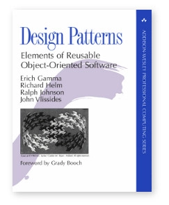

.. include:: <mmlalias.txt>

What's There? What Have We Accomplished?
========================================

.. contents::
   :local:

Rules? Why Rules?
-----------------

Rules are there to enforce ...

* A working state
* Maintainability/modifiability (|longrightarrow| readability)
* Respect from ...

  * Co-workers
  * Employer
  * Users/customers

Which rules and tools have established in software?

Object Oriented Programming
---------------------------

.. sidebar:: Survey

   Who ever over-engineered a program?

*Talk about the code as if you'd talk about you domain objects*.

A rather old discipline ...

* Encapsulation
* Interfaces
* *Overengineering*
* |longrightarrow| *a hard discipline*

**Looks like that is part of our craft**

* Not tied to any programming language
* "This is how things are done"
* *Only a write-up of existing practice*
* Gives things *names*
* |longrightarrow| chances are good that what we do is a craft

Coding Style
------------

.. sidebar:: Disclaimer

   Don't ask me too much about coding style - I like to break rules.

* Respect: others might not be as smart as you - they want uniformity
* No rules?

  * |longrightarrow| consensus is needed
  * People don't usually consent easily (especially male individuals)

* All rules?

  * No consensus needed
  * *But:* rules are never 100% (has your company established
    prcesses?)
  * War between those who obey the rules and those who (occasionally)
    don't

Design Principles: SOLID
------------------------

* Single Responsibility

  * Every class must have a single responsibility

* Open/Closed

  * Software entities must be open for extension, but closed for
    modification

* Liskov Substitution

  * It must be possible in a program to exchange two implementations
    of an interface *without* compromising the correctness of the
    program

* Interface Segregation

  * No client of an interface should be forced to depend on methods it
    does not use

* Dependency Inversion

  * High-level modules should not depend on low-level modules. Both
    should depend on abstractions.
  * Abstractions should not depend upon details. Details should depend
    upon abstractions.

*Antipattern*: a pattern that violates any of these principles

Another One: YAGNI
------------------

"You ain't gonna need it!"

* Extreme Programming (XP)
* Test Driven Development
* When everything is covered by tests, then you can implement a
  feature at the time you need it
* |longrightarrow| the system can be changed at any time

Architecture
------------

* Good architecture allows major decisions to be deferred
* Maximizes the number of decisions *not* made
* Makes choice of tools irrelevant

"Interfaces are a sign of indecisiveness!" |:middle_finger:|

Project Management: Traditional
-------------------------------

* Road construction business

  * Fundamentally different from software
  * No cycles (version 2.0 of a road?)

* Hardware manufacturing

  * Somewhere in the middle
  * PCB design
  * BOM
  * Production
  * Bug are fixed |longrightarrow| new version

Project Management: Software
----------------------------

* Continuous change possible |longrightarrow| happens!
* Great tools: version control systems (craft?)
* Do we want continuous change?

  * What is bad about it?
  * Is it necessary?

* Is it possible to plan 100% ahead?

  * Requiremenets must be rock stable
  * Road construction?

* Anyway, fact is ...

  * Cycles are possible
  * We are too stupid to plan ahead

|longrightarrow| let's just accept the fact, and make the best out of
it!

**Let's go AGILE!**

So What?
--------

* Everything's there: tools, principles, do's and dont's ...
* Well understood
* It's just that it takes about 20 years to learn all that (because
  everyone has do experience all that by themselves)
* Did Bob Martin move anything? (I don't know.)

