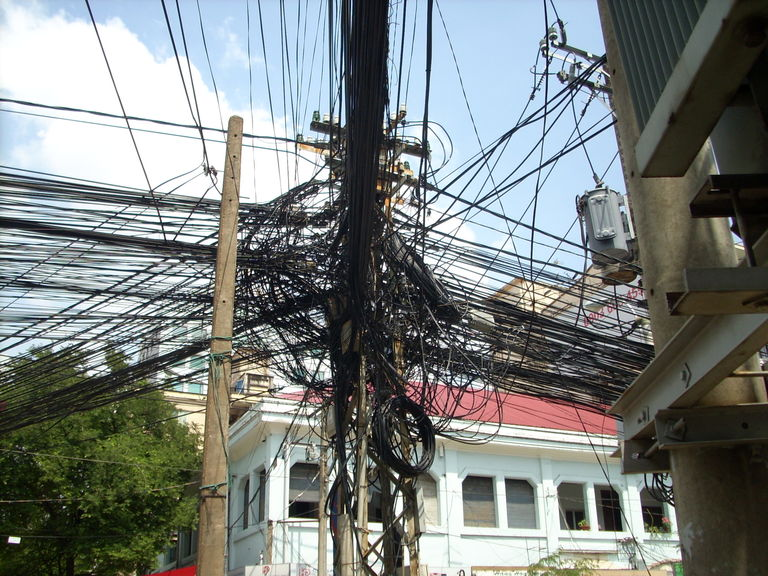
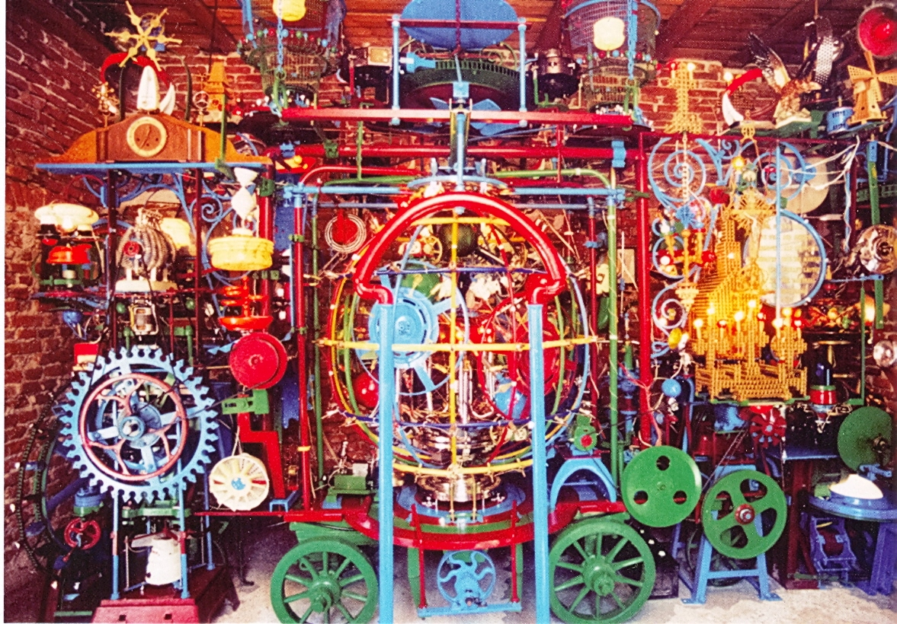

.. include:: <mmlalias.txt>

Is Software A Craft? Software Is A Craft!
=========================================

.. contents::
   :local:

.. list-table::
   :align: left
   :widths: auto

   * * .. image:: ../images/clean-code.jpg
          :height: 300px
     * .. image:: ../images/tdd.jpg
          :height: 300px
     * .. image:: ../images/design_patterns.webp
          :height: 300px

09:00-09:15 Introductory Words
------------------------------

* This is not a tech seminar, but a psycho-social seminar
* Craftsmanship

  * Do we have rules?
  * Dont's?
  * Should we?

* How about that scenario (Robert Martin brings it during one of his
  talks) ...

  * Someone makes a dumb mistake and software kills 10000 people
  * Politics will jump in want answers
  * If we do not have one, they will regulate
  * Do we want this?
  * Ethics maybe? Do we have ethics?

   Every craft has rules

   This particular electrical installation does not seems to adhere to
   any rule.

   This is art

   It does not solve an immediate problem. There are software systems
   that look like this, though.

* Survey: who has had a project in their life that got out of control?
  Why?

09:15-10:00 Software Engineering: A Discipline? (What Have We Established?)
---------------------------------------------------------------------------

.. toctree::
   :maxdepth: 1

   craft-sw

10:00-10:15 Coffee Break
------------------------

.. _clean-code-establish-project:

10:15-11:00 Establishing "The Project" (Live Hacking, Slides)
-------------------------------------------------------------

In a live-hacking session, establish the initial project state.

.. toctree::
   :maxdepth: 1

   block-before-googletest

11:00-12:00 Enter Unit Testing Frameworks
-----------------------------------------

.. image:: ../images/xunit-structure.png
   :scale: 50%

.. toctree::
   :maxdepth: 1

   enter-googletest

12:00-13:00 Lunch Break
-----------------------

13:00-14:00 Cornerstones From The "Clean Code" Book
---------------------------------------------------

.. toctree::
   :maxdepth: 1

   clean-code-craftsmanship

14:00-14:45 Keeping Code Clean In The Small
-------------------------------------------

* :doc:`/trainings/material/soup/c/090-program-sanity/group`
* :doc:`/trainings/material/soup/c/100-performance/group`

14:45-15:00 Coffee Break
------------------------

15:00-23:59 "Extreme Programming" Session
-----------------------------------------

Using Test Driven Development, hack deliciously, fearlessly cleaning
up the code base!

.. toctree::
   :hidden:

   tasks/group

See :doc:`tasks/group` for more.
