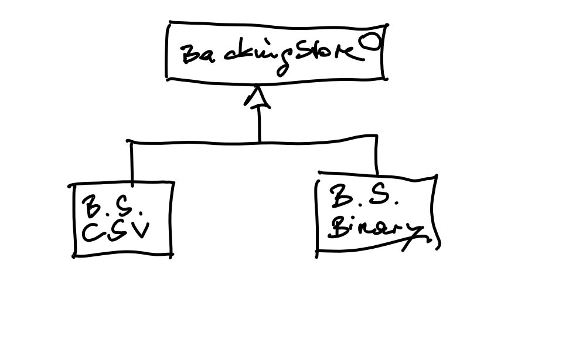

.. ot-task:: clean_code.refactoring.backingstore_interface
   :dependencies: clean_code.refactoring.backingstore_monolithic

.. include:: <mmlalias.txt>

``BackingStore`` Has Too Many Responsibilities |longrightarrow| Interface
=========================================================================

``BackingStore``, while now maintained in isolation from ``UserDB``,
still has many responsibilities - it is used to write both "binary"
and "CSV" file formats.

This is a violatin of the :ref:`"Open/Closed Principle"
<clean-code-solid>`!

Create an *interface*, and move the branches from the two ``switch``
statements into the respective methods of the two implementations.

