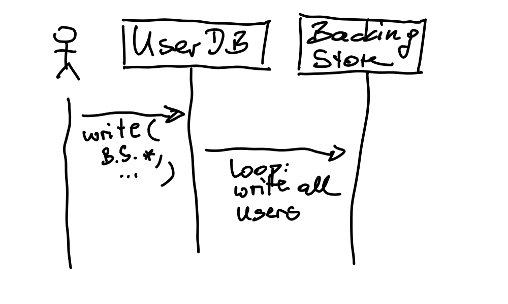

.. include:: <mmlalias.txt>

``UserDB`` Has Too Many Responsibilities |longrightarrow| ``BackingStore``
==========================================================================

.. contents::
   :local:

Should the file format be the responsibility of something that is
mainly an in-memory database?

.. attention::

   There are bugfixes ongoing in the file IO scene. Please wait until
   they are in place to not unnecessarily conflict by ripping out code
   under modification.
   
   (See :doc:`../bugs/overwrite-existing-files` and
   :doc:`../bugs/overwrite-store-content-on-read`)

``BackingStore``
----------------

Extract the bodies of ``UserDB::read()`` and ``UserDB::write()`` into
a new class ``BackingStore``. It is that class's responsibility to
implement the details of binary and CSV files IO.

Class ``UserDB`` gets passed a ``BackingStore`` instance in its
``read()`` and ``write()`` methods, as a replacement for a
``filename``.

Like so,

.. code-block:: c++

   class UserDB {
   public:
       void read(BackingStore&, /*...*/);
       void write(BackingStore&, /*...*/);
   };

