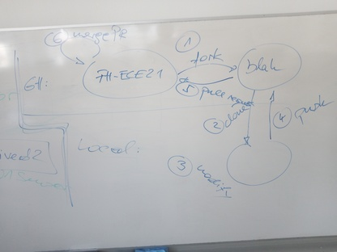
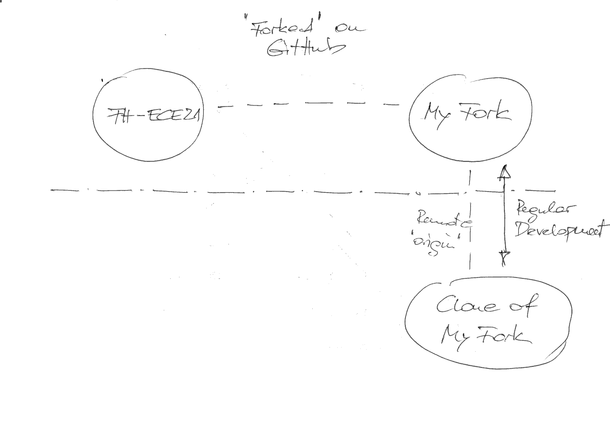
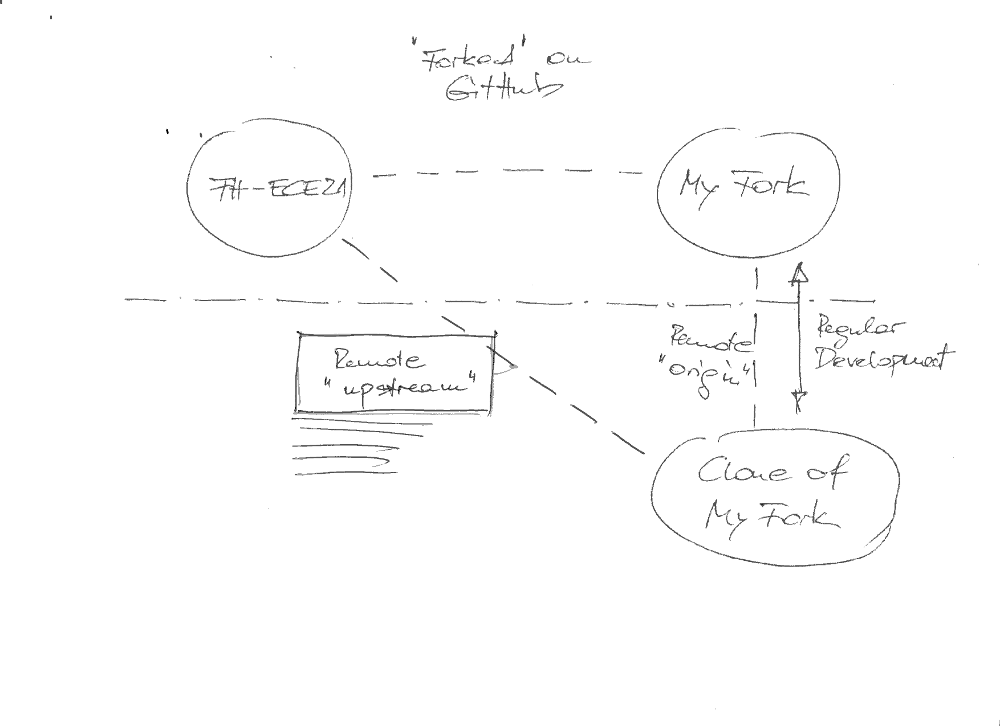
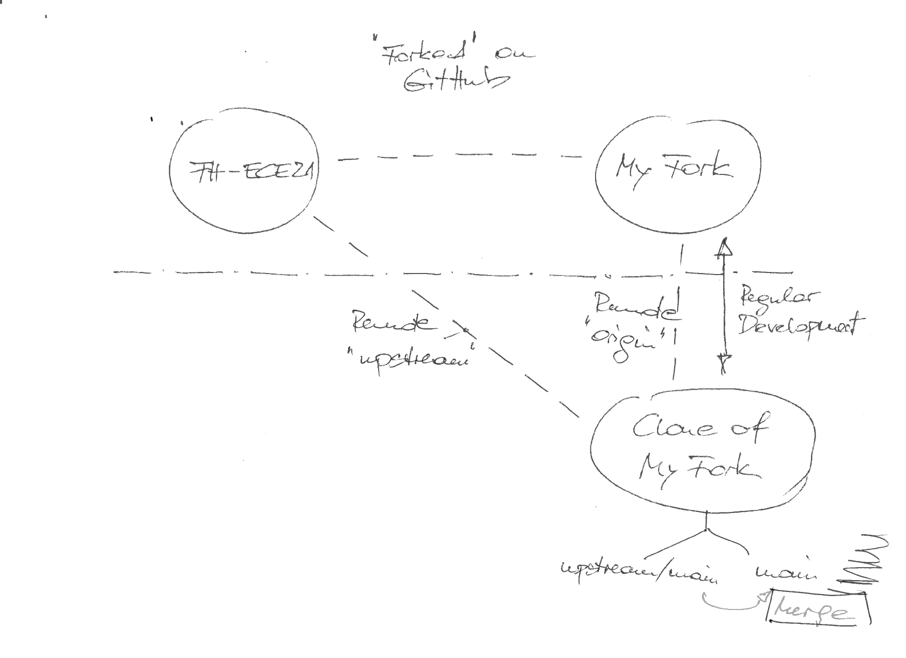
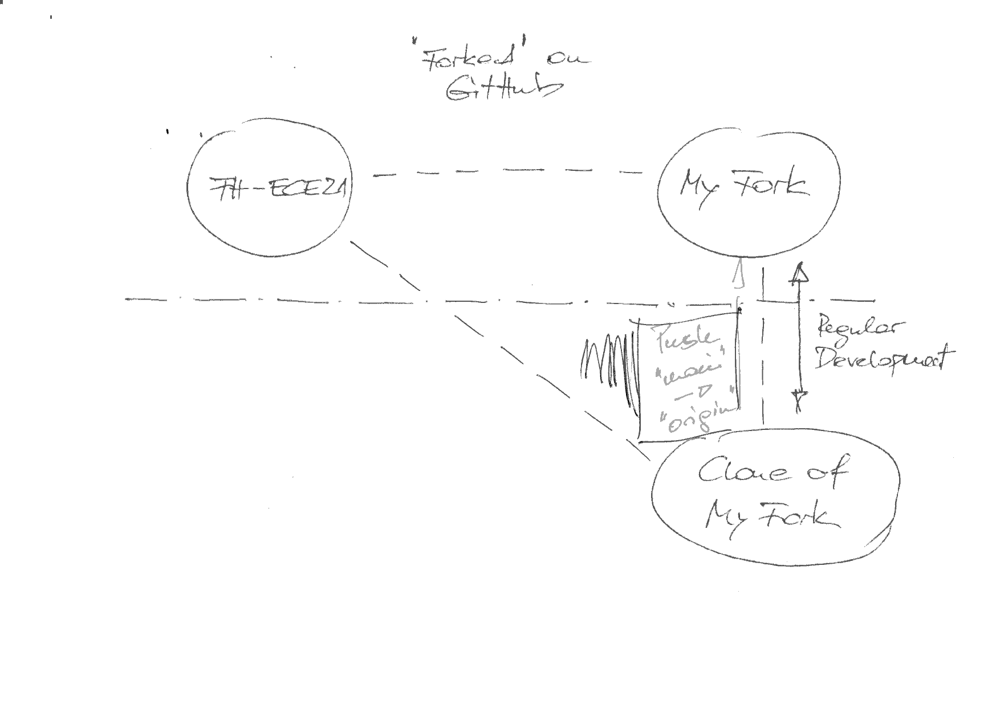

Working with Git In Our ``FH-ECE21`` Project
============================================

.. contents:: 
   :local:

Forks And Pull Requests
-----------------------

`Github pull requests
<https://docs.github.com/pull-requests>`__, especially ...

* `Fork and pull model
  <https://docs.github.com/en/pull-requests/collaborating-with-pull-requests/getting-started/about-collaborative-development-models>`__
* `Fork a repo
  <https://docs.github.com/en/get-started/quickstart/fork-a-repo>`__
* `About pull requests
  <https://docs.github.com/en/pull-requests/collaborating-with-pull-requests/proposing-changes-to-your-work-with-pull-requests/about-pull-requests>`__
* `Creating a pull request from a fork
  <https://docs.github.com/en/pull-requests/collaborating-with-pull-requests/proposing-changes-to-your-work-with-pull-requests/creating-a-pull-request-from-a-fork>`__



Multiple Pull Requests: Pulling Upstream Changes ("Syncing" A Fork)
-------------------------------------------------------------------

.. sidebar::

   **See also**

   * `Syncing a fork branch from the command line
     <https://docs.github.com/en/pull-requests/collaborating-with-pull-requests/working-with-forks/syncing-a-fork>`__

A forked repo [#fork_github]_ carries commits for a particular feature
that the *upstream* repository (where the fork was created from) does
not contain. Development on the fork is integrated back into upstream
by filing a *pull request*.



Multiple pull requests are possible, if not even the norm. Ongoing
development on a fork might require pulling in *upstream* changes
(changes from other forks that were integrated into *upstream* in the
meantime). Here's how this is done.

A clone of a fresh fork - one that has a number of commits, and that
has been pulled into the repository where it was cloned from (by
filing a *pull request*) - has no remotes other than the repo where it
was cloned from: the remote named ``origin``. Pushes and pull
communicate with the ``origin`` remote by default.

.. code-block:: console

   $ git remote -v
   origin	https://github.com/FH-ECE21-Team/FH-ECE21-MQTT.git (fetch)
   origin	https://github.com/FH-ECE21-Team/FH-ECE21-MQTT.git (push)

Creating A Remote for *Upstream* (Done Only Once)
.................................................

.. sidebar::

   **See also**

   * `Configuring a remote repository for a fork
     <https://docs.github.com/en/pull-requests/collaborating-with-pull-requests/working-with-forks/configuring-a-remote-repository-for-a-fork>`__
		
To prepare the clone for continuous syncing with the *upstream* of the
fork, you create another remote, namely one that points to where the
fork was made from. In this case the fork was made from the ``main``
branch of the repository ``https://github.com/jfasch/FH-ECE21``.

Create a remote named ``upstream`` (note that the name is arbitrary -
the name ``upstream`` appears most descriptive) pointing to
``https://github.com/jfasch/FH-ECE21``, the *upstream* of the fork:

.. code-block:: console

   $ git remote add upstream https://github.com/jfasch/FH-ECE21.git



Updating The Fork ("Syncing" It From Its Upstream)
..................................................

Fetch ``upstream`` Into Your Clone
``````````````````````````````````

In your clone of the fork (here
``https://github.com/FH-ECE21-Team/FH-ECE21-MQTT.git``), fetch the
remote content onto a local branch

* Check situation

  .. code-block:: console

     $ pwd
     /home/jfasch/My-Projects/FH-ECE21/FH-ECE21-MQTT
     $ git remote -v
     origin	https://github.com/FH-ECE21-Team/FH-ECE21-MQTT.git (fetch)
     origin	https://github.com/FH-ECE21-Team/FH-ECE21-MQTT.git (push)
     upstream	https://github.com/jfasch/FH-ECE21.git (fetch)
     upstream	https://github.com/jfasch/FH-ECE21.git (push)
		  
* Fetch ``upstream`` changes since last integration (or initial fork,
  whichever happened last)

  .. code-block:: console

     $ git fetch upstream
     remote: Enumerating objects: 15, done.
     remote: Counting objects: 100% (15/15), done.
     remote: Compressing objects: 100% (6/6), done.
     remote: Total 12 (delta 9), reused 9 (delta 6), pack-reused 0
     Unpacking objects: 100% (12/12), 1.09 KiB | 222.00 KiB/s, done.
     From https://github.com/jfasch/FH-ECE21
      * [new branch]      main       -> upstream/main

  .. image:: github-fetch-upstream.png
     :scale: 30%

* For the interested, the local repository now has a *remote tracking*
  branch, ``remotes/upstream/main`` (in addition to
  ``remotes/origin/main`` that it had from the beginning):

  .. code-block:: console

     $ git branch -a
     * main
       remotes/origin/HEAD -> origin/main
       remotes/origin/main
       remotes/upstream/main

Merge ``upstream/main`` Into Local ``main``
```````````````````````````````````````````



* Checkout branch to merge ``upstream`` into. This should be ``main``.

  .. code-block:: console
     :caption: Check checked-out branch (should be ``main``)

     $ git branch
     * main

  .. code-block:: console
     :caption: If not on ``main``, check that out

     $ git checkout main
     Previous HEAD position was 9bfda12 rename demo mosquitto client
     Switched to branch 'main'
     Your branch is up to date with 'origin/main'.

* Merge ``upstream`` (branch ``main``) changes into local
  ``main``. Here in this example, the merge goes in smoothly - a *fast
  forward*, because there were no local changes on ``main`` that made
  your local situation diverge from ``upstream/main``.

  **Note that this is not always so simple**. Resolve conflicts (see
   `here
   <https://docs.github.com/en/pull-requests/collaborating-with-pull-requests/addressing-merge-conflicts/resolving-a-merge-conflict-using-the-command-line>`__)

  .. code-block:: console

     $ git branch
     * main
     $ git merge upstream/main
     Updating 00aea42..9bfda12
     Fast-forward
      bin/CMakeLists.txt                                  | 4 ++--
      bin/{mqtt-client.cpp => mosquitto-publish-demo.cpp} | 0
      2 files changed, 2 insertions(+), 2 deletions(-)
      rename bin/{mqtt-client.cpp => mosquitto-publish-demo.cpp} (100%)

Push Into Fork On Github
````````````````````````



Your local clone is now in sync with the fork's upstream. Now it's
time to bring those local changes back where the clone comes from.

.. code-block:: console
   :caption: That is simple

   $ git push

.. rubric:: Footnotes
.. [#fork_github] "Fork" is a term that is *Github* specific. In
                  implementing the "Github workflow" they named the
                  initial clone a "fork", and re-integration into the
                  cloned repo a "pull request".
