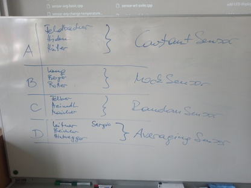
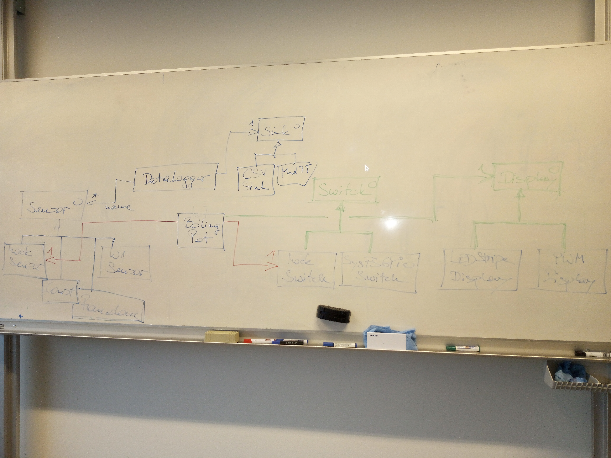

.. include:: <mmlalias.txt>


WS2023/24
=========

.. toctree::
   :hidden:

   tasks/group
   git/git
   exam-2024-02-02/exam-2024-02-02-sample

.. sidebar::

   * `Github project <https://github.com/jfasch/FH-ECE21>`__
   * :doc:`tasks/group`
   * :doc:`git/git`
   * SSH login on the Pi: ``ssh -p 2020 firstname.lastname@jfasch.bounceme.net``

.. contents::
   :local:

2023-10-05 (6 VO)
-----------------

OO: Recap
.........

* *What we know*: Constructor, Methods, Objects, ``this``

  * :doc:`/trainings/material/soup/cxx03/020-data-encapsulation/cpp-introduction`
  * :doc:`/trainings/material/soup/cxx03/030-functions-and-methods/group`
  
* *What we have*

  *Sensor-like* types

  * :doc:`/trainings/material/soup/cxx-exercises/nopoly-sensors-core/sensor-const-nopoly` (`sensor-avg.h <https://github.com/jfasch/FH-ECE21/blob/main/toolcase/sensor-avg.h>`__)
  * :doc:`/trainings/material/soup/cxx-exercises/nopoly-sensors-core/sensor-mock-nopoly` (`sensor-mock.h <https://github.com/jfasch/FH-ECE21/blob/main/toolcase/sensor-mock.h>`__)
  * :doc:`/trainings/material/soup/cxx-exercises/nopoly-sensors-core/sensor-random-nopoly` (`sensor-random.h <https://github.com/jfasch/FH-ECE21/blob/main/toolcase/sensor-random.h>`__)
  * :doc:`/trainings/material/soup/cxx-exercises/nopoly-sensor-avg/sensor-avg-nopoly` (`sensor-avg.h <https://github.com/jfasch/FH-ECE21/blob/main/toolcase/sensor-avg.h>`__)

  *Switch-like* types

  * :doc:`/trainings/material/soup/cxx-exercises/nopoly-switch-mock/switch-mock-nopoly` (`switch-mock.h <https://github.com/jfasch/FH-ECE21/blob/main/toolcase/switch-mock.h>`__)

  *Consumers*

  * :doc:`/trainings/material/soup/cxx-exercises/nopoly-display-led-stripe/display-led-stripe-nopoly`
  * :doc:`/trainings/material/soup/cxx-exercises/nopoly-hysteresis/hysteresis-nopoly` (`hysteresis.h <https://github.com/jfasch/FH-ECE21/blob/main/toolcase/hysteresis.h>`__)

Plan |:muscle:|
...............

* Polymorphize switches and sensors |longrightarrow| interfaces
* Use interfaces in LED display and hysteresis

  Show example of a display that outputs sensor values to ``stdout``
  (rather than writing the output inline, inside the measurement loop)

* Project: *Data Logger*

  * Define sink
  * Define source configuration

* Lifetime (e.g. ``AveragingSensor::add()``) |longrightarrow| pointer
  classes
* ... see what time brings ...

OO: Polymorphism
................

From
:doc:`/trainings/material/soup/cxx03/100-inheritance-oo-design/group`:

* :doc:`/trainings/material/soup/cxx03/100-inheritance-oo-design/basics`
* :doc:`/trainings/material/soup/cxx03/100-inheritance-oo-design/virtual-method`
* :doc:`/trainings/material/soup/cxx03/100-inheritance-oo-design/polymorphism`
* :doc:`/trainings/material/soup/cxx03/100-inheritance-oo-design/destructor`
* :doc:`/trainings/material/soup/cxx03/100-inheritance-oo-design/virtual-destructor`
* :doc:`/trainings/material/soup/cxx03/100-inheritance-oo-design/interface`

From
:doc:`/trainings/material/soup/cxx11/020-new-language-features/group`:

* :doc:`/trainings/material/soup/cxx11/020-new-language-features/override`

Git Collaboration (via Github, but not necessarily): Forks And Pull Request
...........................................................................

See :doc:`git/git`, "Forks And Pull Requests"

Tasks, First Round
..................



2023-11-03 (6 VO)
-----------------

Organizational
..............

* Course page modifications (chapters instead of table)
* Grading scheme

OO: Design?
...........

* Look over integrated pull requests

  * ``ConstantSensor``
  * ``RandomSensor``
  * ``MockSensor``
  * ``AveragingSensor``

    * Dependencies: does it really need ``sensor-mock.h``?
    * |longrightarrow| UML sketch

* :doc:`/trainings/material/soup/cxx-design-patterns/uml/uml`
* |longrightarrow| Design patterns
  (:doc:`/trainings/material/soup/cxx-design-patterns/composite/composite`)

* What was that all for?

  * Structure: ``Sensor`` interface
  * :doc:`/trainings/material/soup/cxx11/020-new-language-features/override`
  * :doc:`/trainings/material/soup/cxx-design-patterns/oo-principles`
  * Design patterns (outlook)

    * :doc:`/trainings/material/soup/cxx-design-patterns/composite/composite`
    * :doc:`/trainings/material/soup/cxx-design-patterns/adapter/adapter`
    * Many more: :doc:`/trainings/material/soup/cxx-design-patterns/group`

Project
.......

Hardware Overview
`````````````````

.. sidebar::

   * :doc:`/about/site/recipes/camera-ssh`

* :doc:`/trainings/material/soup/linux/sysprog/intro-hw/sysfs-gpio`
  (see :doc:`tasks/sysfs-gpio-switch`)
* :doc:`/trainings/material/soup/linux/hardware/w1/topic` (``class
  W1Sensor`` implements that, in our project)
* :doc:`/trainings/material/soup/linux/hardware/pwm/topic` (see
  :doc:`tasks/pwm-display`)

Tasks
`````

See :doc:`tasks/group`

2023-11-09 (3 VO)
-----------------

Project
.......

* Caring about hacking students

2023-11-10 (3 VO)
-----------------

Project
.......

* Caring about hacking students
* Team meeting



2023-11-17 (3 VO)
-----------------

OO, And Software Development At Large
.....................................

* :doc:`/trainings/material/soup/cxx-design-patterns/oo-principles`

  See :doc:`tasks/sysfs-gpio-switch` and :doc:`tasks/boiling-pot` for
  why.

  * Single responsibility |longrightarrow| ``Hysteresis`` does not do
    sensoring and switching *itself*; it *uses* an interface
  * Open/closed |longrightarrow| ``Hysteresis`` is not modified when a
    new ``Sensor`` implementation is added
  * Liskow substitution |longrightarrow| ``Hysteresis`` *should* be
    possible to use *any* ``Sensor``. **Easily violated!!**
  * Interface segregation |longrightarrow| ``Sensor`` does not have a
    name in it. Data logger would need one, but adds it itself
    (``SensorConfig`` is a ``name`` |longrightarrow| ``Sensor``
    mapping)
  * Dependency Inversion |longrightarrow| ``Hysteresis`` does not
    depend on, say, ``W1Sensor``, but rather on ``Sensor``

Project
.......

Updating A Fork From Upstream
`````````````````````````````

* Look over :doc:`git/git`
* Reasons to "sync" a fork

  * GCC warning: "Structured binding only available for C++17"
    |longrightarrow| ``-std=c++17`` at toplevel ``CMakeLists.txt``
  * Continuous development cycles on fork, repeated pull requests from
    the same fork

* Presentations: where we are, with 

  * :doc:`tasks/boiling-pot`
  * :doc:`tasks/pwm-display`

2023-11-20 (6 VO)
-----------------

Container Templates (``std::map``)
..................................

* :doc:`/trainings/material/soup/cxx03/060-stl/050-associative-containers/map`

Project
.......

New Tasks: MQTT And CSV ``Sink`` Implementations
````````````````````````````````````````````````

* MQTT

  * :doc:`/trainings/material/soup/python/misc/mqtt/topic`
  * :doc:`tasks/datalogger-mqtt-sink` (task definition)

* :doc:`tasks/datalogger-csv-sink`


Datalogger Pull Request
```````````````````````

* See today's meeting minutes in :doc:`tasks/datalogger`

Boiling Pot, Switches
`````````````````````

* See today's meeting minutes in :doc:`tasks/boiling-pot`
* Team to continue on ``tasks/switch-interface``

SysFS GPIO Switch
`````````````````

* See today's meeting minutes in :doc:`tasks/boiling-pot`

2023-12-07 (6 VO)
-----------------

Project
.......

Structure
`````````

* ``firmware/``: what's supposed to be deployed: ``data-logger`` and
  ``boiling-pot``
* ``demos/``: demo and test programs
* ``toolcase/``: library, structure into subdirectories

  * ``base/``
  * ``data-logger/``
  * ``boiling-pot/``

* ``tests/`` ...

Show dependency graph

Renames
```````

* ``LEDDisplay`` -> ``PWMController``

2023-12-14 (6 VO)
-----------------

Project
.......

* :doc:`tasks/group`

Datalogger
``````````

* :doc:`tasks/datalogger`

  * Status: couple of minor tweaks (see "Standup records" in
    :doc:`tasks/datalogger`)

* Followup tasks

  * :doc:`tasks/datalogger-csv-sink`
  * :doc:`tasks/datalogger-mqtt-sink`
  * :doc:`tasks/datalogger-integration`

Boiling Pot
```````````

* :doc:`tasks/boiling-pot`
* Followup tasks

  * :doc:`tasks/boiling-pot-display`
  * :doc:`tasks/boiling-pot-basic-integration`
  * :doc:`tasks/boiling-pot-full-integration`

Peripherals
```````````

* :doc:`tasks/pwm-display`
* :doc:`tasks/sysfs-gpio-switch`
* :doc:`tasks/switch-interface`
* Followup tasks

  * :doc:`tasks/display-infrastructure`

2024-01-08 (6 VO)
-----------------

Project
.......

* Close task :doc:`tasks/boiling-pot-basic-integration`

  * Bonus points for switch
  * Bonus points for Pi donation
  * Bring relay board and cooker, and a gapher tape

* Bring :doc:`tasks/datalogger-integration` to an and

  * Use a real sensor
  * Coordinate with :doc:`tasks/datalogger-csv-sink` and
    :doc:`tasks/datalogger-mqtt-sink`
  * Integrate those using a *composite* sink

* :doc:`tasks/display-infrastructure`, and
  :doc:`tasks/boiling-pot-display`

  * Status: do we have an interface? If not, make it so!
  * Integrate into `firmware/boiling-pot.cpp
    <https://github.com/jfasch/FH-ECE21/blob/main/firmware/boiling-pot.cpp>`__
    |longrightarrow| see test cases mentioned in
    :doc:`tasks/boiling-pot-display`

2024-01-11 (6 VO)
-----------------

Project
.......

**BIG FAT SYSFS-GPIO NOTICE**: **NO SAFETY**

2024-02-02 (Exam)
-----------------

* :doc:`exam-2024-02-02/exam-2024-02-02-sample`
