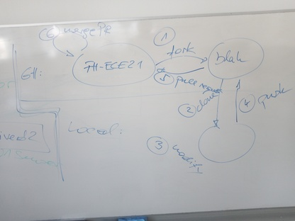

.. include:: <mmlalias.txt>


WS2023/24
=========

.. toctree::
   :hidden:

   tasks/group

.. sidebar::

   * `Github project <https://github.com/jfasch/FH-ECE21>`__
   * SSH login on the Pi: ``ssh -p 2020 firstname.lastname@jfasch.bounceme.net``

.. contents::
   :local:

2023-10-05 (6 VO)
-----------------

OO: Recap
.........

* *What we know*: Constructor, Methods, Objects, ``this``

  * :doc:`/trainings/material/soup/cxx03/020-data-encapsulation/cpp-introduction`
  * :doc:`/trainings/material/soup/cxx03/030-functions-and-methods/group`
  
* *What we have*

  *Sensor-like* types

  * :doc:`/trainings/material/soup/cxx-exercises/nopoly-sensors-core/sensor-const-nopoly` (`sensor-avg.h <https://github.com/jfasch/FH-ECE21/blob/main/toolcase/sensor-avg.h>`__)
  * :doc:`/trainings/material/soup/cxx-exercises/nopoly-sensors-core/sensor-mock-nopoly` (`sensor-mock.h <https://github.com/jfasch/FH-ECE21/blob/main/toolcase/sensor-mock.h>`__)
  * :doc:`/trainings/material/soup/cxx-exercises/nopoly-sensors-core/sensor-random-nopoly` (`sensor-random.h <https://github.com/jfasch/FH-ECE21/blob/main/toolcase/sensor-random.h>`__)
  * :doc:`/trainings/material/soup/cxx-exercises/nopoly-sensor-avg/sensor-avg-nopoly` (`sensor-avg.h <https://github.com/jfasch/FH-ECE21/blob/main/toolcase/sensor-avg.h>`__)

  *Switch-like* types

  * :doc:`/trainings/material/soup/cxx-exercises/nopoly-switch-mock/switch-mock-nopoly` (`switch-mock.h <https://github.com/jfasch/FH-ECE21/blob/main/toolcase/switch-mock.h>`__)

  *Consumers*

  * :doc:`/trainings/material/soup/cxx-exercises/nopoly-display-led-stripe/display-led-stripe-nopoly`
  * :doc:`/trainings/material/soup/cxx-exercises/nopoly-hysteresis/hysteresis-nopoly` (`hysteresis.h <https://github.com/jfasch/FH-ECE21/blob/main/toolcase/hysteresis.h>`__)

Plan |:muscle:|
...............

* Polymorphize switches and sensors |longrightarrow| interfaces
* Use interfaces in LED display and hysteresis

  Show example of a display that outputs sensor values to ``stdout``
  (rather than writing the output inline, inside the measurement loop)

* Project: *Data Logger*

  * Define sink
  * Define source configuration

* Lifetime (e.g. ``AveragingSensor::add()``) |longrightarrow| pointer
  classes
* ... see what time brings ...

OO: Polymorphism
................

From
:doc:`/trainings/material/soup/cxx03/100-inheritance-oo-design/group`:

* :doc:`/trainings/material/soup/cxx03/100-inheritance-oo-design/basics`
* :doc:`/trainings/material/soup/cxx03/100-inheritance-oo-design/virtual-method`
* :doc:`/trainings/material/soup/cxx03/100-inheritance-oo-design/polymorphism`
* :doc:`/trainings/material/soup/cxx03/100-inheritance-oo-design/destructor`
* :doc:`/trainings/material/soup/cxx03/100-inheritance-oo-design/virtual-destructor`
* :doc:`/trainings/material/soup/cxx03/100-inheritance-oo-design/interface`

From
:doc:`/trainings/material/soup/cxx11/020-new-language-features/group`:

* :doc:`/trainings/material/soup/cxx11/020-new-language-features/override`

Git Collaboration (via Github, but not necessarily)
...................................................

`Github pull requests
<https://docs.github.com/pull-requests>`__, especially ...

* `Fork and pull model
  <https://docs.github.com/en/pull-requests/collaborating-with-pull-requests/getting-started/about-collaborative-development-models>`__
* `Fork a repo
  <https://docs.github.com/en/get-started/quickstart/fork-a-repo>`__
* `About pull requests
  <https://docs.github.com/en/pull-requests/collaborating-with-pull-requests/proposing-changes-to-your-work-with-pull-requests/about-pull-requests>`__
* `Creating a pull request from a fork
  <https://docs.github.com/en/pull-requests/collaborating-with-pull-requests/proposing-changes-to-your-work-with-pull-requests/creating-a-pull-request-from-a-fork>`__



.. image:: teams-2023-10-05.jpg

2023-11-03 (6 VO)
-----------------

Organizational
..............

* Course page modifications (chapters instead of table)
* Grading scheme

OO: Design?
...........

* Look over integrated pull requests

  * ``ConstantSensor``
  * ``RandomSensor``
  * ``MockSensor``
  * ``AveragingSensor``

    * Dependencies: does it really need ``sensor-mock.h``?
    * |longrightarrow| UML sketch

* :doc:`/trainings/material/soup/cxx-design-patterns/uml/uml`
* |longrightarrow| Design patterns
  (:doc:`/trainings/material/soup/cxx-design-patterns/composite/composite`)

* What was that all for?

  * Structure: ``Sensor`` interface
  * :doc:`/trainings/material/soup/cxx11/020-new-language-features/override`
  * :doc:`/trainings/material/soup/cxx-design-patterns/oo-principles`
  * Design patterns (outlook)

    * :doc:`/trainings/material/soup/cxx-design-patterns/composite/composite`
    * :doc:`/trainings/material/soup/cxx-design-patterns/adapter/adapter`
    * Many more: :doc:`/trainings/material/soup/cxx-design-patterns/group`

Project
.......

Hardware Overview
`````````````````

.. sidebar::

   * :doc:`/about/site/recipes/camera-ssh`

* :doc:`/trainings/material/soup/linux/sysprog/intro-hw/sysfs-gpio`
  (see :doc:`tasks/sysfs-gpio-switch`)
* :doc:`/trainings/material/soup/linux/hardware/w1/topic` (``class
  W1Sensor`` implements that, in our project)
* :doc:`/trainings/material/soup/linux/hardware/pwm/topic` (see
  :doc:`tasks/pwm-display`)

Tasks
`````

.. ot-graph::
   :entries: fh2021.boiling_pot, 
	     fh2021.datalogger, 
	     fh2021.pwm_display, 
	     fh2021.switch_interface, 
	     fh2021.sysfs_gpio_switch

2023-11-09 (3 VO)
-----------------

Project
.......

* Caring about hacking students

2023-11-10 (3 VO)
-----------------

Project
.......

* Caring about hacking students
* Team meeting

.. image:: 2023-11-10-uml.jpg
   :scale: 50%

2023-11-17 (3 VO)
-----------------

OO, And Software Development At Large
.....................................

* :doc:`/trainings/material/soup/cxx-design-patterns/oo-principles`

  See :doc:`tasks/sysfs-gpio-switch` and :doc:`tasks/boiling-pot` for
  why.

  * Single responsibility |longrightarrow| ``Hysteresis`` (does not do
    sensoring and switching *itself*)
  * Open/closed |longrightarrow| ``Hysteresis`` (work with *any*
    ``Sensor``)
  * Liskow substitution |longrightarrow| ``Hysteresis`` *should* be
    possible to use *any* sensor*. **Easily violated**
  * Interface segregation |longrightarrow| ``Sensor`` does not have a
    name in it. Although data logger needs one.

Project
.......

* GCC warning: "Structured binding only available for C++17"
  |longrightarrow| ``-std=c++17`` at toplevel ``CMakeLists.txt``
* Datalogger pull request

  * One team member to present task

  * *Explain:* ``TARGET_INCLUDE_DIRECTORIES()`` announces ``.``
    ``PUBLIC`` to anyone who needs that node
  * Two ``DataLogger::startLogging()`` implementations
    |longrightarrow| unify
  * Discuss time
    
    * Remove leftover ``DataLogger::getTime()``
    * ``DataLogger::_interval`` appears to be milliseconds
      |longrightarrow| rename accordingly
    * `man -s 2 nanosleep
      <https://man7.org/linux/man-pages/man2/nanosleep.2.html>`__
    * :doc:`/trainings/material/soup/cxx11/100-miscellaneous/010-chrono/topic`

  * ``SinkMock::getTemperature()``

    * Write *sunny* test for it
    * And how about non-existing entries?
    * ``std::map<>::at()``

  * Tests

    * ``tests/logger-suite.cpp``
      
      * Fixtures
      * ``EXPECT_EQ()``

    * ``tests/sensor-config-suite.cpp``

      * Adding the same name three times should be an error (lets use
        ``assert(false)`` as an error handling replacement)
      * Three sensors should lead to a measurement size (``.size()``) of 3
      * How about order? ``std::map<>`` *does not preserve order!*

    * ``tests/sensor-values-suite.cpp`` *does not exist*
    * ``tests/sink-suite.cpp``

      Lets look at it together
