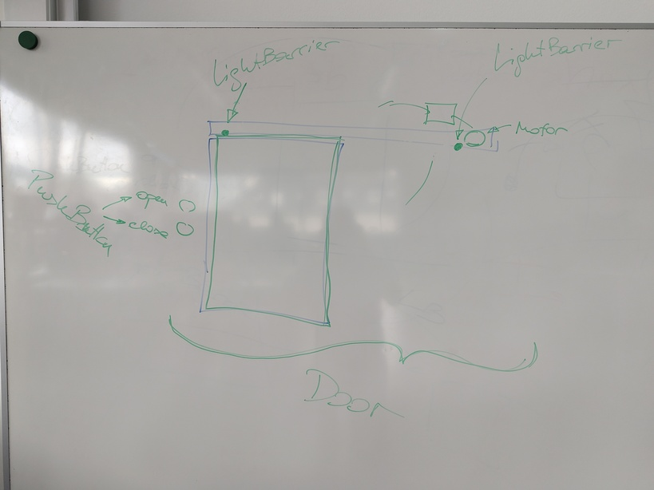

.. include:: <mmlalias.txt>

2025-05-07 (3 VO): Commandline/Shell Recap, C++
===============================================

.. contents::
   :local:

Recap: Exercises From 2025-05-05
--------------------------------

* :doc:`../2025-05-06/index`

C++ Intro
---------

.. sidebar:: See also

   * :doc:`/trainings/material/soup/cxx/cxx03/020-data-encapsulation/c`
   * :doc:`/trainings/material/soup/cxx/cxx03/020-data-encapsulation/cpp-introduction`

* C implementation: https://github.com/FH-STECE2023-Org/FH-STECE2023/tree/main/livehacking/point-c
* C++ implementation: https://github.com/FH-STECE2023-Org/FH-STECE2023/tree/main/livehacking/point-c++

.. _fh_2023_door_exercise:

Door State Machine
------------------

