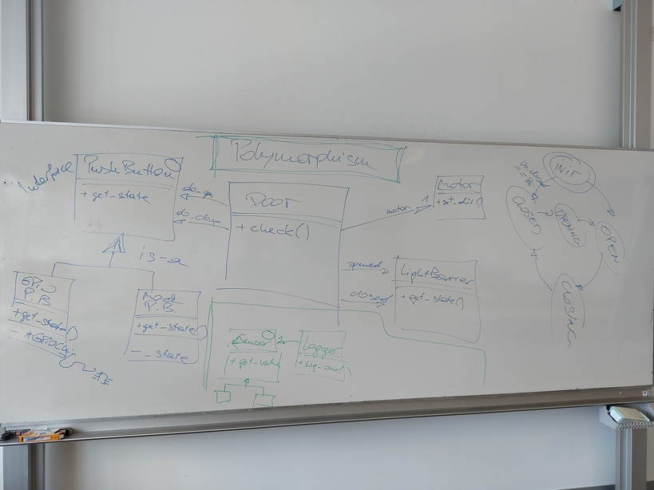

.. include:: <mmlalias.txt>

2025-05-{20,22,23} (6+6 UE): Polymorphic Door Parts, And Some Git
=================================================================

.. contents::
   :local:

.. _fh-2025-05-20-git-remote-workflow:

Git: Update From Upstream
-------------------------

Current Status: Your Own Fork Is ``origin``
...........................................

.. sidebar:: See also

   * :ref:`fh-2025-05-12-change-origin`

Recently, we arranged that everyone's own fork of the *upstream*
project (https://github.com/jfasch/FH-STECE2023) is the *origin* of
everyone's local work.

.. image:: ../2025-05-12/git-workflow.jpg

.. code-block:: console

   $ git remote -v 
   origin	git@github.com:you/FH-STECE2023.git (fetch)
   origin	git@github.com:you/FH-STECE2023.git (push)

.. code-block:: console

   $ git branch -a
   * main
     remotes/origin/HEAD -> origin/main
     remotes/origin/main

Update Your Fork
................

* Create a remote for *upstream*
  https://github.com/jfasch/FH-STECE2023.git (this is done only once):

  .. code-block:: console
  
     $ git remote add upstream https://github.com/jfasch/FH-STECE2023.git

  .. code-block:: console
  
     $ git remote -v 
     origin	git@github.com:you/FH-STECE2023.git (fetch)
     origin	git@github.com:you/FH-STECE2023.git (push)
     upstream   https://github.com/jfasch/FH-STECE2023.git (fetch)
     upstream   https://github.com/jfasch/FH-STECE2023.git (push)

* Fetch from *upstream*. This fetches into a branch ``upstream/main``.

  .. code-block:: console
  
     $ git fetch upstream
     ... roedel ...

* Merge ``upstream/main`` into your local ``main`` branch

  Check that your current branch is main,

  .. code-block:: console
  
     $ git branch
     * main

  Merge,

  .. code-block:: console
  
     $ git merge upstream/main

  Note that this is not always so easy - you might have to resolve
  conflicts.

  Push to default location - your fork,

  .. code-block:: console
  
     $ git push

.. _fh-2025-05-20--exercise-door-polymorphic:

Exercise: Create Interfaces For Door Parts
------------------------------------------

Problem
.......

* Door parts (``Motor``, ``LightBarrier``, ``PushButton``) don't
  implement anything that could be of practical use. They don't do any
  real hardware stuff.
* But: They implement functionality that is there for testing

  * ``LightBarrier::set_state()``
  * ``PushButton::set_state()``
  * ``Motor::get_direction()``

  No real light barrier, for example, would have a method
  ``set_state()``!

* |longrightarrow| Need hardware parts and mock parts side by side!

Requirement
...........

.. sidebar:: See also

   * :doc:`/trainings/material/soup/cxx/cxx11/scenarios/concrete-to-polymorphic/topic`

* According to
  :doc:`/trainings/material/soup/cxx/cxx11/scenarios/concrete-to-polymorphic/topic`,
  create *interfaces* (those with ``virtual`` and ``= 0``) for

  * ``LightBarrier`` (``light-barrier.h``)
  * ``PushButton`` (``push-button.h``)
  * ``Motor`` (``motor.h``)

  And use those interfaces in ``Door``.

  .. attention:: 

     * ``Door`` **must not use any concrete classes - only interfaces**
     * As such, it only includes ``motor.h``, and not ``motor-mock.h``
       (for example)

* Slight complication: currently, the *mocking* implementations are in
  conflict with the proposed interface names.

  Rename the files e.g. ``light-barrier.h`` to
  ``light-barrier-mock.h``, and the classes e.g. ``LightBarrier`` to
  ``LightBarrierMock``.

Work Instructions
.................

Exercise takes place in
``exercises/door-polymorphic/firstname.lastname``. Start with the
tests. In ``tests/CMakeLists.txt``, you'll find three more tests which
should be able to guide you through the exercise.

.. code-block:: cmake

   add_executable(
     door-tests-polymorphic-joerg.faschingbauer
   
     motor-tests.cpp
     lightbarrier-tests.cpp
     pushbutton-tests.cpp
   
     door-tests.cpp
   
     # --- this is for you :* ---
     # motor-polymorphic-tests.cpp
     # lightbarrier-polymorphic-tests.cpp
     # pushbutton-polymorphic-tests.cpp
   )
   
* Uncomment them one by one (e.g. ``motor-polymorphic-tests.cpp``)
* Rename current ``motor.{h,cpp}`` to ``motor-mock.{h,cpp}``
* Create interface for ``Motor`` in ``motor.h``
* Understand and fix compiler errors
* Run test suite
* Repeat with next door part

Homework (Until 2025-06-01)
---------------------------

Complete :ref:`the exercise
<fh-2025-05-20--exercise-door-polymorphic>`, and send pull request.
