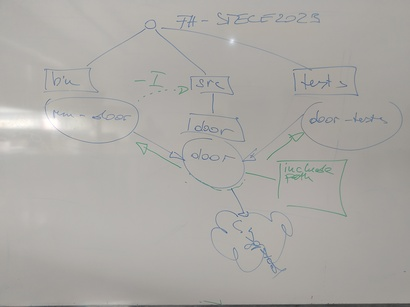

.. include:: <mmlalias.txt>


2025-06-16 (3 VO): CMake, And A Little Git
==========================================

.. contents::
   :local:

CMake
-----



Dependencies
............

.. sidebar:: See also

   * :doc:`/trainings/material/soup/cmake/intro/libraries`
   * `Graphviz <https://graphviz.org/>`__

.. sidebar:: Trainer's note

   Remove ``libgpiod`` first

   .. code-block:: console

      # dnf remove libgpiod-devel

*Node/Target* Definitions, Basic Visualization
``````````````````````````````````````````````

* ``run-door`` (through ``add_executable``)

  .. code-block:: cmake
     :caption: `bin/CMakeLists.txt
               <https://github.com/jfasch/FH-STECE2023/blob/main/bin/CMakeLists.txt>`__
  
     add_executable(run-door run-door.cpp)
     target_link_libraries(run-door door)
  
* ``door`` (through ``add_library``)

  .. code-block:: cmake
     :caption: `src/door/CMakeLists.txt
               <https://github.com/jfasch/FH-STECE2023/blob/main/src/door/CMakeLists.txt>`__
  
     add_library(
       door
     
       door.h
       door.cpp
     
       ...
     )

* Visualizing

  .. code-block:: console
  
     $ cd ~/My-Builds/FH-STECE2023-x86_64
     $ cmake --graphviz dependencies.dot ~/My-Projects/FH-STECE2023
     $ dot -Tpng dependencies.dot > dependencies.png
     $ loupe dependencies.png 

Install ``libgpiod``, And Visualize Again
`````````````````````````````````````````

* Optional Dependencies

  .. code-block:: cmake
     :caption: `src/door/CMakeLists.txt
               <https://github.com/jfasch/FH-STECE2023/blob/main/src/door/CMakeLists.txt>`__

     if (LIBGPIOD_FOUND)                                    # <-- set toplevel by find_package(LIBGPIOD)
       target_link_libraries(door LIBGPIOD::LIBGPIOD)
     else()
       message(WARNING "door will not use libgpiod (which has not been found). note that this might lead to errors in the build process")
     endif()

* Install ``libgpiod``, and try again

  .. code-block:: console
  
     # dnf install libgpiod-devel

  .. code-block:: console
  
     $ pwd
     /home/jfasch/My-Builds/FH-STECE2023-x86_64
     $ rm -rf *                                        # <-- LIBGPIOD_FOUND is cached
     $ cmake --graphviz dependencies.dot ~/My-Projects/FH-STECE2023
     $ dot -Tpng dependencies.dot > dependencies.png
     $ loupe dependencies.png 

* |longrightarrow| more dependencies

Include Paths
.............

.. sidebar:: See also

   * :doc:`/trainings/material/soup/cmake/intro/structure`

* *Build information* like include paths are propagated along reverse
  edges

.. code-block:: cmake
   :caption: `src/door/CMakeLists.txt
             <https://github.com/jfasch/FH-STECE2023/blob/main/src/door/CMakeLists.txt>`__

   # build information (include path) for our users
   target_include_directories(
     door
   
     PUBLIC
   
     ${CMAKE_CURRENT_SOURCE_DIR}/..                       # <-- users have to e.g. say #include <door/motor.h>
   )

Git: Merge, Rebase, Stash
-------------------------

Merge
.....

* Create branch ``merge-demo``

  * Modify ``bin/run-demo.cpp``
  * Commit

* Checkout ``main``

  * Modify ``bin/run-demo.cpp``
  * Commit

* Show: ``gitk --all``
* Merge: on ``main``, ``git merge merge-demo``
* Show: ``gitk --all``

Rebase
......

* Create branch ``rebase-demo``

  * Modify ``bin/run-demo.cpp``
  * Commit

* Checkout ``main``

  * Modify ``bin/run-demo.cpp``
  * Commit

* Show: ``gitk --all``
* Checkout ``rebase-demo``
* Transplant onto ``main``: ``git rebase main``  
* Show: ``gitk --all``

What Is An OS Image? How Do I Write It Onto SD-Card?
----------------------------------------------------

...
