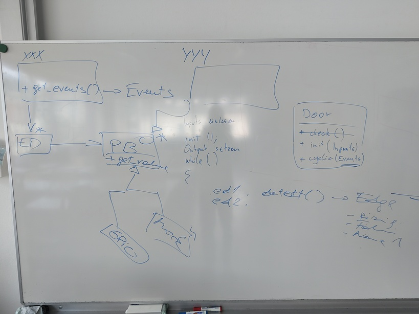

.. include:: <mmlalias.txt>


2025-06-17 (2*3 UE): Project Work
=================================

.. contents::
   :local:

Group 1: Pressure Sensor, SPS Dreamteam, Edge Detection
-------------------------------------------------------

.. _2025-06-17-pressure-sensor:

Pressure Sensor
...............

Split group

* Hardware specific part

  * Setup Pi
  * Implement prototype (in Python)
  * Create C++ class from it

* Software/Agile part

  Much like the :doc:`event detector task
  </about/site/work-in-progress/fh-joanneum/2023/ss2025/tasks/event-detector>`
  computes events/edges from GPIO levels 0 and 1, the pressure thing
  needs to be configured to recognize over-pressure (harming people)
  and under-pressure (sensor defect).

  The :doc:`SPS dream team
  </about/site/work-in-progress/fh-joanneum/2023/ss2025/tasks/sps-shell>`
  can then consume these pressure events much like it consumes GPIO
  edges.

  * Define interface for sensor
  * Create mocking version
  * Over/under-pressure detection

    * **Write unit tests first**
    * Hysteresis of some kind


.. _2025-06-17-sps-dreamteam:

SPS Dreamteam
.............



.. _2025-06-17-libgpiod-fiasco:

Group 2: ``libgpiod`` Fiasco
----------------------------

Problem(s)
..........

* WSL does not have ``libgpiod`` version 2

  * WSL is of limited use anyway: PCs usually don't have GPIO
    hardware, and if so they are unlinkely to be seen from Linux

* VirtualBox/Debian likewise

Solution: Raspi As Development Machine
.......................................

This is challenging on a Raspi 3!

* vscode's SSH remote file access consumes an infinite amount of
  resources |longrightarrow| cannot work from PC

  .. image:: vscode-crap.jpg

* Running a graphical editor *on the Pi* requires a graphical
  desktop. This also requires a non-negligible amount of resources but
  should work.

  I recommend using ``gedit``. Works like notepad++, only better.

Install ``libgpiod``
````````````````````

* Prerequisites

  .. code-block:: console
  
     $ sudo apt install -y automake autoconf autoconf-archive libtool

* Get/Build/Install ``libgpiod``

  .. code-block:: console
  
     $ git clone https://git.kernel.org/pub/scm/libs/libgpiod/libgpiod.git
     $ cd libgpiod/
     $ ./autogen.sh --enable-tools
     $ ./configure --enable-tools --enable-bindings-cxx
     $ make
     $ sudo make install

* Build Our Project On Raspberry

  * Use desktop OS version
  * Sync your fork
  * Clone project on Raspberry
  
    * Possibly copy SSH private key to Raspberry?
  
  * Build as usual
  * Watch out for ``libgpiod`` related warnings
