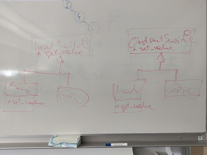

Input And Output Switches
=========================

.. contents::
   :local:

Meetings/News
-------------

Goal
----

Unify ``LightBarrier`` and ``PushButton``. Both are the same; create
centralized code.

How
---

Testing
-------

* Electrically connect a ``OutputSwitchGPIO`` to an
  ``InputSwitchGPIO``
* Define a ``googletest`` executable that uses both: set output, read
  input, and see if expectations hold.
