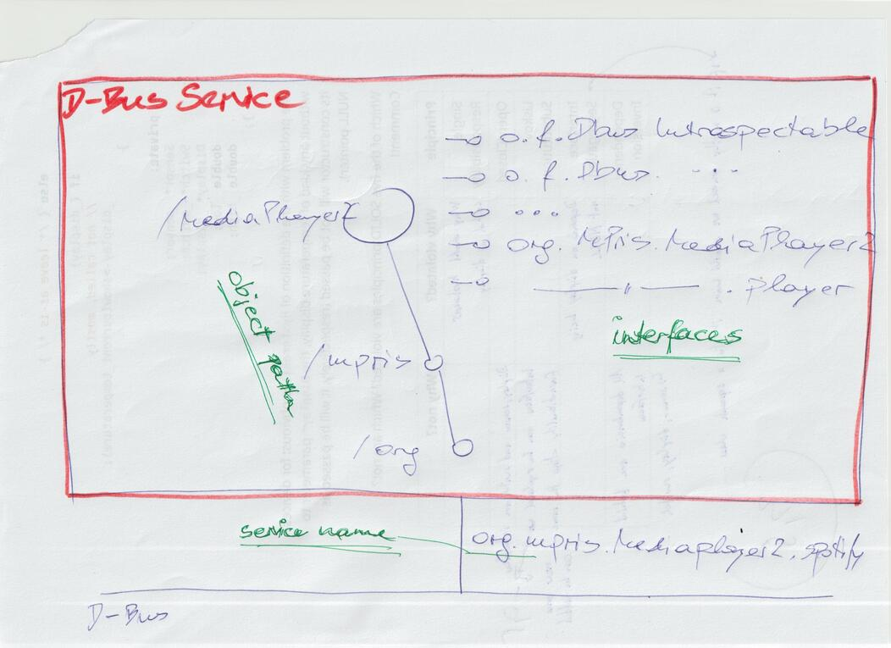
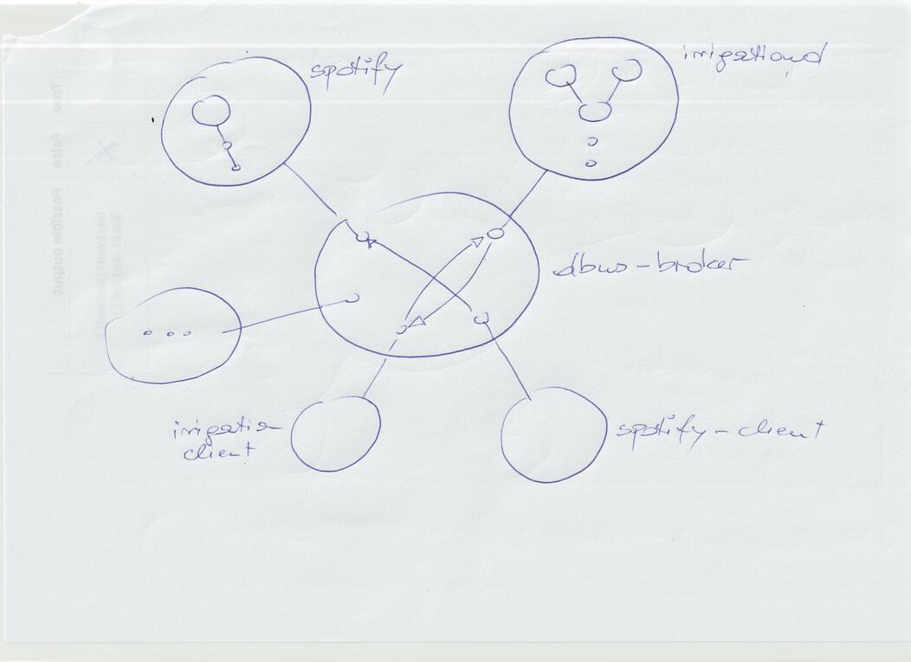
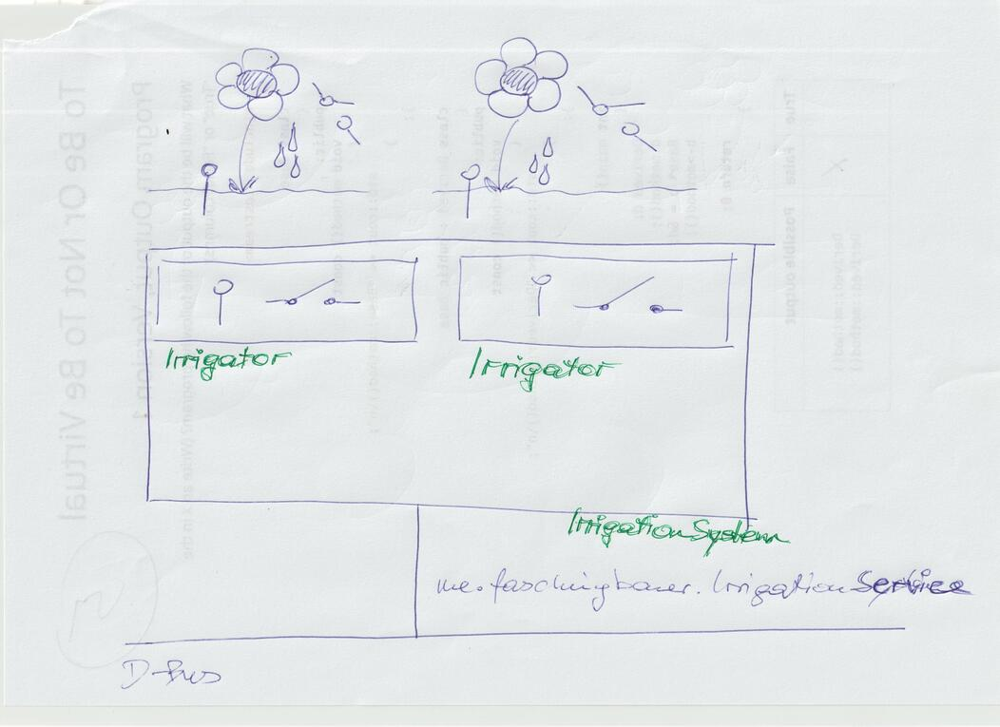

.. include:: <mmlalias.txt>

Slides: systemd's D-Bus Implementation, And Its Python ``asyncio`` Binding
==========================================================================

.. contents::
   :local:

TL;DR
-----

* Lennart Poettering's blog post about D-Bus and Lennart's baby,
  sdbus: https://0pointer.net/blog/the-new-sd-bus-api-of-systemd.html
* sdbus's Python binding: https://python-sdbus.readthedocs.io
* :doc:`python:library/asyncio`
* ... and programming; e.g. https://github.com/jfasch/jf-irrigation/

Show
----

.. sidebar::

   * `MPRIS D-Bus Interface Specification <https://specifications.freedesktop.org/mpris-spec/>`__.
   * `man -s 7 busctl <https://man7.org/linux/man-pages/man1/busctl.1.html>`__

* How does Spotify react on ``Next/Prev`` buttons? |longrightarrow|
  D-Bus
* ``d-feet``: on *session*/*user* bus, search "spotify", and examine
  object |longrightarrow| call
* Same with ``busctl`` |longrightarrow| *wonderful commandline
  completion!*

  .. code-block:: console

     $ busctl --user list | grep spotify
     $ busctl --user tree org.mpris.MediaPlayer2.spotify
     $ busctl --user call org.mpris.MediaPlayer2.spotify /org/mpris/MediaPlayer2 org.mpris.MediaPlayer2.Player Pause

A Big Picture
-------------

.. sidebar::

   * `D-Bus Overview
     <https://www.freedesktop.org/wiki/Software/dbus/>`__
   * `D-Bus Specification
     <https://dbus.freedesktop.org/doc/dbus-specification.html>`__

Sample Client (``sdbus``, Blocking)
-----------------------------------

.. sidebar:: Speaker notes

   * :download:`snippets/spotify-client.py`
   * :download:`snippets/mpris.py`
   * :download:`snippets/snippet-spotify-quit`

* Simple main program |longrightarrow| *blocking*

  .. literalinclude:: snippets/spotify-client.py
     :language: python
     :caption: :download:`spotify-client.py (download)
	       <snippets/spotify-client.py>`

* Show ``strace`` output on it. Explain ``ppoll()`` usage (dispatching
  only one event) on non-blocking file descriptor |longrightarrow|
  *Blocking*

Defining Interfaces, Pythonically
---------------------------------

* Interface definition (``MPRISPlayer``)

  .. literalinclude:: code/mpris.py
     :language: python
     :caption: :download:`mpris.py (download) <code/mpris.py>`

* Quit Spotify (now via ``MPRISApp``)

  .. literalinclude:: snippets/snippet-spotify-quit
     :language: python
     :caption: ``snippet-spotify-quit``

History/Implementations/Bindings |longrightarrow| ``sdbus``
-----------------------------------------------------------

.. sidebar:: In reality, all is more complex

   * https://lwn.net/Articles/967192/ ("``xz`` backdoor")
   * `dbus-broker <https://github.com/bus1/dbus-broker/wiki>`__
   * https://github.com/bus1/dbus-broker/wiki/Integration

* Original/reference implementation (``libdbus``): https://www.freedesktop.org/wiki/Software/dbus/
* GNOME/GLib/GIO implementation:
  https://gnome.pages.gitlab.gnome.org/libsoup/gio/gdbus-convenience.html
* `systemd <https://systemd.io>`__ implementation (``sdbus``):
  https://0pointer.net/blog/the-new-sd-bus-api-of-systemd.html
* ... some more ...

Language bindings available for all languages and all implementations
|longrightarrow| confusion

For Python,

* ``dbus-python``: deprecated; uses ``libdbus``
  (https://dbus.freedesktop.org/doc/dbus-python/)
* ``pydbus``: uses GLib/GIO (https://pydbus.readthedocs.io)
* ``python-sdbus``: uses ``sdbus``; both blocking and async
  (https://python-sdbus.readthedocs.io)

Concrete Use Case: ``jf-irrigation``
------------------------------------

.. sidebar::

   * https://github.com/jfasch/jf-irrigation

* Local objects

  * Entire irrigation system, containing irrigators
  * Irrigators: sensor/switch pairs, giving water when moisture low
  * Show `bin/irrigation-local.py
    <https://github.com/jfasch/jf-irrigation/blob/main/bin/irrigation-local.py>`__
  * Show `config
    <https://github.com/jfasch/jf-irrigation/blob/main/configs/tomatoes-beans-file-stubs.conf>`__

  .. code-block:: console

     $ ./bin/irrigation-local.py --conf configs/tomatoes-beans-file-stubs.conf

* |longrightarrow| *adaptation* into D-Bus

Irrigation Client: Enter ``asyncio``
------------------------------------

* Show `irrigation/dbus_interfaces.py
  <https://github.com/jfasch/jf-irrigation/blob/main/src/irrigation/dbus_interfaces.py>`__
  |longrightarrow| *async*
* Need to duplicate definition to create *blocking* client
  |longrightarrow| **No!** *async is better anyway*

First Step: Create Proxy
------------------------

.. literalinclude:: snippets/irrigation-client-01
   :language: python
   :caption: ``snippets/irrigation-client-01`` (:download:`download
             <snippets/irrigation-client-01>`)

Naive try: Use Async Definition To Block
----------------------------------------

.. literalinclude:: snippets/irrigation-client-10
   :language: python
   :caption: ``snippets/irrigation-client-10`` (:download:`download
             <snippets/irrigation-client-10>`)

Fix: Async Machinery
--------------------

* Blah event loop blah
* |longrightarrow| ``strace`` output below

.. literalinclude:: snippets/irrigation-client-20
   :language: python
   :caption: ``snippets/irrigation-client-20`` (:download:`download
             <snippets/irrigation-client-20>`)

Create Irrigator Proxies
------------------------

.. literalinclude:: snippets/irrigation-client-30
   :language: python
   :caption: ``snippets/irrigation-client-30`` (:download:`download
             <snippets/irrigation-client-30>`)

Print Statistics
----------------

.. literalinclude:: snippets/irrigation-client-40
   :language: python
   :caption: ``snippets/irrigation-client-40`` (:download:`download
             <snippets/irrigation-client-40>`)

D-Bus Signals
-------------

* D-Bus Signals: events emitted from D-Bus objects
* |longrightarrow| opposite of method call or property read
* |longrightarrow| Pythonically, this can only be ``async for``
* Replace one client "task" (printing irrigator properties) with
  another (waiting for signals)

  .. literalinclude:: snippets/irrigation-client-50
     :language: python
     :caption: ``snippets/irrigation-client-50`` (:download:`download
               <snippets/irrigation-client-50>`)

And Parallelism?
----------------

.. sidebar::

   * :doc:`python:library/asyncio-task`

* ``async def status_loop()``, ``report_switches_changed()``

  .. literalinclude:: snippets/irrigation-client-60
     :language: python
     :caption: ``snippets/irrigation-client-60`` (:download:`download
               <snippets/irrigation-client-60>`)

Introduce ``asyncio.TaskGroup``
-------------------------------

  .. literalinclude:: snippets/irrigation-client-70
     :language: python
     :caption: ``snippets/irrigation-client-70`` (:download:`download
               <snippets/irrigation-client-70>`)

Keep In Mind ...
----------------

* D-Bus calls (method calls, signals, and property access) are
  *expensive*

  * tons of context switches until a call is back |longrightarrow|
    picture from earlier
  * ``low``, ``high``, sensor value, and switch state of
    ``DBusIrrigator`` should better be exposed as D-Bus *struct* type
    property with those members
  * (maybe hack that)

* *Local* irrigation system knows nothing about ``async``.

  * It might implement a switch change as callback
  * ... a small local-to-dbus trampoline sends the signal away
  * Not trivial: non-async functions cannot call async
    directly. Possibilities:

    * Local callback enqueues towards a "signal emitter task" (which
      is entirely async, obviously)
    * Avoid callbacks in local system (show
      ``DBusIrrigationSystem.SwitchStateChanged``, and
      ``bin/irrigationd.py``)

* All in all

  * D-Bus objects/interfaces should mimic local ones as much as
    possible
  * But no closer

* What else?

  * Show ``dbus-monitor``

More ``asyncio``
----------------

* ``aiomqtt`` (`PyPI <https://pypi.org/project/aiomqtt/>`__, `source
  <https://github.com/empicano/aiomqtt>`__)
* ``aiohttp`` (`PyPI <https://pypi.org/project/aiohttp/>`__, `source
  <https://github.com/aio-libs/aiohttp>`__)
* ``asyncio-requests`` (`PyPi
  <https://pypi.org/project/asyncio-requests/>`__, `source
  <https://github.com/gofynd/asyncio-requests>`__)
* ``textual`` (`PyPI <https://pypi.org/project/textual/>`__, `source
  <https://github.com/Textualize/textual>`__)
