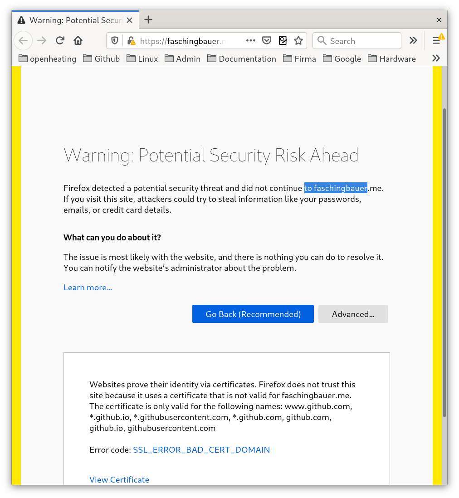
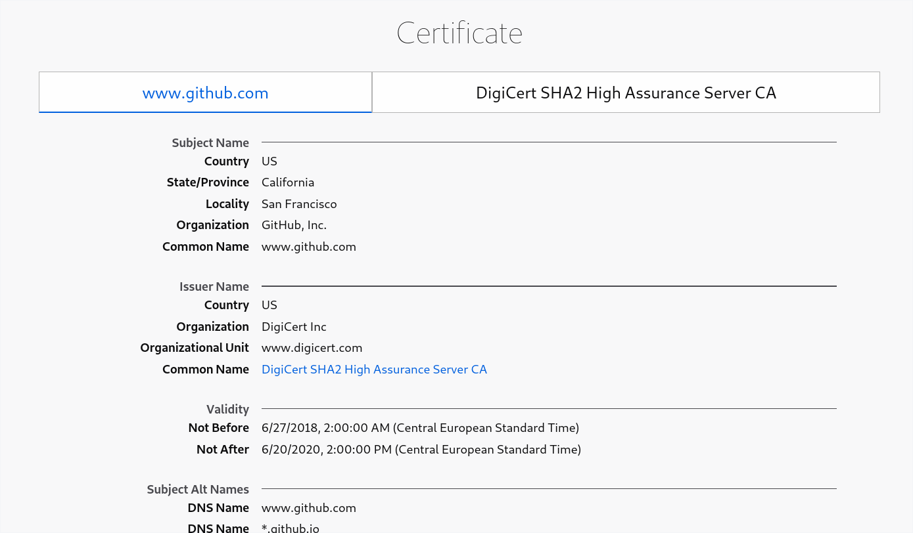
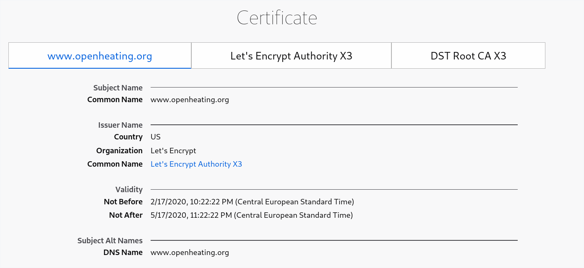

Github Pages with Custom Domain: ``SSL_ERROR_BAD_CERT_DOMAIN``
==============================================================

* Domain ``faschingbauer.me``: SSL problems

  * Apex domain with SSL `https:://faschingbauer.me
    <https:://faschingbauer.me>`__ leads to
    ``SSL_ERROR_BAD_CERT_DOMAIN``
  
    * Apparently this is because it comes with a certificate whose
      *Subject Name* is ``www.github.com``
  
  * Subdomain works: `https:://www.faschingbauer.me
    <https:://www.faschingbauer.me>`__
  
    * *Subject Name* is ``www.faschingbauer.me``

* Domain ``opensource.org``: no SSL problems

  * ``https://opensource.org`` redirects to
    ``https://www.opensource.org``.
  * Both come with certificate for ``www.opensource.org``.

Error on ``https:://faschingbauer.me``
--------------------------------------

   Error message

   Certificate ``www.github.com``

Ok on ``https:://www.faschingbauer.me``
---------------------------------------

.. figure:: https-www-faschingbauer-me--cert-www-faschingbauer-me.png

   DNS name and cert names match

Ok on ``https://openheating.org`` and ``https://www.openheating.org``
---------------------------------------------------------------------

On `OpenHeating <https://openheating.org>`__ there is no problem. It
redirects to `https://www.openheating.org
<https://wwwopenheating.org>`__, and the certificate of that is

Fix Fucking Shit
----------------

.. todo:: more here

* rm CNAME
* wait
* add CNAME again
* try faschingbauer.me. does not work
* try www.faschingbauer.me still works
