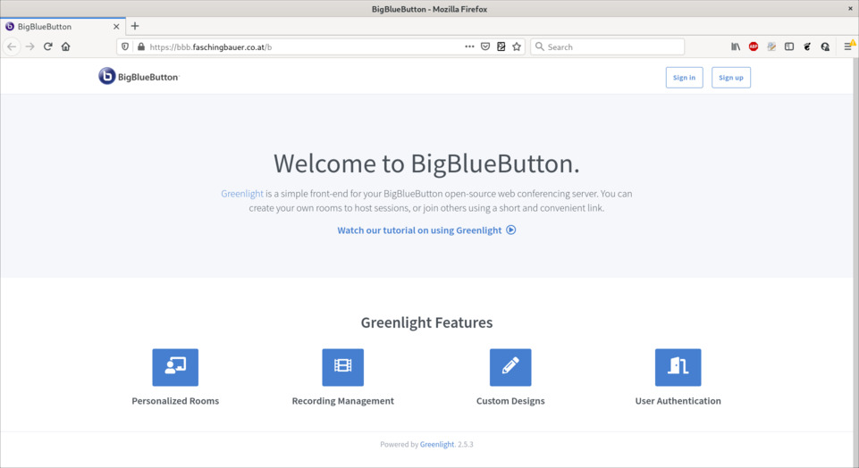
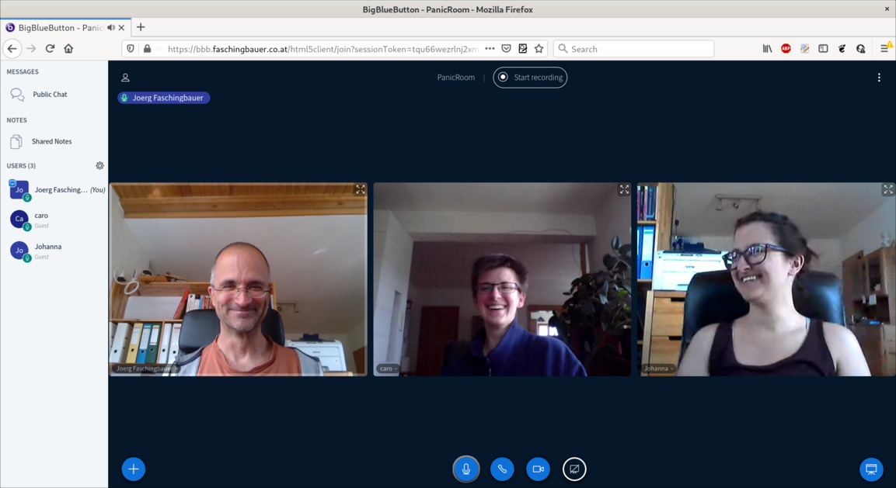

.. post:: 2020-04-19
   :category: training, linux
   :language: en

.. meta::
   :description: Using BigBlueButton for Online Training
   :keywords: online, training, linux, video, conference, virtual,
              classroom, remote

Using BigBlueButton for Online Training
=======================================

.. sidebar:: In this Article

   .. contents::
      :local:

It's the *Age of the Corona Virus*, and I have had opportunity to gain
a little experience with :doc:`Microsoft Teams
</blog/2020/03/ms-teams-on-linux>` and `Zoom <https://zoom.us/>`__
recently. I now know that doing my :doc:`trainings </trainings/index>`
online *is definitely possible* - it is more a matter of attitude
[#need_attitude]_ than a technical problem. Plus: I strongly believe
that it is a shame I haven't pursued this before. This post is an
attempt at correcting that.

Microsoft Teams' and Zoom's focus are online meetings and
collaboration. Moreover, both are *hosted* solutions - you do not
setup software and servers, but rather throw in money **and/or data**
and be done.

A different thing is `BigBlueButton <https://bigbluebutton.org/>`__:
it focuses on *online teaching* which makes it perfect for my
needs. If you care about trust, it has the benefits that

* Software is `open source <https://github.com/bigbluebutton>`__
* You can easily install and host it yourself, which is what this
  article describes. It is also possible to spend money and let
  somebody else do that; see below.

Installing and hosting a solution that beats - *I mean it* - Teams and
Zoom might sound like *a lot of work*. Just how much work that is, is
the topic of this article.

TL;DR
-----

**First: not a lot of work!** I have setup a fully functional
BigBlueButton instance out there in the cloud in less than an hour
(including cloud). And for sure I am not a talented admin.

**Second: it just works!** With the focus on online training, features
include

* Video and audio sharing
* Client runs in the browser; participants do not need to install
  anything
* Whiteboard
* Chats (class wide and one-to-one)
* Breakout rooms
* Fine grained (though easy) administration of users and rooms

With this, BigBlueButton *beats any of the above* regarding feature
set and stability. Note that I do not intend to provide video
streaming to hundreds of thousands, for example, so I cannot say
anything about BigBlueButton in that regard.

Background Information
----------------------

For the curious, here's some meta information along with links I have
gathered while curiously reading around.

**License**. BigBlueButton is licensed under the `LGPL
<http://www.gnu.org/licenses/lgpl.html>`__. See `here
<https://bigbluebutton.org/open-source-license/>`__ for more.

**Source Code** is `hosted on GitHub
<https://github.com/bigbluebutton>`__.

**Commercial support**. `Blindside Networks
<https://blindsidenetworks.com/>`__ is the company who governs
development. Along with a `number of other companies
<https://bigbluebutton.org/commercial-support/>`__, they provide
support and hosting.

**Web client, architecture**. The native HTML5 client is `relatively
new
<https://blindsidenetworks.com/2019/03/15/html5-client-is-coming/>`__,
though exceptionally stable across modern browsers. It heavily depends
on the browser's `WebRTC <https://webrtc.org/>`__ support. Before
that, BigBlueButton used `Flash
<https://en.wikipedia.org/wiki/Adobe_Flash>`__ for their UI; these
times have come to an end fortunately, due to Flash's long and painful
death.

There is more to it than just the browser, naturally - see their
`architecture
<https://docs.bigbluebutton.org/2.2/architecture.html>`__ for more.

Hosting Setup
-------------

I admit I am not a great admin. Programming is fine, and I understand
what The Internet and firewalls are, but maintaining machines and
networks is not something I'm good at, or even like. Consequentially,
I have kept myself out of this business as much as I can. For example,
I have never created a machine in the cloud - knowing that I couldn't
avoid it indefinitely. Time has come, and in case you are in the same
position, then I can tell you it is not rocket science.

Here's what I used for the test setup in this article.

* **Cloud**. `Google Cloud Platform
  <https://cloud.google.com/gcp/getting-started>`__ lets you `setup a
  VM <https://cloud.google.com/compute/docs/quickstart-linux>`__ in no
  time. (Others sure do too.)
* **SSL/TLS**. BigBlueButton's client runs in the browser (using
  `WebRTC <https://webrtc.org/>`__) which is cool. This requires that
  the browser access camera and microphone though - browsers do this
  only when the connection is secured by TLS. Long story short: I
  decadently let the install script generate me a certificate from
  `Let's Encrypt <https://letsencrypt.org/>`__. (This matters when it
  comes to firewall settings.)
* **Domain name**. At my DNS provider, I reserved
  ``bbb.faschingbauer.co.at``; I'll use this domain name in the rest
  of the article.

What follows are the parameters of the VM I provisioned at GCP. Note
that this is only a first shot, so don't take this as real expertise.

* **Machine type**. ``n1-standard-8`` has 8 CPUs and 30G of RAM; this
  should suffice.
* **Boot disk**. Default is Debian, but BigBlueButton requires Ubuntu
  16.04 LTS - change it accordingly. I gave it 500GB of disk space while
  I was at it (10GB appeared a little sparse when it comes to recording
  meetings).
* **External IP address**. Create a static IP. This is where I point
  the DNS address (``A``) record for ``bbb.faschingbauer.co.at``.
* **Firewall** (initial setting). HTTP and HTTPS. HTTPS is mandatory
  (see above). HTTP is necessary for automatic Let's Encrypt
  certificate issuance during the BigBlueButton installation. You can
  remove the rule when done, or `simply leave it in place
  <https://letsencrypt.org/docs/allow-port-80/>`__.

With this, you create the machine. Once that is done, add another
firewall rule,

* **Firewall** (again): permit UDP port range 16384-32768.

Firewall settings are important; here's what I have,

.. image:: gcp-firewall.png

Now login to the machine via SSH (clickable in the GCP window).

BigBlueButton Installation
--------------------------

At first I followed the `step-by-step instructions
<https://docs.bigbluebutton.org/2.2/install.html#step-by-step>`__, but
soon lost track. If you don't have a good understanding of the
architecture, following the `step-by-step instructions
<https://docs.bigbluebutton.org/2.2/install.html#step-by-step>`__
might easily lead to mistakes such as letting TCP/7443 through your
firewall.

At some point I decided that I do *not* have to understand everything,
and switched to the decadent `installation script
<https://github.com/bigbluebutton/bbb-install>`__.

Here I deviate a bit from the `suggestions made for installation
script usage <https://github.com/bigbluebutton/bbb-install>`__. Not
wanting to pipe the internet into ``bash`` (as root), I download the
script first and check what it does (as normal user),

.. code-block:: console

   jf@bbb:~$ wget https://ubuntu.bigbluebutton.org/bbb-install.sh
   jf@bbb:~$ less bbb-install.sh
   jf@bbb:~$ chmod 755 bbb-install.sh
   jf@bbb:~$ ./bbb-install.sh -h
   ...
     -v <version>           Install given version of BigBlueButton (e.g. 'xenial-220') (required)
     -s <hostname>          Configure server with <hostname>
     -l                     Install Let's Encrypt certificate (required)
     -e <email>             Email for Let's Encrypt certbot
     -g                     Install Greenlight
   ...
  
Pure decadence from now on. I even let the script install a
`LetsEncrypt <https://letsencrypt.org/>`__ certificate for me. (I
named the machine ``bbb``, and my login name is ``jf``, hence the
prompt shows ``jf@bbb``.)

.. code-block:: console

   jf@bbb:~$ sudo ./bbb-install.sh \
     -v xenial-220 \
     -s bbb.faschingbauer.co.at \
     -l \
     -e jf@faschingbauer.co.at \
     -g

After roughly 15 minutes, all is set up.

Next, an administrator must be created so you can point your browser
at it and do something meaningful. Apparently, the installation script
does not do that automatically, so one has to manually correct this
minor hiccup.

Login to the machine (with GCP, you just click on the ``SSH`` field in
your VM instance listing), and

.. code-block:: console

   jf@bbb:~$ sudo -i
   root@bbb:~# cd ~jf/greenlight/
   root@bbb:/home/jf/greenlight# docker exec greenlight-v2 bundle exec rake admin:create
   Account succesfully created.
   Email: admin@example.com
   Password: administrator
   Role: admin
   PLEASE CHANGE YOUR PASSWORD IMMEDIATELY
   root@bbb:/home/jf/greenlight# 
   
Done. Point the browser at ``https://bbb.faschingbauer.co.at``, and you'll see BigBlueButton's front page.

 
.. danger::

   As they say,

   **PLEASE CHANGE YOUR PASSWORD IMMEDIATELY**

   Login as stated above ``admin@example.com``, password
   ``administrator``, and modify these credentials to something more
   secure.

Functionality Check
-------------------

Creating a room for a meeting is as easy as clicking on a big fat
button,

.. image:: bbb-room-create.png
   :scale: 120%

Here's a screenshot from a tryout session that I had with the
kids. Video and audio quality no different from other tools, from a
layman's perspective. No glitches.

I haven't used the tool for a real-life training yet, as of
2020-04-21. What I did though, together with the kids, is to try out
some of the features that I knew I am going to use in future
trainings, like

* Whiteboard
* Chats
* Breakout rooms

**Really cool. All there, all working.**

There's no point in reproducing the steps here in this article. I
suggest you take yourself a few minutes to try all those out. All I
can say is that using BigBlueButton is absolutely simple - which
usually means that it is well thought-out.

The Internet (in its Youtube incarnation) has a number of tutorials
for basic and advanced usage. I cite some of them here; they answer
any question I could have had (as well as those I couldn't).

* `"BigBlueButton overview for moderator/presenters (with breakout
  rooms) in BigBlueButton"
  <https://www.youtube.com/watch?v=Q2tG2SS4gXA>`__. By Fred Dixon,
  BigBlueButton project leader.
* `"BigBlueButton (AKA Canvas Conferences) - Student Tutorial"
  <https://www.youtube.com/watch?v=9WGrVCNvNuY>`__. By Bradley
  Schreffler who has a number of good videos. I strongly suggest you
  suggest your students to invest a few minutes upfront, to see what
  they're up to.
* `"BigBlueButton - Frequently Asked Questions"
  <https://www.youtube.com/watch?v=C6GtSQ30Voo>`__. Bradley
  Schreffler, clearing up a number of questions.
* `"BigBlueButton - Advanced and Interactive Features"
  <https://www.youtube.com/watch?v=oHxJ2YuNfxk>`__. Bradley Schreffler
  on a couple of not-so-obvious features.

This list is by far not exhaustive; look out for yourself if you have
questions.

What Else?
----------

This article only covers my personal needs - those of a part-time
trainer who gives online trainings from time to time. There is more to
be had from BigBlueButton though, only some of which I list here.

* It integrates with `Moodle <https://moodle.org/>`__; see `here
  <https://moodle.com/certified-integrations/bigbluebutton/>`__ for
  more.
* It integrates with `a large number of other systems
  <https://bigbluebutton.org/integrations/>`__ that I have never heard
  of.
* Apparently the developers have good taste, which can be seen from
  `the API they provide
  <https://docs.bigbluebutton.org/dev/api.html>`__.

It looks like the Corona era will not come to an end as fast as we
might wish. Many people like me are currently looking for a way to
carry on with their business, only in its online form. Whatever it
will look like, my hope is that some of it will make its way into
normality - whatever the definition of normality will be once we have
returned to "business as usual".

BigBlueButton and the set of involved companies have no marketing
budget large enough to advertise their services on TV. Nevertheless,
they are able to provide a viable alternative to those who just shout
loud enough.

.. rubric:: Footnotes

.. [#need_attitude] It's not like my online training capabilities are
                    perfect. Not even my face to face capabilities
                    are.
		    
