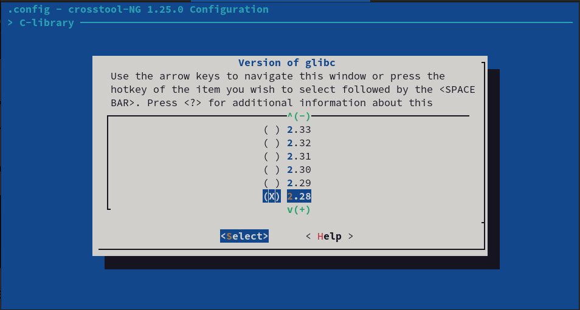
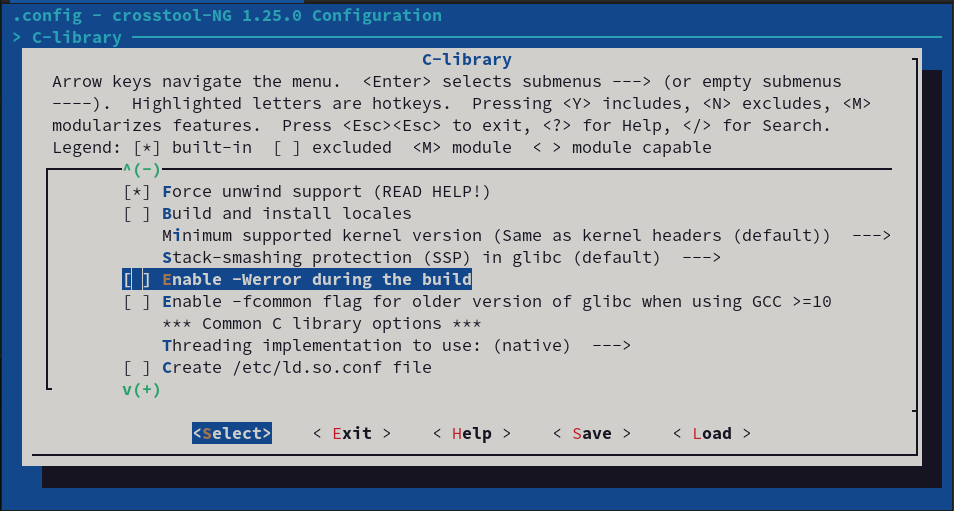
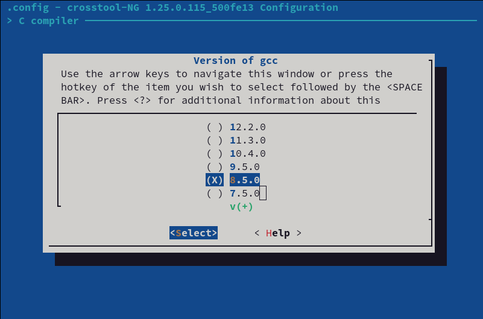

.. post:: 2022-09-23
   :category: embedded, linux, raspberry
   :language: en

.. meta::
   :description: crosstool-ng - built Raspberry Pi Cross Toolchain 
   :keywords: cross development, raspberry pi, linux, crosstool-ng, gcc, c++

Building A Cross Toolchain For The Raspberry Pi, Using ``crosstool-ng``
=======================================================================

.. contents::
   :local:

Why This Article? Why Not Use A Prebuilt Toolchain?
---------------------------------------------------

* There `used to be <https://github.com/raspberrypi/tools>`__ a
  toolchain for the Raspberry Pi, made by the `Raspberry Pi OS
  <https://www.raspberrypi.com/software/>`__ creators. Sadly, this
  repository has been dead since years.
* One popular toolchain, `Linaro
  <https://snapshots.linaro.org/gnu-toolchain/>`__, is widely
  recommended for the Raspberry. It does not work for C++ though - its
  ``libstdc++`` has an unsatisfied version dependency on
  ``libpthread``.
* A number of other Raspberry toolchains exist out there, but I either
  didn't get them to work at all (see the ``glibc`` :ref:`version
  dependency <glibc-version>`), or didn't get them to work for C++.

.. contents::
   :local:

Prebuilt toolchains may work for C, but I failed to find one that
works for C++. The amount of work that I invested in finding one was,
in my opinion, totally wasted. Building a toolchain yourself is not at
all hard, provided that you bring basic Linux understanding (which you
should if you program for it).

In my opinion (please given me :doc:`feedback
</about/myself/index>`), this article describes the most
close-to-correct way to build a toolchain for a target that does not
come with a toolchain. Although I describe the situation for the
Raspberry (because that was my primary intention), it will sure work
for *any* target.

Installing ``crosstool-ng``
---------------------------

Below is a writeup of how I installed ``crosstool-ng`` (running
Fedora, I chose to install from a released tarball) . Please read
through their `installation documentation
<https://crosstool-ng.github.io/docs/install/>`__ for your particular
situation.

Prerequisites
.............

``crosstool-ng`` requires one to install a number of packages
first. Thankfully, they do thorough testing in Docker, and the list of
dependencies can be taken from the Docker file for your OS (see `here
<https://github.com/crosstool-ng/crosstool-ng/tree/master/testing/docker>`__).

.. code-block:: console
   :caption: Dependencies for Fedora

   root@host # dnf install autoconf gperf bison file flex texinfo help2man gcc-c++ libtool make patch \
       ncurses-devel python3-devel perl-Thread-Queue bzip2 git wget which xz unzip rsync diffutils \
       meson ninja-build

.. code-block:: console
   :caption: Dependencies for Ubuntu

   root@host # apt install -y gcc g++ gperf bison flex texinfo help2man make libncurses5-dev \
       python3-dev autoconf automake libtool libtool-bin gawk wget bzip2 xz-utils unzip \
       patch libstdc++6 rsync git meson ninja-build

Installing From Cloned Git Repository
.....................................

.. note::

   At one point, ``ct-ng`` (as installed from the release tarball)
   failed to build toolchains because it tried to download a version
   of ``zlib`` that did not exist anymore:

   .. code-block:: console

      [EXTRA]    Retrieving 'zlib-1.2.12'
      [ERROR]    zlib: download failed

   The issue had already been resolved in the upstream repository, but
   no tarball release had been made. So building ``crosstool-ng`` from
   source is in order.

The steps are basically the same as installing from the release
tarball, except that some massaging (yes, autotools) in the source
directory is necessary prior to building.

Clone repository, and massage source tree:

.. code-block:: console

   me@host$ git clone https://github.com/crosstool-ng/crosstool-ng
   me@host$ cd crosstool-ng/
   me@host$ sh ./bootstrap
   me@host$ ./configure --prefix=/home/jfasch/cross
   me@host$ make
   me@host$ make install

Installing From Release Tarball
...............................
 
As complained above, releases might be out of date. Anyway, the
procedure is slightly simpler that building from the upstream repo
source. Download latest release `here
<https://crosstool-ng.github.io/download/>`__); current version as of
this writing is ``1.25.0``.

.. code-block:: console

   me@host$ wget http://crosstool-ng.org/download/crosstool-ng/crosstool-ng-1.25.0.tar.xz
   me@host$ tar xf crosstool-ng-1.25.0.tar.xz
   me@host$ cd crosstool-ng-1.25.0/
   me@host$ ./configure --prefix=/home/jfasch/cross
   me@host$ make
   me@host$ make install

``PATH``, And Basic Test
........................

Add ``ct-ng`` to ``PATH``,

.. code-block:: shell
   :caption: You may want to add this to ``~/.bashrc``

   me@host$ export PATH=$HOME/cross/bin:$PATH

Test if all is well,

.. code-block:: console

   me@host$ ct-ng help
   This is crosstool-NG version 1.25.0
   
   Copyright (C) 2008  Yann E. MORIN <yann.morin.1998@free.fr>
   This is free software; see the source for copying conditions.
   There is NO warranty; not even for MERCHANTABILITY or FITNESS FOR A
   PARTICULAR PURPOSE.
   ...

Configure Toolchain Build
-------------------------

``ct-ng`` toolchain build configuration works a lot like the Linux
kernel's configuration system (a little less elaborate though). There
are a number of base configurations to choose from (we need a
Raspberry config), and, having chosen one, you can tune it to your
needs.

Base Configuration For The Raspberry
....................................

.. code-block:: console

   me@host$ ct-ng list-samples|grep rpi
   [G...]   aarch64-rpi3-linux-gnu
   [G...]   aarch64-rpi4-linux-gnu
   [G...]   armv7-rpi2-linux-gnueabihf
   [G...]   armv8-rpi3-linux-gnueabihf
   [G...]   armv8-rpi4-linux-gnueabihf

Mine is a Pi 4, still running the (still default) 32 bit version, so I
create a ``.config`` file for that,

.. code-block:: console

   me@host $ ct-ng armv8-rpi4-linux-gnueabihf
   me@host $ ls -l .config
   -rw-r--r--. 1 jfasch jfasch 23179 Sep 23 08:18 .config

.. _glibc-version:

Important: ``glibc`` Version
............................

The Error
`````````

Executables built by your toolchain won't work if the toolchain links
against a C library whose version is higher than what is present on
the target. Continuing with the above default configuration, and just
saying ``ct-ng build`` will likely result in an error
[#glibc-default-version]_.

A minimal ``int main() { return 0; }`` program, compiled for the
target, will complain:

.. code-block:: console

   me@target $ ./a.out
   ./a.out: /lib/arm-linux-gnueabihf/libc.so.6: version `GLIBC_2.34' not found (required by ./a.out)

Background is that ``glibc`` employs `ELF symbol versioning
<https://refspecs.linuxfoundation.org/LSB_3.0.0/LSB-PDA/LSB-PDA.junk/symversion.html>`__
a lot. Key point is that an executable which links against version,
say, `2.34` (which is the ``ct-ng`` default), will require the symbol
``GLIBC_2.34`` in the C library, and fail to load if the target
``glibc`` version is, say, ``2.28`` [#my-situation]_. That version
obviously cannot have ``GLIBC_2.34``, so the executable cannot load.

Find out location of ``glibc``,

.. code-block:: console

   me@target $ ldd /usr/bin/ls
           ...
           libc.so.6 => /lib/arm-linux-gnueabihf/libc.so.6 (0xb6e06000)
           ...
 
Simply *invoke* (sic!) the library,

.. code-block:: console

   me@target $ /lib/arm-linux-gnueabihf/libc.so.6
   GNU C Library (Debian GLIBC 2.28-10+rpt2+rpi1+deb10u1) stable release version 2.28.
   ...

The Fix
```````

So, it's ``2.28``. Back on the *host* again, tune configuration:

.. code-block:: console

   me@host $ ct-ng menuconfig

In ``C-library -> Version of glibc``, choose ``2.28``.



Minor quirk: version ``2.28`` does not build without warnings, so one
has to disable ``-Werror`` during its build,



Important: GCC Version
......................

Not only is the Pi's ``glibc`` version rather outdated; GCC is also a
bit behind - it's ``8.3.0``.

The Error
`````````

Using the latest supported GCC version (``12.2.0`` as of this writing)
as a cross compiler, A less trivial C++ program fails to start:

.. code-block:: console

   ./a.out: /lib/arm-linux-gnueabihf/libstdc++.so.6: version `GLIBCXX_3.4.29' not found (required by ./a.out)
   ./a.out: /lib/arm-linux-gnueabihf/libstdc++.so.6: version `GLIBCXX_3.4.26' not found (required by ./a.out)

It turns out that the program makes use of the ``std::filesystem``
library that has been added in C++17. Apparently that library uses
some more modern functionality from GCC's C++ support library,
``libgcc_s.so.1``. That functionality is obviously not contained in
``libgcc_s.so.1`` as of GCC ``8.3.0``

The Fix
```````

Downgrade the toolchain's GCC to something like ``8.3.0`` (``8.5.0``
is just a minor release, so it should work).

In ``C compiler -> Version of gcc``, choose ``8.5.0``:



Toolchain Build/Install
-----------------------

This is as simple as saying,

.. code-block:: console

   me@host $ ct-ng build

By default [#ct-prefix]_, the toolchain is installed in
``$HOME/x-tools/armv8-rpi4-linux-gnueabihf/`` (you may want to add
``$HOME/x-tools/armv8-rpi4-linux-gnueabihf/bin/`` to ``$PATH``).

For build system configuration (see for example
:doc:`/trainings/material/soup/linux/toolchain/cmake/cross`),

.. list-table::

   * * ``PATH`` (best in ``~/.bashrc``)
     * ``$HOME/x-tools/armv8-rpi4-linux-gnueabihf/bin``
   *
     * Sysroot; in CMake toolchain files (see
       :doc:`/trainings/material/soup/linux/toolchain/cmake/cross`,
       "Toolchain Files"), this is

       * ``CMAKE_FIND_ROOT_PATH``
       * ``CMAKE_SYSROOT``

     * ``$HOME/x-tools/armv8-rpi4-linux-gnueabihf/armv8-rpi4-linux-gnueabihf``

Test
----

I tested the toolchain from a number of viewpoints that I describe
below.

Simplest: C, ``<stdio.h>``
..........................

Check for availability of ``libc``.

.. literalinclude:: c-stdio.c
   :caption: :download:`c-stdio.c`
   :language: c

.. code-block:: console

   me@host $ ~/x-tools/armv8-rpi4-linux-gnueabihf/bin/armv8-rpi4-linux-gnueabihf-gcc c-stdio.c 
   me@host $ scp a.out me@target:
   me@host $ ssh me@target ./a.out
   Hello World

C++, ``<iostream>``
...................

Check for availability of ``libstdc++``.

.. literalinclude:: c++-iostream.cpp
   :caption: :download:`c++-iostream.cpp`
   :language: c++

.. code-block:: console

   me@host $ ~/x-tools/armv8-rpi4-linux-gnueabihf/bin/armv8-rpi4-linux-gnueabihf-g++ c++-iostream.cpp 
   me@host $ scp a.out me@target:
   me@host $ ssh me@target ./a.out
   Hello World

C++, ``<thread>``
.................

Check for availability of ``libpthread``.

.. literalinclude:: c++-thread.cpp
   :caption: :download:`c++-thread.cpp`
   :language: c++

.. code-block:: console

   me@host $ ~/x-tools/armv8-rpi4-linux-gnueabihf/bin/armv8-rpi4-linux-gnueabihf-g++ -pthread c++-thread.cpp 
   me@host $ scp a.out me@target:
   me@host $ ssh me@target ./a.out
   Hello Thread
   Bye

Packaging/Distributing The Toolchain
------------------------------------

The toolchain is fully relocatable. Although
``$HOME/x-tools/armv8-rpi4-linux-gnueabihf/`` contains the cross
toolchain *together* with the :doc:`sysroot
</trainings/material/soup/linux/toolchain/cross/basics>`, even if you
move it around it will remain self-contained.

Pack it into an archive,

.. code-block:: console

   $ tar -C ~/x-tools -J -c -f raspberry-pi-toolchain.tar.xz armv8-rpi4-linux-gnueabihf/

And share it with your colleagues.

Afterword
---------

I hope I could help you with this article. Share it if I could, or, if
I couldn't, feel free to send me an :doc:`email
</about/myself/index>` explaining why.

Either way: cross development is not easy, given the huge number of
dependencies between target libraries. This is a rather complex and
fragile thing, and there are sure better ways to do cross development
than the one that I describe here. Ideally, a target vendor (in our
case, the guys who create `Raspberry Pi OS
<https://www.raspberrypi.com/software/>`__) would release an SDK that
developers could install, and that contained *all* that is necessary
to do cross development. This would be the toolchain and associated
basic runtime libraries (described here), and the entire *sysroot* of
the target.

Creating such an SDK is the job of higher level tools like `Yocto
<https://www.yoctoproject.org/>`__ or `Buildroot
<https://buildroot.org/>`__ - but this is another story.

.. rubric:: Footnotes

.. [#my-situation] That describes the situation that I encountered;
                   yours might be a little different.

.. [#ct-prefix] You change the installation prefix by setting the
                ``CT_PREFIX`` environment variable prior to building,

		.. code-block:: console

		   $ CT_PREFIX=/some/other/location ct-ng build

.. [#glibc-default-version] As of this writing, ``ct-ng`` chooses the
                            GNU C Library version ``2.34``. Your
                            situation might be different, the
                            principle remains the same.
