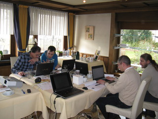

Schulungen
==========

Mir ist es sehr wichtig, Schulungen ausschliesslich über solche Themen
anzubieten, in denen ich selbst lange genug tätig bin und in denen ich
genügend Erfahrung besitze. Zum Beispiel möchte ich gerne eines Tages
eine Schulung über `Git <http://git-scm.com/>`__ anbieten - bis dahin
ist es allerdings noch ein langer Weg. Ich lerne noch.

Termine, Buchung
----------------

Offene Schulungen [#offene_schulung]_ werden durch Partner angeboten;
Sie finden eine Liste an geplanten Terminen bei der jeweiligen
Schulungsbeschreibung.

Inhouseschulungen [#inhouse_schulung]_ werden in Absprache mit der/dem
Buchenden terminisiert - genauso wie ihr Inhalt zustandekommt. Ich bin
hier zeitlich und örtlich so flexibel wie es der Kalender zulässt.

Unterlagen
----------

Die Schulungsunterlagen sind durchwegs in Englisch; die Kurse selbst
werden wahlweise in Deutsch oder Englisch gehalten.

Der Großteil der Unterlagen ist noch in gutem altem Latex geschrieben
(`Latex Beamer, ein Folienpaket
<https://en.wikipedia.org/wiki/Beamer_(LaTeX)>`__). Einen Teil dieser
finden Sie als vorcompilierte PDFs :doc:`hier
</training-material/index>`.

.. sidebar:: Download

   Ein Großteil der Unterlagen ist :doc:`hier
   </training-material/index>` als Download verfügbar.

Work in Progress: S5 Web Slides
...............................

*Work in Progress* ist die Konvertierung der Folien nach `S5
<https://meyerweb.com/eric/tools/s5/>`__, beziehungsweise nach
`reStructuredText <https://docutils.sourceforge.io/rst.html>`__, aus
dem mit Hilfe von `rst2s5
<https://docutils.sourceforge.io/docs/user/slide-shows.html>`__ S5
Slides generiert werden. Das macht insofern Sinn, als die ganze Seite
hier in `Sphinx <https://www.sphinx-doc.org/en/master/>`__ verfasst
ist, das seinerseits auf reStructuredText aufbaut.

Den Status dieser Konvertierung (inklusive Links zu den Slides) können
Sie :doc:`hier </training-material/index>` einsehen.

Gehaltene Schulungen
--------------------

:doc:`Hier <records/index>` finden Sie ein Liste von bereits
gehaltenen Schulungen, inklusive Anmerkungen.

.. toctree::
   :maxdepth: 2

   records/index

.. rubric:: Fußnoten

.. [#offene_schulung] Zu einer "offenen Schulung" kann sich jeder
                      anmelden - sie ist öffentlich.
.. [#inhouse_schulung] "Inhouseschulung" ist eine Schulung, die
                       exklusiv für eine Firma gehalten wird -
                       üblicherweise am Firmenstandort.
