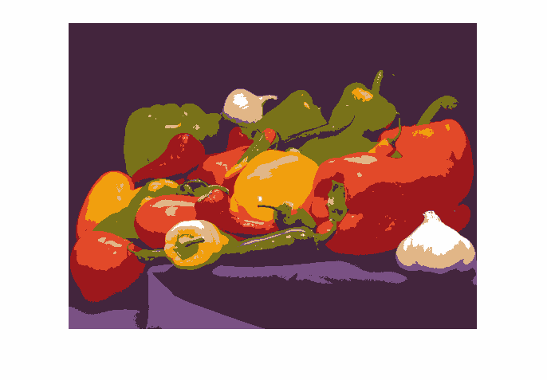

.. meta::
   :description: Vor- und Nachbearbeitung eines zweitägigen Python
                 Trainings
   :keywords: schulung, training, programming, python

Python (12.11.2019 - 14.11.2019 in Graz)
========================================

.. toctree::
   :hidden:
   :maxdepth: 1

   code/BigPlan.ipynb
   code/LiveHacking.ipynb

.. sidebar:: Inhalt

   .. contents::
      :local:

.. sidebar:: Material

   * :doc:`Schulungsbeschreibung
     </trainings/repertoire/python-basics>`
   * :download:`PDF </trainings/material/pdf/300-python.pdf>`

Standardthemen
--------------

Die Datentypen, und das "Normale" an Python waren schnell erklärt. Ich
kanns nicht lassen, bevor die Anfängerthemen vorbei sind, auf dem
Besten von Python herumzureiten: Iteration und Generatoren. Hier hatte
ich eine kleine Demo gehackt - zum x-ten mal. Das ganze Fibonacci-Zeug
gibts jetzt als :doc:`Live-Hacking-Screenplay
</trainings/material/soup/python/python_1010_generators_yield/screenplay>`

Das Hauptthema: Numerik, NumPy
------------------------------

Siehe dazu auch :doc:`ein Jupyter Notebook "BigPlan" <code/BigPlan>`
(:download:`download <code/BigPlan.ipynb>`).

Der Chef hat mir bei einem Vorgespräch ein Übungsbeispiel für die
Teilnehmer mitgegeben: ausgehend von einem Spektralbild (sagt man
so?), verwende den `K-Means Clusteringalgorithmus
<https://en.wikipedia.org/wiki/K-means_clustering>`__, um die Bereiche
auf dem Bild zu kategorisieren (die abgebildeten Stücke zu erkennen).

Ich hab mir erlaubt, für die Kursvorbereitung
[#ich_nix_bildverarbeitung]_ so quasi als Appetizer das Problem etwas
zu reduzieren: Farbreduktion eines Bildes (auf 8 Farben). Das Programm
(siehe unten) verwendet

* `Pillow <https://pillow.readthedocs.io/en/3.1.x/index.html>`__, um
  Bilddaten zu lesen und schreiben. Die Library interoperiert nahtlos
  mit `NumPy <https://numpy.org/>`__, was sicher kein Zufall ist.
* `NumPy <https://numpy.org/>`__, um die Alpha-Plane des
  Ausgangsbildes abzuschneiden und zu restoren.
* `Den K-Means Algorithmus aus scikit-learn
  <https://scikit-learn.org/stable/modules/generated/sklearn.cluster.KMeans.html>`__,
  um das Clustering jemand anders machen zu lassen.

.. figure:: code/veggie.png

   Ausgangsbild ``veggie.png``: viele Farben

   Reduziertes Bild ``veggie-reduced.png``: Acht Farben

Das Programm ist überschaubar - es verwendet nur Libraries und macht
nichts selbst (das ist der Plan, immer, beim Programmieren). Die
Ausdrucksstärke von Python macht sich hier bemerkbar durch z.B. die
Slice-Syntax (wegschneiden der Alpha-Plane), oder beim Iterieren
mittels ``enumerate()``.

.. literalinclude:: code/color-reduce.py
   :caption: :download:`code/color-reduce.py`
   :language: python

Lesen von ``.mat`` Files
------------------------

Das Spektralbild liegt im ``.mat`` Format vor - was immer das ist, hat
wahrscheinlich mit MATLAB zu tun. Etwas Recherche hat ergeben, dass
die `Funktion
<https://docs.scipy.org/doc/scipy/reference/generated/scipy.io.loadmat.html?highlight=loadmat#scipy.io.loadmat>`__
``scipy.io.loadmat()`` das kann. Hier ein kleines Testprogramm,

.. literalinclude:: code/mat.py
   :caption: :download:`code/mat.py`
   :language: python

Lösen einer Uni-Übung
---------------------

Ein Teilzeitmitarbeiterin der Firma, sie studiert Physik neben der
Arbeit, muss für eine Übung ... was weiss ich ... machen. Wie auch
immer, der Input für ihre Arbeit liegt in folgendem bekackten
Inputformat vor, das es zu parsen gilt. War eine nette
Zwischendurch-Gruppenarbeit.

.. literalinclude:: code/franziska/H2O.dat.txt
   :caption: :download:`code/franziska/H2O.dat.txt`

Der Code, mit dem wir nach einigen Runden Nachdenkens einigermaßen
zufrieden waren, sieht so aus,

.. literalinclude:: code/franziska/dat.py
   :language: python
   :caption: :download:`code/franziska/dat.py`

.. rubric:: Footnotes

.. [#ich_nix_bildverarbeitung] Ich hatte von Bildverarbeitung keine
                               Ahnung
