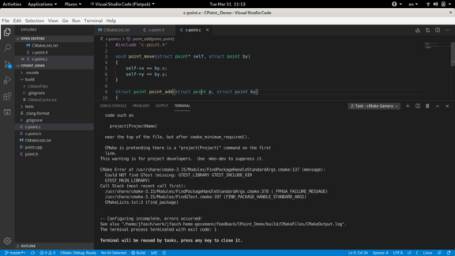

Argh: Using This Site With Visual Studio Code
=============================================

Flatpak
-------

`Install flatpak vscode version
<https://fedoraproject.org/wiki/Visual_Studio_Code>`__

.. code-block:: console

   $ flatpak install https://flathub.org/repo/appstream/com.visualstudio.code.flatpakref

Issues
......

Flatpak is a package format that bundles application together with
their dependencies. Usually, the dependencies are shared libraries
that the application requires, and which might not be installed on the
system in exactly that version. This is a stone old problem, and
flatpak (and Ubuntu's snap) is an attempt to solve that problem - by
letting the application *bundle* its dependencies. And isolate that
inside a container-like world so it can restrict its access.

Anyway: vscode flatpak appears to bundle a version of cmake that
cannot (at least) determine the ``googletest`` install.

For those of us who don't like screenshots so much (me I like copying
the error message into the browser's search field, and I hate
screenshots), here's a textual screenshot,

.. code-block:: console

   CMake Error at /usr/share/cmake-3.15/Modules/FindPackageHandleStandardArgs.cmake:137 (message):
     Could NOT find GTest (missing: GTEST_LIBRARY GTEST_INCLUDE_DIR
     GTEST_MAIN_LIBRARY)
   Call Stack (most recent call first):
     /usr/share/cmake-3.15/Modules/FindPackageHandleStandardArgs.cmake:378 (_FPHSA_FAILURE_MESSAGE)
     /usr/share/cmake-3.15/Modules/FindGTest.cmake:197 (FIND_PACKAGE_HANDLE_STANDARD_ARGS)
     CMakeLists.txt:3 (find_package)
   
   
   -- Configuring incomplete, errors occurred!
   See also "/home/jfasch/work/jfasch-home-gessmann/feedback/CPoint_Demo/build/CMakeFiles/CMakeOutput.log".
   The terminal process terminated with exit code: 1

Hmm. Sigh. Bundling. I'd have liked to cram vscode into a jail, but
no.

RPM From M$
-----------

Use instructions from `here
<https://code.visualstudio.com/docs/setup/linux>`__, and it'll
work. Sigh.
