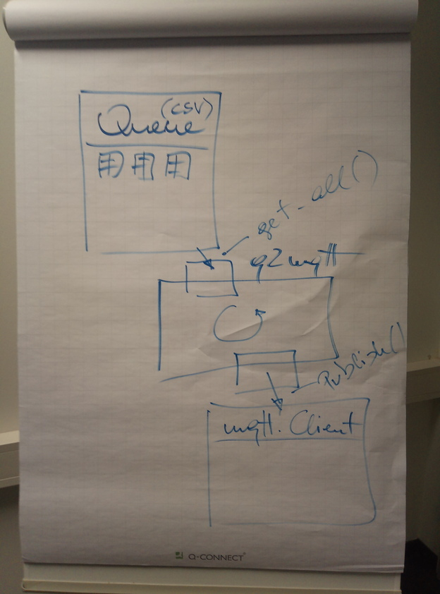
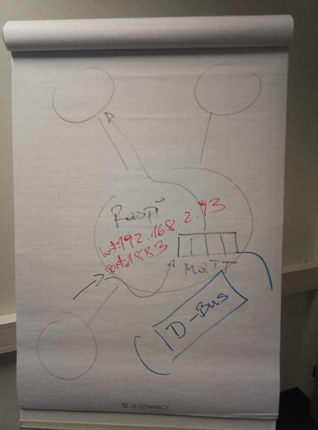

2021-03-15
==========

.. contents::
   :local:

Exercises (auf Github)
----------------------

.. code-block:: shell

   $ git clone https://github.com/jfasch/2021-02-22.git

Jupyter Notebook
----------------

.. sidebar:: Download

   :download:`Notebook.ipynb`

.. toctree::

   Notebook

Log
---

* Tag 1 und 1/2 2: siehe notebook
* Tag 1/2 2 und 3

  * File IO
  * OO Basics
  * Github Exercise
  * :doc:`/trainings/material/soup/python/misc/mqtt/topic` Diskussion

  * Unittesting

