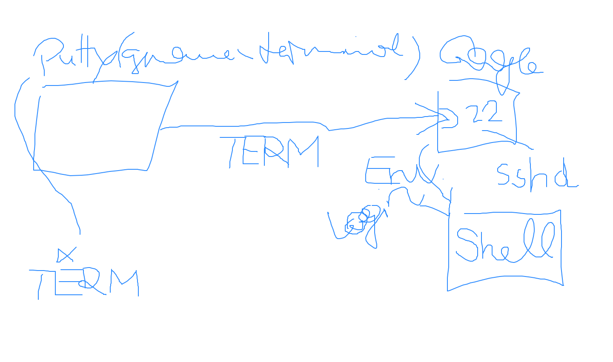

Linux Basics, Shell Scripting (2019-03-29)
==========================================

.. contents::
   :local:

.. sidebar:: Course Details

   * Start: 9:00 (see MS Teams invitation)
   * Linux Basics (:download:`Download
     </trainings/material/pdf/010-linux-basics.pdf>`)
   * Shell Scripting (:download:`Download
     </trainings/material/pdf/100-shell-scripting.pdf>`)
   * `Github Repository <https://github.com/jfasch/2021-03-29>`__
   * :download:`Bash help sheet
     </trainings/material/misc/bash-help-sheet.pdf>`
   * :download:`Readline Emacs Editing Mode Cheat Sheet
     </trainings/material/misc/readline-emacs-editing-mode-cheat-sheet.pdf>`

Agenda
------

* Day 1

  * Linux and UNIX concepts
  * Commandline: using the shell efficiently
  * Filesystem and permissions

* Day 2

  * Tools: ``cat``, ``cut``, ``head``, ``tail``, ``grep``, and the
    like
  * The pipe
  * Exercises: combine things to solve problems

* Day 3

  * Shell scripting: Variables
  * Control flow: ``if``, ``while``
  * Exercises

* Day 4

  * Functions
  * Subshells
  * Parameter expansion, here-documents, and more details
  * Exercises
  

Course Preparation
------------------

We will be using a Linux machine somewhere in the cloud, IP address
``34.107.39.200``.  Please verify that you are able to login as
follows (substitute my username with yours),

* From a Linux system, use the ``ssh`` program (substitute my username
  with yours)

  .. code-block:: console
  
     $ ssh faschingbauer.joerg@34.107.39.200
     The authenticity of host '34.107.39.200 (34.107.39.200)' can't be established.
     ECDSA key fingerprint is SHA256:/in22o4VCD400X0bb4FlCb5/vQnrvKvOirgfqq6maPo.
     Are you sure you want to continue connecting (yes/no/[fingerprint])? yes
     Warning: Permanently added '34.107.39.200' (ECDSA) to the list of known hosts.
     faschingbauer.joerg@34.107.39.200's password: 
     Linux fh-ece-19 4.19.0-14-cloud-amd64 #1 SMP Debian 4.19.171-2 (2021-01-30) x86_64
     
     The programs included with the Debian GNU/Linux system are free software;
     the exact distribution terms for each program are described in the
     individual files in /usr/share/doc/*/copyright.
     
     Debian GNU/Linux comes with ABSOLUTELY NO WARRANTY, to the extent
     permitted by applicable law.
     Last login: Sat Feb 27 15:04:09 2021 from 77.119.129.226
     faschingbauer.joerg@fh-ece-19:~$ 

* From a Windows system, use `PuTTY <https://www.putty.org/>`__ to do
  the same.

  .. raw:: html

     <iframe
         width="560" 
	 height="315" 
	 src="https://www.youtube.com/embed/umFEuHWJW3w" 
	 frameborder="0" 
	 allow="accelerometer; autoplay; clipboard-write; encrypted-media; gyroscope; picture-in-picture" 
	 allowfullscreen>
     </iframe>

Log
---

Day 1
.....

Linux Basics (:download:`download
</trainings/material/pdf/010-linux-basics.pdf>`), heading straight
through to the "Permissions" chapter startung on slide #92.

Exercises
`````````

* *Change Password*

  Your password on our cloud machine equals your username. From a
  security standpoint, this is suboptimal - if anybody knows your
  username, you're `pwned <https://haveibeenpwned.com/>`__.

  Change your password.

* *Create an alias*

  ``ls -al DIR`` shows a long listing of ``DIR`` (including "hidden"
  files). ``ls -al`` is relatively clumsy to type, clumsier than
  e.g. ``x``.

  For your comfort, create an alias to solve this problem. Do this in
  a way that makes the alias automatically available on next login.

* ``echo`` *suppressing linefeed*

  The ``echo`` command appends a linefeed (aka newline) to its output,

  .. code-block:: console

     $ echo this is a line because it has a newline at the end
     this is a line because it has a newline at the end
     $

  (You can see the newline character because the next prompt appears
  on a new line.)

  Which option makes ``echo`` suppress the newline character? (The
  next prompt appears right after the output, on the same line.)

* *Show file content*

  In my (username ``faschingbauer.jörg``) home directory, there exists
  a subdirectory ``dumpbin``, and inside that directory exists a file
  ``easter``.

  Print the file content on the console.

* *Create dumpbin, and give colleagues write permissions*

  In your hmoe directory, create a ``dumpbin`` directory. Give your
  colleagues write permissions in that directory (btw, a colleague is
  one of the ``frcoll`` group).

* *Create a file in your colleague's dumpbin, and write-protect that
  file against the colleague*

Day 2
.....  

Again from Linux Basics (:download:`download
</trainings/material/pdf/010-linux-basics.pdf>`)

* Permissions, again (*this is important!*)
* Tools, including some live demos of pipe usage
* ``stdin``, ``stdout``, pipe short demos



   How PuTTY/SSH *terminals* play together with the SSH daemon
