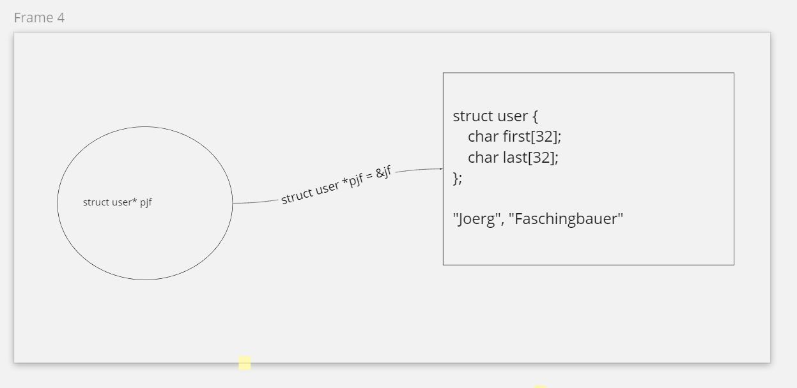

.. include:: <mmlalias.txt>

Programmieren mit C (2021-06-14 - 2021-06-18)
=============================================

.. sidebar:: *Training Information*

   **Start**

   Montag 14.6.2021, 9:00

   **Offizielle Beschreibung**

   `tecTrain
   <https://www.tectrain.at/seminare/seminar-themen/programmierung/c-grundlagen-fuer-programmierer>`__

   **Material**

   * Slides, :download:`C </trainings/material/pdf/050-c.pdf>`
   * Slides, :download:`CMake </trainings/material/pdf/045-cmake.pdf>`
   * Slides, :download:`GNU Make </trainings/material/pdf/040-gnu-make.pdf>`
   * `Github Repository <https://github.com/jfasch/2021-06-14>`__

   **CPA Exam**

   * `Sample Questions
     <https://cppinstitute.org/wp-content/uploads/2016/07/CPA_sample_exam_questions.pdf>`__

.. contents::
   :local:

Preparation: Tools
------------------

* `C/C++ for Visual Studio Code <https://code.visualstudio.com/docs/languages/cpp>`__
* `Get started with CMake Tools on Linux
  <https://code.visualstudio.com/docs/cpp/cmake-linux>`__
* `CMake download <https://cmake.org/download/>`__

Log
---

Day 1
.....

* Introduction (from the :download:`C slides
  </trainings/material/pdf/050-c.pdf>`)

  * Hello World
  * Variables and Arithmetic
  * ``for`` Loops
  * Symbolic Constants
  * Character I/O

* Occasional live hacking

  * `hello.c <https://github.com/jfasch/2021-06-14/blob/main/live-hacking/hello.c>`__
  * `fahr.c <https://github.com/jfasch/2021-06-14/blob/main/live-hacking/fahr.c>`__
  * `fahr-for.c <https://github.com/jfasch/2021-06-14/blob/main/live-hacking/fahr-for.c>`__
  * `wc.c
    <https://github.com/jfasch/2021-06-14/blob/main/live-hacking/wc.c>`__. This
    is going to be morphed into a formal state machine tomorrow.

Day 2
.....

State machine
`````````````
It turns out that the correct solution to exercise on slide 37 of
:download:`the slide deck </trainings/material/pdf/050-c.pdf>` is a
*state machine*. It enables us to correctly cover all corner cases
(e.g. multiple consecutive spaces between two words) ...

  .. image:: state-machine.jpg
     :scale: 20%

* `wc.c <https://github.com/jfasch/2021-06-14/blob/main/wc.c>`__
  became a state machine, implementing the above state chart. Using
  ``if-then-else`` to cover the states.
* Introduced the ``switch`` statement (slightly :-) deviating from the
  regular course flow); changed the state maching to use that instead
  of ``if-then-else``. See `wc-switch.c
  <https://github.com/jfasch/2021-06-14/blob/main/wc-switch.c>`__

Regular Course Topics
`````````````````````

* Introduced pre and post increment operators (again severely
  deviating). See `pre-post-increment.c
  <https://github.com/jfasch/2021-06-14/blob/main/pre-post-increment.c>`__.
* Ah, arrays: leading to the "histogram" exercise (slide 41 from the
  :download:`slides </trainings/material/pdf/050-c.pdf>`). Solution see
  `here on Github <https://github.com/jfasch/2021-06-14/blob/main/histogram.c>`__
* Functions. Slides 44ff. from the :download:`slides
  </trainings/material/pdf/050-c.pdf>` (the ``power()`` function from
  the K&R book) as a live hacking gig. `See here on Github
  <https://github.com/jfasch/2021-06-14/blob/main/power-function.c>`__.
* Quick :download:`CMake </trainings/material/pdf/045-cmake.pdf>`
  intro, as a preparation for the upcoming group project. Confusing
  people.

Day 3
.....

Development Tools (Git & CMake) Installation Massacre
`````````````````````````````````````````````````````

* *Git*. See `here
  <https://code.visualstudio.com/docs/editor/versioncontrol>`__ for
  instructions about how to use Git with VS Code. It turns out that

  * `Git Extension Pack
    <https://marketplace.visualstudio.com/items?itemName=donjayamanne.git-extension-pack>`__
    guides users through workflows pretty well. Staging, commits,
    merges.
  * Except that we appear to have problems with Github authentication,
    which is why we use `Github Desktop
    <https://desktop.github.com/>`__ for remote stuff like clone,
    push, pull.

* *CMake*. `Doze installation <https://cmake.org/install>`__; use the
  MSI (the installer package).

Regular Course Material
```````````````````````

* Fast run-through: slides 64-75
* Stop at enums/76: morph wc.c state machine into a perfect enum
  candidate. This is the time to ...

  * Show how to use ``enum`` in the state machine from above.
  * Enable ``-Wswitch-enum`` (nowadays included in ``-Wall``,
    apparently) `CMakeLists.txt
    <https://github.com/jfasch/2021-06-14/blob/main/CMakeLists.txt>`__
  * Show how ``default:``-less ``switch`` statements, ``enum``s, and
    ``-Wswitch-enum`` can work together and help me maintain code
    better.

  Program see `here
  <https://github.com/jfasch/2021-06-14/blob/main/live-hacking/wc-switch-enum.c>`__.

* "Variable Definitions" section. Slides 77ff. Emphasize on local
  variables (this is what we saw so far) more. Lifetime,
  initialization, etc.

* Almost skip 81-88. Operators, boring.
* Hard stop at "Type Conversions", slides 89ff. Make people run away
  screaming (intentionally).

Group Project Kick-Off :-)
``````````````````````````

Kick off "group project". Git, CMake, and team development, with
rather artificial use cases. But anyway, these are use cases. See
`here
<https://github.com/jfasch/2021-06-14/tree/main/group-project>`__.

*Exercise*: in the ``group-project/`` directory,

* Build a program that uses *declarations* from ``db.h``, to

  * Iterate over what is in the user database |longrightarrow|
    ``userdb`` alongside ``num_users``, *external variables*.
  * Write CSV output.

* Add build instructions to ``group-project/CMakeLists.txt``.
* When done, commit and push to Github.

Day 4
.....

Regular Course Material
```````````````````````

* Repeat ``external``, local vs. global variables, visibility
* Pointers: 199ff from the :download:`slides
  </trainings/material/pdf/050-c.pdf>`. Address space and pointers:

  .. figure:: address-space-and-pointers.jpg
     :scale: 40%

     Entire address space


* Pointers: slide 203, "More Examples": `pointers.c
  <https://github.com/jfasch/2021-06-14/blob/main/live-hacking/pointers.c>`__

  .. figure:: take-address.jpg
     :scale: 60%

* Slide 204ff, "Pointers as Function Parameters":
  `pointers-as-function-parameters.c
  <https://github.com/jfasch/2021-06-14/blob/main/live-hacking/pointers-as-function-parameters.c>`__
* Slide 208ff, "Pointers and Arrays": `pointer-arrays-arithmetic.c
  <https://github.com/jfasch/2021-06-14/blob/main/live-hacking/pointer-arrays-arithmetic.c>`__
* Slide 220ff, "Commandline": `pointers-argv.c
  <https://github.com/jfasch/2021-06-14/blob/main/live-hacking/pointers-argv.c>`__
* C++: STL, Iterators, and their relation to pointer
  arithmetic. `pointer-array-in-c++.cpp
  <https://github.com/jfasch/2021-06-14/blob/main/live-hacking/pointer-array-in-c++.cpp>`__.

* ``struct`` chapter, slides 222ff

  * Live-hack the ``struct point`` story from the slides. Show how an
    API could look like. `point.c
    <https://github.com/jfasch/2021-06-14/blob/main/live-hacking/point.c>`__.

Exercise: Encapsulate Index Access to ``userdb``
````````````````````````````````````````````````

* In your CSV export programs, replace the direct index access to
  ``userdb`` with the API function ``db_get_user_at_index()`` from
  ``db.h``.
* ``userdb`` must not be seen anymore in any user code.



Group Project (Use Case Driven Course Flow :-) )
````````````````````````````````````````````````

* Hide implementation details: use ``static`` for the ``userdb``
  array. (More on slides 298ff.)
* Add user record to DB. Have to use ``strcpy()``. Here a sketch of
  the internal "organisation".

  .. image:: db-extend.jpg
     :scale: 40%

Day 5
.....

Pointer Recap
`````````````

* ``strlen()``. `Man page <https://linux.die.net/man/3/strlen>`__

  .. figure:: strlen.jpg
     :scale: 60%

* ``strcpy()``. `Man page <https://linux.die.net/man/3/strcpy>`__.

  Here is how to produce undefined bahavior by allocating too less
  space for the target string.

  .. literalinclude:: strcpy-undefined-behavior.c
     :caption: :download:`strcpy-undefined-behavior.c`

  .. figure:: strcpy-overwrite.jpg
     :scale: 60%

* Pointer massacre: ``strtol()``. `Man page
  <https://linux.die.net/man/3/strtol>`__.

  Live hacking example: `str-to-int-conversion.c
  <https://github.com/jfasch/2021-06-14/blob/main/live-hacking/str-to-int-conversion.c>`__

  .. figure:: strtol.jpg
     :scale: 60%

On With Group Project
`````````````````````

* Show how *error codes* can be implemented

  * Error code definition using an ``enum``. `db.h
    <https://github.com/jfasch/2021-06-14/blob/main/db-c/db.h>`__,
    ``enum Error``.
  * Error code stringification, ``db_error_string()``.

    * `db.h
      <https://github.com/jfasch/2021-06-14/blob/main/db-c/db.h>`__,
      declaration.
    * `db.c
      <https://github.com/jfasch/2021-06-14/blob/main/db-c/db.c>`__,
      definition. Note how we are using a ``default``-less ``switch``
      statement, together with ``-Wall`` (implicitly enabling
      ``-Wswitch-enum``) in the `toplevel CMakeLists.txt
      <https://github.com/jfasch/2021-06-14/blob/main/CMakeLists.txt>`__.

* `Valgrind <https://www.valgrind.org/>`__. Here's a `YouTube Video
  <https://www.youtube.com/watch?v=bb1bTJtgXrI>`__ on it.

  .. raw:: html

     <iframe width="560" height="315" 
             src="https://www.youtube.com/embed/bb1bTJtgXrI" 
	     title="YouTube video player" 
	     frameborder="0" 
	     allow="accelerometer; autoplay; clipboard-write; encrypted-media; gyroscope; picture-in-picture" 
	     allowfullscreen>
     </iframe>

* File IO: binary vs. text. Here's a `YouTube Video
  <https://www.youtube.com/watch?v=uk61sKTgpMA>`__ on it.

  .. raw:: html

     <iframe width="560" height="315" 
             src="https://www.youtube.com/embed/uk61sKTgpMA" 
	     title="YouTube video player" 
	     frameborder="0" 
	     allow="accelerometer; autoplay; clipboard-write; encrypted-media; gyroscope; picture-in-picture" 
	     allowfullscreen>
     </iframe>

* CMake: show how you build and use
  libraries. `group-project/CMakeLists.txt
  <https://github.com/jfasch/2021-06-14/blob/main/group-project/CMakeLists.txt>`__.

Further Information
-------------------

Here's some literature :-) to study as a preparation for our upcoming
C++ course. Unfortunately, there are no absolute high-quality tutorial
videos out there - one reason might be that those languages are not as
sexy anymore as, for example, Python (where you can pick your
favorites from a large pool of high quality material).

C++ Basics
..........

* `C++ Strings - Intro and Comparison to C Strings
  <https://www.youtube.com/watch?v=qUcHK3zVp1I>`__. `Caleb Curry
  <https://www.youtube.com/channel/UCZUyPT9DkJWmS_DzdOi7RIA>`__.

 .. raw:: html

    <iframe width="560" height="315" 
            src="https://www.youtube.com/embed/qUcHK3zVp1I" 
	    title="YouTube video player" 
	    frameborder="0" 
	    allow="accelerometer; autoplay; clipboard-write; encrypted-media; gyroscope; picture-in-picture" 
	    allowfullscreen>
    </iframe>

* `C++ Examples - Pass by Value vs Reference vs Pointer
  <https://www.youtube.com/watch?v=minNjVO8jkM>`__. `Caleb Curry
  <https://www.youtube.com/channel/UCZUyPT9DkJWmS_DzdOi7RIA>`__.

  .. raw:: html

     <iframe width="560" height="315" 
             src="https://www.youtube.com/embed/minNjVO8jkM" 
	     title="YouTube video player" 
	     frameborder="0" 
	     allow="accelerometer; autoplay; clipboard-write; encrypted-media; gyroscope; picture-in-picture" 
	     allowfullscreen>
     </iframe>

Pointers, Pointer Arithmetic, and the Standard Template Library (STL)
.....................................................................

* `C++ Pointers - Finally Understand Pointers
  <https://www.youtube.com/watch?v=rtgwvkaYt1A>`__. `Caleb Curry
  <https://www.youtube.com/channel/UCZUyPT9DkJWmS_DzdOi7RIA>`__.

  .. raw:: html

     <iframe width="560" height="315" 
             src="https://www.youtube.com/embed/rtgwvkaYt1A" 
	     title="YouTube video player" 
	     frameborder="0" allow="accelerometer; autoplay; clipboard-write; encrypted-media; gyroscope; picture-in-picture" 
	     allowfullscreen>
     </iframe>

* `Pointer Arithmetic
  <https://www.youtube.com/watch?v=FmptkK2XZ0w>`__. Pointer Arithmetic
  in C; good to understand before going into C++ containers and
  iterators.

  .. raw:: html

     <iframe width="560" height="315" 
             src="https://www.youtube.com/embed/FmptkK2XZ0w" 
	     title="YouTube video player" 
	     frameborder="0" 
	     allow="accelerometer; autoplay; clipboard-write; encrypted-media; gyroscope; picture-in-picture" 
	     allowfullscreen>
     </iframe>

* `STL Containers - Learn Modern C++
  <https://www.youtube.com/watch?v=fuI7UQ8dg1Q>`__. A somewhat boring
  but comprehensive overview of available C++/STL datastructures *and
  their runtime behaviour*.

  .. raw:: html

     <iframe width="560" height="315" 
             src="https://www.youtube.com/embed/fuI7UQ8dg1Q" 
	     title="YouTube video player" 
	     frameborder="0" 
	     allow="accelerometer; autoplay; clipboard-write; encrypted-media; gyroscope; picture-in-picture" 
	     allowfullscreen>
     </iframe>

* `STL Vector <https://www.youtube.com/watch?v=Y29tlyp_jBA>`__.

  .. raw:: html

     <iframe width="560" height="315" 
             src="https://www.youtube.com/embed/Y29tlyp_jBA" 
	     title="YouTube video player" 
	     frameborder="0" 
	     allow="accelerometer; autoplay; clipboard-write; encrypted-media; gyroscope; picture-in-picture" 
	     allowfullscreen>
     </iframe>

* `STL Map <https://www.youtube.com/watch?v=kDwXAmLz47w>`__.

  .. raw:: html

     <iframe width="560" height="315" 
             src="https://www.youtube.com/embed/kDwXAmLz47w" 
	     title="YouTube video player" 
	     frameborder="0" 
	     allow="accelerometer; autoplay; clipboard-write; encrypted-media; gyroscope; picture-in-picture" 
	     allowfullscreen>
     </iframe>

* `STL Set <https://www.youtube.com/watch?v=YuZPHhniZtw>`__.

  .. raw:: html

     <iframe width="560" height="315" 
             src="https://www.youtube.com/embed/YuZPHhniZtw" 
	     title="YouTube video player" 
	     frameborder="0" 
	     allow="accelerometer; autoplay; clipboard-write; encrypted-media; gyroscope; picture-in-picture" 
	     allowfullscreen>
     </iframe>
