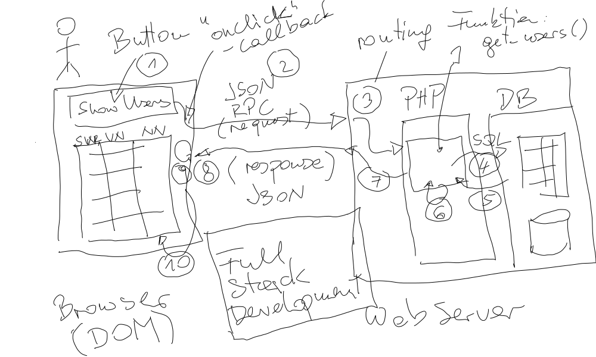

.. include:: <mmlalias.txt>

Programmierung Grundlagen, anhand von Python (2. und 3.8.2021)
==============================================================

.. sidebar:: *Training Information*

   **Offizielle Beschreibung**

   `tecTrain "Programmierung Grundlagen"
   <https://www.tectrain.at/seminare/seminar-themen/programmierung/programmierung-grundlagen>`__

   **Material**

   * PDF Slides, :download:`Python </trainings/material/pdf/300-python.pdf>`
   * :doc:`OpenTraining </about/site/opentraining/index>` Topics, :doc:`/trainings/material/soup/python/group`
   * Herdt vs. Python: :doc:`hier </trainings/repertoire/python_herdt>`.
   * `Github Repository <https://github.com/jfasch/2021-08-02>`__

.. contents::
   :local:

Überblick
---------

Die Kurssprache des Kurses "Programmierung Grundlagen" ist Python;
viele der Python-spezifische Elemente werden von :doc:`hier
</trainings/material/soup/python/basics/group>` unterrichtet.

Themenreihenfolge und Übungen werden aus dem Herdt-Skriptum
"Programmierung Grundlagen mit Beispielen in Python" übernommen.

Das Herdt Skriptum ist etwas zu allgemein gehalten (geht auf
Programmiersprachen im Allgemeinen ein, und ist dadurch verwirrend),
weswegen in vielen Fällen Ausnahmen gemacht werden. Siehe :doc:`hier
</trainings/repertoire/python_herdt>` für eine Zuordnung zu meinen
Python Unterlagen.

Log
---

Tag 1
.....

**Vorab**: bissl Livehacking

* `Hello World <https://github.com/jfasch/2021-08-02/blob/master/live-hacking/hello.py>`__
* `Commandlineargumente <https://github.com/jfasch/2021-08-02/blob/master/live-hacking/args.py>`__
* `Input/Prompt <https://github.com/jfasch/2021-08-02/blob/master/live-hacking/input.py>`__

Variablen und Datentypen
````````````````````````

**Stoff**

* :doc:`/trainings/material/soup/python/basics/python_0110_blahblah/topic`
* :doc:`/trainings/material/soup/python/basics/python_0120_helloworld/topic`
* :doc:`/trainings/material/soup/python/basics/python_0130_syntax_etc/topic`
* :doc:`/trainings/material/soup/python/basics/python_0150_datatypes_overview/topic`
* :doc:`/trainings/material/soup/python/basics/python_0160_boolean/topic`
* :doc:`/trainings/material/soup/python/basics/python_0300_strings/topic`

**Übungen**

* :doc:`/trainings/material/soup/python/exercises/herdt/swap` (`livehacked <https://github.com/jfasch/2021-08-02/blob/master/live-hacking/swap.py>`__)

  .. .. jjjj rename exercise to something like "swap"

  .. .. jjjj extract herdt exercises into separate group

  .. image:: wacom-sketches/swap.png
     :scale: 50%

Kontrollstrukturen
``````````````````

**Stoff**

* :doc:`/trainings/material/soup/python/basics/python_0170_if/topic`

**Übungen**

* :doc:`/trainings/material/soup/python/exercises/herdt/max_numbers` (`livehacked <https://github.com/jfasch/2021-08-02/blob/master/live-hacking/maximum.py>`__)
* :doc:`/trainings/material/soup/python/exercises/herdt/greet` (`livehacked <https://github.com/jfasch/2021-08-02/blob/master/live-hacking/greeting.py>`__)

**Stoff**

* :doc:`/trainings/material/soup/python/basics/python_0193_while/topic` (das
  Summenbeispiel `live-gehackt
  <https://github.com/jfasch/2021-08-02/blob/master/live-hacking/sum.py>`__)

**Übungen**

* :doc:`/trainings/material/soup/python/exercises/herdt/exercise_while_even_numbers`
* :doc:`/trainings/material/soup/python/exercises/legacy/while_primeness`

  .. image:: wacom-sketches/prime.png
     :scale: 50%

Tag 2
.....

**Stoff**

* :doc:`/trainings/material/soup/python/basics/python_0270_functions/topic`

**Übungen**

* :doc:`/trainings/material/soup/python/exercises/legacy/max_numbers_function`

**Stoff**

* :doc:`/trainings/material/soup/python/basics/python_0150_datatypes_overview_compound/topic`
* :doc:`/trainings/material/soup/python/basics/python_0400_lists/topic`
* :doc:`/trainings/material/soup/python/basics/python_0450_dictionaries/topic`
* :doc:`/trainings/material/soup/python/basics/python_0460_sets/topic`

**Showcasing "Full Stack Development"**



.. toctree::

   notebook

Links
-----

* `PHP: A Fractal of Bad Design <https://eev.ee/blog/2012/04/09/php-a-fractal-of-bad-design/>`__
* :doc:`Meine Web-Tutorials </about/site/work-in-progress/web>`
