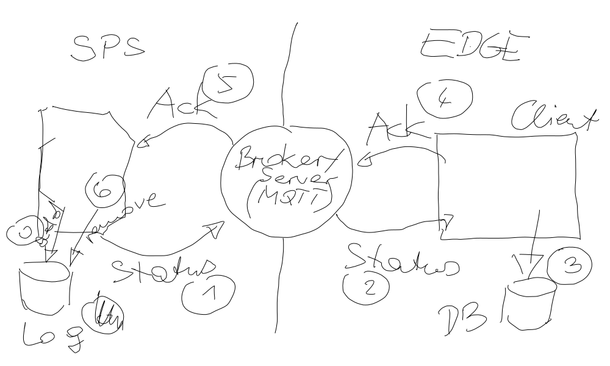

.. include:: <mmlalias.txt>

Python Grundlagen (2021-08-23 - 2021-08-25)
===========================================

.. sidebar:: *Training Information*

   **Start**

   Monday 2021-08-23, 9:00

   **Course Description**

   `tecTrain "Programmierung Grundlagen"
   <https://www.tectrain.at/seminare/seminar-themen/programmierung/programmierung-grundlagen>`__

   **Material**

   * :doc:`Python Topics </trainings/material/soup/python/group>`
   * PDF Slides (Altlast), :download:`Python
     </trainings/material/pdf/300-python.pdf>`
   * Jupyter Notebook: :doc:`HTML <notebook-wrapper>`,
     :download:`download <Notebook.ipynb>`
   * `Github Repository <https://github.com/jfasch/2021-08-23>`__

.. toctree::
   :hidden:

   Jupyter Notebook (Übersicht) <notebook-wrapper>
   Jupyter Notebook <Notebook>
   exercises/sap-cleaned

.. contents::
   :local:

Log
---

Day 1
.....

The basics, with a moderate amount of exercises.

* :doc:`/trainings/material/soup/python/basics/installation`
* :doc:`/trainings/material/soup/python/draft/vscode`

* Datatypes

  * :doc:`/trainings/material/soup/python/basics/python_0110_blahblah/topic`
  * :doc:`/trainings/material/soup/python/basics/python_0120_helloworld/topic`

    * `Hello world
      <https://github.com/jfasch/2021-08-23/blob/master/live-hacking/hello.py>`__
    * `Commandline arguments demo
      <https://github.com/jfasch/2021-08-23/blob/master/live-hacking/argv.py>`__

  * :doc:`/trainings/material/soup/python/basics/python_0130_syntax_etc/topic`
  * :doc:`/trainings/material/soup/python/basics/python_0140_variables/topic`
  * :doc:`/trainings/material/soup/python/basics/python_0150_datatypes_overview/topic`
  * :doc:`/trainings/material/soup/python/basics/python_0160_boolean/topic`
  * :doc:`/trainings/material/soup/python/basics/python_0150_datatypes_overview_compound/topic`
  * Exercise: :doc:`/trainings/material/soup/python/exercises/legacy/mixed_list_interactive`
  * Exercise: :doc:`/trainings/material/soup/python/exercises/legacy/mixed_list_executable`
  * :doc:`/trainings/material/soup/python/basics/python_0200_sequential_types/topic`
  * Exercise: :doc:`/trainings/material/soup/python/exercises/legacy/dict_keyerror`
  * Exercise:
    :doc:`/trainings/material/soup/python/exercises/legacy/cmdline_digit`
    (`Solution
    <https://github.com/jfasch/2021-08-23/blob/master/live-hacking/digit.py>`__)
  * :doc:`/trainings/material/soup/python/basics/python_0250_refs_flat_deep_copy/topic`

* Control Flow and Iteration

  * :doc:`/trainings/material/soup/python/basics/python_0170_if/topic`
  * Exercise: :doc:`/trainings/material/soup/python/exercises/legacy/max_numbers`
  * :doc:`/trainings/material/soup/python/basics/python_0193_while/topic`
  * Exercise:
    :doc:`/trainings/material/soup/python/exercises/legacy/while_primeness`
    (`Solution
    <https://github.com/jfasch/2021-08-23/blob/master/live-hacking/prime-while.py>`__)
  * :doc:`/trainings/material/soup/python/basics/python_0220_for/topic`
  * :doc:`/trainings/material/soup/python/basics/python_0225_range/topic`
  * Exercise: :doc:`/trainings/material/soup/python/exercises/legacy/for_primeness`

* Functions and Generators

  * :doc:`/trainings/material/soup/python/basics/python_0270_functions/topic`
  * Exercise: :doc:`/trainings/material/soup/python/exercises/legacy/max_numbers_function`
  * Exercise: :doc:`/trainings/material/soup/python/exercises/legacy/primeness_function`
  * Exercise: :doc:`/trainings/material/soup/python/exercises/legacy/uniq_function`

Day 2
.....

* Functions and Generators

  * Exercise: :doc:`/trainings/material/soup/python/exercises/legacy/uniq_function`
  * Exercise: :doc:`/trainings/material/soup/python/exercises/legacy/join_function`
  * :doc:`/trainings/material/soup/python/python_1010_generators_yield/topic`
  * Exercise: :doc:`/trainings/material/soup/python/exercises/legacy/uniq_generator`

* File I/O and Strings

  * :doc:`/trainings/material/soup/python/basics/python_0300_strings/topic`
  * :doc:`/trainings/material/soup/python/basics/python_0320_strings_methods/topic`
  * Exercise: :doc:`/trainings/material/soup/python/exercises/legacy/string-rightjustify`
  * :doc:`/trainings/material/soup/python/basics/python_0310_strings_formatting/topic`
  * :doc:`/trainings/material/soup/python/basics/python_0330_strings_encoding/topic`
  * :doc:`/trainings/material/soup/python/basics/python_0500_files/topic`
  * ``collections.namedtuple``: see `here
    <https://docs.python.org/3/library/collections.html#collections.namedtuple>`__
  * ``datetime``

    * ``datetime``: `here <https://docs.python.org/3/library/datetime.html?highlight=strptime#datetime.datetime>`__
    * ``timedelta``: `here <https://docs.python.org/3/library/datetime.html?highlight=strptime#timedelta-objects>`__
    * ``datetime.strptime()``: `parsing strings
      <https://docs.python.org/3/library/datetime.html?highlight=strptime#datetime.datetime.strptime>`__

    .. image:: datetime.png
       :scale: 50%

  * Exercise: :doc:`exercises/sap-cleaned`
  * Modules

    * :doc:`/trainings/material/soup/python/python_1200_modules/topic`
    * `Quick run-through
      <https://github.com/jfasch/2021-08-23/tree/master/sap>`__,
      modularizing the :doc:`last exercise <exercises/sap-cleaned>`
      
  * JSON (Java Script Object Notation) `quick demo
    <https://github.com/jfasch/2021-08-23/blob/master/sap/read-file-and-write-json-output.py>`__
    (full JSON documentation see `here
    <https://docs.python.org/3/library/json.html>`__)

Day 3
.....

* :doc:`/trainings/material/soup/python/draft/pip/topic`
* :doc:`/trainings/material/soup/python/draft/venv/topic`
* :doc:`/trainings/material/soup/python/draft/mqtt/topic`

* Databases

  * :doc:`/trainings/material/soup/python/python_5500_dbapi2/topic`
  * :doc:`/trainings/material/soup/python/python_5510_dbapi2_sqlite3/topic`
  * `DB-API2 for MS-SQL <https://docs.microsoft.com/de-de/sql/connect/python/python-driver-for-sql-server>`__

* Advanced Topics

  * :doc:`/trainings/material/soup/python/python_1050_oo/topic`
  * :doc:`/trainings/material/soup/python/python_1100_exceptions/topic`
  * :doc:`/trainings/material/soup/python/python_5600_unittest/topic`

* What else?
    
  * `Multithreading <https://docs.python.org/3/library/threading.html>`__
  * `Multiprocessing
    <https://docs.python.org/3/library/multiprocessing.html>`__
  * `OPC-UA
    <https://opcfoundation.org/about/opc-technologies/opc-ua/>`__,
    `Python client <https://pypi.org/project/opcua-client/>`__

Live-Hacking (Jupyter Notebook)
-------------------------------

* :doc:`Jupyter Notebook (Übersicht) <notebook-wrapper>`
* :doc:`Jupyter Notebook <Notebook>`
* :download:`Download <Notebook.ipynb>`

Links
-----

jjj

* https://oss.oetiker.ch/rrdtool/
* https://pypi.org/project/rrdtool/

Tutorials
---------

* `Python Tutorial for Beginners 4: Lists, Tuples, and Sets
  <https://www.youtube.com/watch?v=W8KRzm-HUcc>`__, by `Corey Schafer
  <https://www.youtube.com/channel/UCCezIgC97PvUuR4_gbFUs5g>`__

  .. raw:: html
	   
     <iframe width="560" height="315" 
             src="https://www.youtube.com/embed/W8KRzm-HUcc" 
	     title="YouTube video player" 
	     frameborder="0" 
	     allow="accelerometer; autoplay; clipboard-write; encrypted-media; gyroscope; picture-in-picture" 
	     allowfullscreen>
     </iframe>

* `Python Tutorial for Beginners 5: Dictionaries - Working with
  Key-Value Pairs <https://www.youtube.com/watch?v=daefaLgNkw0>`__, by
  `Corey Schafer
  <https://www.youtube.com/channel/UCCezIgC97PvUuR4_gbFUs5g>`__

  .. raw:: html
	   
     <iframe width="560" height="315" 
             src="https://www.youtube.com/embed/daefaLgNkw0" 
	     title="YouTube video player" 
	     frameborder="0" 
	     allow="accelerometer; autoplay; clipboard-write; encrypted-media; gyroscope; picture-in-picture" 
	     allowfullscreen>
     </iframe>

* `Python Tutorial for Beginners 7: Loops and Iterations - For/While
  Loops <https://www.youtube.com/watch?v=6iF8Xb7Z3wQ>`__, by `Corey
  Schafer
  <https://www.youtube.com/channel/UCCezIgC97PvUuR4_gbFUs5g>`__

  .. raw:: html
	   
     <iframe width="560" height="315" 
             src="https://www.youtube.com/embed/6iF8Xb7Z3wQ" 
	     title="YouTube video player" 
	     frameborder="0" 
	     allow="accelerometer; autoplay; clipboard-write; encrypted-media; gyroscope; picture-in-picture" 
	     allowfullscreen>
     </iframe>

* `Python Tutorial for Beginners 8: Functions
  <https://www.youtube.com/watch?v=9Os0o3wzS_I>`__, by `Corey Schafer
  <https://www.youtube.com/channel/UCCezIgC97PvUuR4_gbFUs5g>`__

  .. raw:: html
	   
     <iframe width="560" height="315" 
             src="https://www.youtube.com/embed/9Os0o3wzS_I" 
	     title="YouTube video player" 
	     frameborder="0" 
	     allow="accelerometer; autoplay; clipboard-write; encrypted-media; gyroscope; picture-in-picture" 
	     allowfullscreen>
     </iframe>

* `10 Python Tips and Tricks For Writing Better Code
  <https://www.youtube.com/watch?v=C-gEQdGVXbk>`__, by `Corey Schafer
  <https://www.youtube.com/channel/UCCezIgC97PvUuR4_gbFUs5g>`__

  .. raw:: html
	   
     <iframe width="560" height="315" 
             src="https://www.youtube.com/embed/C-gEQdGVXbk" 
	     title="YouTube video player" 
	     frameborder="0" 
	     allow="accelerometer; autoplay; clipboard-write; encrypted-media; gyroscope; picture-in-picture" 
	     allowfullscreen>
     </iframe>

* `Python Tutorial: CSV Module - How to Read, Parse, and Write CSV
  Files <https://www.youtube.com/watch?v=q5uM4VKywbA>`__, by `Corey
  Schafer
  <https://www.youtube.com/channel/UCCezIgC97PvUuR4_gbFUs5g>`__

  .. raw:: html
	   
     <iframe width="560" height="315" 
             src="https://www.youtube.com/embed/q5uM4VKywbA" 
	     title="YouTube video player" 
	     frameborder="0" 
	     allow="accelerometer; autoplay; clipboard-write; encrypted-media; gyroscope; picture-in-picture" 
	     allowfullscreen>
     </iframe>

* `Python Tutorial: Using Try/Except Blocks for Error Handling
  <https://www.youtube.com/watch?v=NIWwJbo-9_8>`__, by `Corey Schafer
  <https://www.youtube.com/channel/UCCezIgC97PvUuR4_gbFUs5g>`__

  .. raw:: html

     <iframe width="560" height="315" 
             src="https://www.youtube.com/embed/NIWwJbo-9_8" 
	     title="YouTube video player" 
	     frameborder="0" 
	     allow="accelerometer; autoplay; clipboard-write; encrypted-media; gyroscope; picture-in-picture" 
	     allowfullscreen>
     </iframe>

* `Python 3.7: Encode String Method <https://www.youtube.com/watch?v=IoU4AbPpMys>`__

  .. raw:: html

     <iframe width="560" height="315" 
             src="https://www.youtube.com/embed/IoU4AbPpMys" 
	     title="YouTube video player" 
	     frameborder="0" 
	     allow="accelerometer; autoplay; clipboard-write; encrypted-media; gyroscope; picture-in-picture" 
	     allowfullscreen>
     </iframe>

* `Python Tutorial: OS Module - Use Underlying Operating System
  Functionality <https://www.youtube.com/watch?v=tJxcKyFMTGo>`__, by
  `Corey Schafer
  <https://www.youtube.com/channel/UCCezIgC97PvUuR4_gbFUs5g>`__

  .. raw:: html

     <iframe width="560" height="315" 
	     src="https://www.youtube.com/embed/tJxcKyFMTGo" 
	     title="YouTube video player" 
	     frameborder="0" 
	     allow="accelerometer; autoplay; clipboard-write; encrypted-media; gyroscope; picture-in-picture" 
	     allowfullscreen>
     </iframe>

* `Python Tutorial: Calling External Commands Using the Subprocess
  Module <https://www.youtube.com/watch?v=2Fp1N6dof0Y>`__, by `Corey
  Schafer
  <https://www.youtube.com/channel/UCCezIgC97PvUuR4_gbFUs5g>`__

  .. raw:: html

     <iframe width="560" height="315" 
             src="https://www.youtube.com/embed/2Fp1N6dof0Y" 
	     title="YouTube video player" 
	     frameborder="0" 
	     allow="accelerometer; autoplay; clipboard-write; encrypted-media; gyroscope; picture-in-picture" 
	     allowfullscreen>
     </iframe>

* `Transforming Code into Beautiful, Idiomatic Python
  <https://www.youtube.com/watch?v=OSGv2VnC0go>`__, by **Raymond
  Hettinger**

  .. raw:: html

     <iframe width="560" height="315" 
             src="https://www.youtube.com/embed/OSGv2VnC0go" 
	     title="YouTube video player" 
	     frameborder="0" 
	     allow="accelerometer; autoplay; clipboard-write; encrypted-media; gyroscope; picture-in-picture" 
	     allowfullscreen>
     </iframe>

Todo
----

*
  :doc:`/trainings/material/soup/python/exercises/legacy/cmdline_digit`
  depends on
  :doc:`/trainings/material/soup/python/exercises/legacy/dict_keyerror`
  which depends on
  :doc:`/trainings/material/soup/python/exercises/legacy/max_numbers`
  which depends on
  :doc:`/trainings/material/soup/python/basics/python_0170_if/topic` !!

