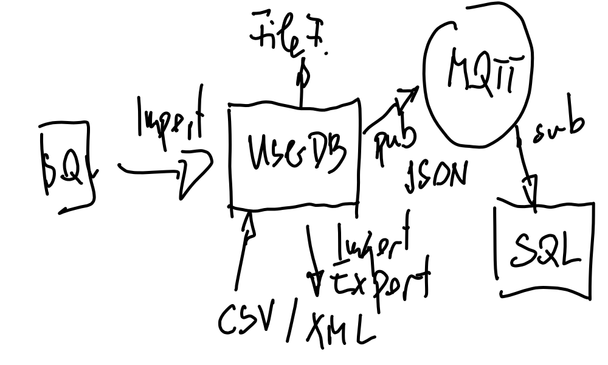

.. include:: <mmlalias.txt>

Python (2022-03-23, 2022-03-30, 2022-04-19 - 2022-03-21)
========================================================

.. sidebar:: *Training Information*

   Start: 9:00

   * :doc:`/trainings/material/soup/python/group`
   * Jupyter Notebook (filled as course proceeds)

     * :doc:`Structure <notebook-wrapper>`
     * :doc:`Entire Notebook <Notebook>`
     * :download:`download <Notebook.ipynb>`

   * `Github Repository <https://github.com/jfasch/2022-03-23>`__

.. toctree::
   :hidden:

   Jupyter Notebook (Übersicht) <notebook-wrapper>
   Jupyter Notebook <Notebook>

.. contents::
   :local:

Agenda
------

2022-03-23: Basics
..................

* :doc:`/trainings/material/soup/python/basics/python_0110_blahblah/topic`
* :doc:`/trainings/material/soup/python/basics/python_0120_helloworld/topic`
* :doc:`/trainings/material/soup/python/misc/vscode` (or simply
  `Notepad++ <https://notepad-plus-plus.org/downloads/>`__)
* :doc:`/trainings/material/soup/python/basics/python_0125_running/topic`
* :doc:`/trainings/material/soup/python/basics/python_0130_syntax_etc/topic`

  Indentation bug demo: `indentation-bug.py
  <https://github.com/jfasch/2022-03-23/blob/main/livehacking/indentation-bug.py>`__

*
  :doc:`/trainings/material/soup/python/basics/python_0139_commandline_argv/topic`
  (Sample code: `argv.py
  <https://github.com/jfasch/2022-03-23/blob/main/livehacking/argv.py>`__)
* :doc:`/trainings/material/soup/python/basics/python_0140_variables/topic`
* :doc:`/trainings/material/soup/python/basics/python_0150_datatypes_overview/topic`
* :doc:`/trainings/material/soup/python/exercises/herdt/max_numbers`
  (Solution: `maximum.py
  <https://github.com/jfasch/2022-03-23/blob/main/exercises/joerg/maximum.py>`__)
* :doc:`/trainings/material/soup/python/basics/python_0160_boolean/topic`
* :doc:`/trainings/material/soup/python/basics/python_0170_if/topic`
* :doc:`/trainings/material/soup/python/exercises/herdt/greet`
  (Solution: `greet.py
  <https://github.com/jfasch/2022-03-23/blob/main/exercises/joerg/greet.py>`__)
* :doc:`/trainings/material/soup/python/basics/python_0150_datatypes_overview_compound/topic`

2022-03-30: Basics
..................

* :doc:`/trainings/material/soup/python/exercises/legacy/cmdline_digit`
* :doc:`/trainings/material/soup/python/basics/python_0193_while/topic`
* :doc:`/trainings/material/soup/python/exercises/herdt/exercise_while_even_numbers`
  (`even.py
  <https://github.com/jfasch/2022-03-23/blob/main/exercises/joerg/even.py>`__,
  `even-pythonic.py
  <https://github.com/jfasch/2022-03-23/blob/main/exercises/joerg/even-pythonic.py>`__)

* :doc:`/trainings/material/soup/python/basics/python_0220_for/topic`
* :doc:`/trainings/material/soup/python/basics/python_0270_functions/topic`
*
    :doc:`/trainings/material/soup/python/exercises/legacy/uniq_function`
    (`uniq.py
    <https://github.com/jfasch/2022-03-23/blob/main/exercises/joerg/uniq.py>`__,
    `uniq-generator.py
    <https://github.com/jfasch/2022-03-23/blob/main/exercises/joerg/uniq-generator.py>`__)
  
* :doc:`/trainings/material/soup/python/basics/python_0300_strings/topic`
* :doc:`/trainings/material/soup/python/basics/python_0320_strings_methods/topic`
* :doc:`/trainings/material/soup/python/basics/python_0310_strings_formatting/topic`
* :doc:`/trainings/material/soup/python/basics/python_0500_files/topic`
* :doc:`/trainings/material/soup/python/exercises/legacy/distill`
* :doc:`/trainings/material/soup/python/exercises/legacy/passwd`

CSV
```

* :doc:`/trainings/material/soup/python/misc/csv/topic`
* :doc:`/trainings/material/soup/python/exercises/userdb/csvreader`
* :doc:`/trainings/material/soup/python/exercises/userdb/csvdictreader`
* :doc:`/trainings/material/soup/python/exercises/userdb/csvreader-function`
* :doc:`/trainings/material/soup/python/exercises/userdb/csvdictreader-function`

2022-04-19, 2022-04-20, 2022-04-21: Advanced
............................................

Plan For The Wild Part
``````````````````````



* Group Exercise Preparation

  * `Git for Windows <https://git-scm.com/download/win>`__
  * Better yet: :doc:`/trainings/material/soup/linux/basics/intro/wsl`
  * :doc:`/trainings/material/soup/python/misc/vscode`

* :doc:`/trainings/material/soup/python/advanced/modules`
* :doc:`/trainings/material/soup/python/swdev/pytest/intro`
* :doc:`/trainings/material/soup/python/exercises/userdb/userdb_csv`
* :doc:`/trainings/material/soup/python/swdev/pip/topic`
* :doc:`/trainings/material/soup/python/swdev/venv/topic`
* :doc:`/trainings/material/soup/python/exercises/userdb/user_json`
* :doc:`/trainings/material/soup/python/exercises/userdb/mqtt-publish-csv`

More details (omitted in "basics" days)

Select topics from chapters ...

* :doc:`/trainings/material/soup/python/advanced/group`
* :doc:`/trainings/material/soup/python/swdev/group`
* :doc:`/trainings/material/soup/python/misc/group`

.. note:: Customer Request

   Aus meiner Sicht wäre zu Beginn noch kurz ein Überblick über
   Installation/Betreiben von unterschiedlichen Versionen sinnvoll (am
   besten auch in Bezug auf virtuelle Umgebungen). In das Thema kommt
   man früher oder später unausweichlich.
   
   Folgende Punkte sind interessant:

   * Installationsverzeichnis(e)
   * Verzeichnisse unterschiedlicher Versionen
   * Python in VisualStudio
   * Code mit unterschiedlichen Versionen ausführen

   Wenn man Code aus dem Internet hernimmt kommt man meiner Erfahrung
   nach schnell auf diese Dinge. Dann machts erst Spaß wenn man weiß
   was man tun muss damits rennt...
