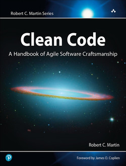

Clean Code Development With Python (2023-03-28 - 2023-03-29)
============================================================

.. contents::
   :local:

.. sidebar::

  **Github Repository**

  * https://github.com/jfasch/2023-03-28.git

Work Environment
----------------

* Python Installation

  * `Installing directly from python.org
    <https://www.python.org/downloads/>`__
  * `Anaconda <https://www.anaconda.com/>`__

* IDE

  * :doc:`/trainings/material/soup/python/misc/vscode`
  * `PyCharm <https://www.jetbrains.com/pycharm/>`__

* Package Installation, Virtual Environments

  * :doc:`/trainings/material/soup/python/swdev/pip/topic`
  * :doc:`/trainings/material/soup/python/swdev/venv/topic`
      
*Day 1:* Python Development: Select Topics
------------------------------------------

Knowing more about Python enables one to write ... well ... more code
in fewer lines. While that is not usually an attitude of programmers
that everybody loves, in Python there's a word for it: *Pythonic*. An
early PEP, `"PEP 20 – The Zen of Python"
<https://peps.python.org/pep-0020/>`__ describes what that could
be. Lets have a closer look at what today's version of the language
offers in that respect.

Datatypes, References, Memory Management, Iteration
...................................................

Built-In Types: Facts
`````````````````````

* :doc:`/trainings/material/soup/python/basics/python_0250_refs_flat_deep_copy/topic`
* :doc:`/trainings/material/soup/python/basics/python_0200_sequential_types/topic`
* :doc:`/trainings/material/soup/python/basics/python_0210_indexing_slicing/topic`
* :doc:`/trainings/material/soup/python/advanced/comprehensions/topic`

``for`` Loops, And The Iterator Protocol
````````````````````````````````````````

* :doc:`/trainings/material/soup/python/basics/python_0220_for/topic`
  (with empasis on the ``else`` clause)

* From :doc:`/trainings/material/soup/python/advanced/iteration-generation/iteration-generation/topic`

  * :doc:`/trainings/material/soup/python/advanced/iteration-generation/python_1010_generators_yield/iterator-protocol`
  * :doc:`/trainings/material/soup/python/advanced/iteration-generation/python_1010_generators_yield/fibonacci-generator`

* Live hack a test-driven directory-only iterator on a parent
  directory (hint:
  ``fabric-defect-detection/scripts/data/make_data_set.py``)

Decorators (The Ominous ``@``)
..............................

* :doc:`/trainings/material/soup/python/advanced/starargs/topic`
* :doc:`/trainings/material/soup/python/advanced/closures/topic`
* :doc:`/trainings/material/soup/python/advanced/decorators/topic`

Error And Resource Management
.............................

* :doc:`/trainings/material/soup/python/advanced/exceptions/topic`
* :doc:`/trainings/material/soup/python/advanced/context-mgr/topic`

OO, Modules
...........

Object Oriented Programming
```````````````````````````

From :doc:`/trainings/material/soup/python/advanced/oo/group`:

* :doc:`/trainings/material/soup/python/advanced/oo/classes-and-dicts/topic`
* :doc:`/trainings/material/soup/python/advanced/oo/constructor/topic`
* :doc:`/trainings/material/soup/python/advanced/oo/methods/topic`
* :doc:`/trainings/material/soup/python/advanced/oo/str-repr/topic`
* :doc:`/trainings/material/soup/python/advanced/oo/properties/topic`
* :doc:`/trainings/material/soup/python/advanced/oo/namedtuple/topic`
* :doc:`/trainings/material/soup/python/advanced/oo/inheritance/topic`              
* :doc:`/trainings/material/soup/python/advanced/oo/operator-overloading/topic`
* :doc:`/trainings/material/soup/python/advanced/oo/abc/topic`

Modules And Packages
````````````````````

* :doc:`/trainings/material/soup/python/advanced/modules`

Pandas
......

From :doc:`/trainings/material/soup/python/misc/pandas/group`:

* :doc:`/trainings/material/soup/python/misc/pandas/basics`
* :doc:`/trainings/material/soup/python/misc/pandas/iloc`
* :doc:`/trainings/material/soup/python/misc/pandas/loc`
* :doc:`/trainings/material/soup/python/misc/pandas/indexes`
* :doc:`/trainings/material/soup/python/misc/pandas/filters`
* :doc:`/trainings/material/soup/python/misc/pandas/mod_col`
* :doc:`/trainings/material/soup/python/misc/pandas/add_row`

*Day 2:* Clean Code? (Software Development: A Craft)
----------------------------------------------------

Messages From *The Book*
........................



The following material (which has been created for a similar show, but
in C++) will be adapted for our seminar. Goal is to start a discussion
on ... well ... software development, and how it is
understood. *Agile*.

* :doc:`/about/site/work-in-progress/2022-04-13/seminar/craft-sw`
* Survey of *The Book* (taken from
  :doc:`/about/site/work-in-progress/2022-04-13/seminar/clean-code-craftsmanship`,
  but polished and Pythonized)

Condensed version of the following talk series by Bob Martin which
takes two days to watch:

* `Clean Code - Uncle Bob / Lesson 1 <https://youtu.be/7EmboKQH8lM>`__

  .. raw:: html

     <iframe width="560" height="315" 
             src="https://www.youtube.com/embed/7EmboKQH8lM" 
	     title="YouTube video player" 
	     frameborder="0" 
	     allow="accelerometer; autoplay; clipboard-write; encrypted-media; gyroscope; picture-in-picture; web-share" 
	     allowfullscreen>
     </iframe>

* `Clean Code - Uncle Bob / Lesson 2 <https://youtu.be/2a_ytyt9sf8>`__

  .. raw:: html

     <iframe width="560" height="315" 
             src="https://www.youtube.com/embed/2a_ytyt9sf8" 
	     title="YouTube video player" 
	     frameborder="0" 
	     allow="accelerometer; autoplay; clipboard-write; encrypted-media; gyroscope; picture-in-picture; web-share" 
	     allowfullscreen>
     </iframe>

* `Clean Code - Uncle Bob / Lesson 3 <https://youtu.be/Qjywrq2gM8o>`__

  .. raw:: html

     <iframe width="560" height="315" 
             src="https://www.youtube.com/embed/Qjywrq2gM8o" 
	     title="YouTube video player" 
	     frameborder="0" 
	     allow="accelerometer; autoplay; clipboard-write; encrypted-media; gyroscope; picture-in-picture; web-share" 
	     allowfullscreen>
     </iframe>

* `Clean Code - Uncle Bob / Lesson 4 <https://youtu.be/58jGpV2Cg50>`__

  .. raw:: html

     <iframe width="560" height="315" 
             src="https://www.youtube.com/embed/58jGpV2Cg50" 
	     title="YouTube video player" 
	     frameborder="0" 
	     allow="accelerometer; autoplay; clipboard-write; encrypted-media; gyroscope; picture-in-picture; web-share" 
	     allowfullscreen>
     </iframe>

* `Clean Code - Uncle Bob / Lesson 5 <https://youtu.be/sn0aFEMVTpA>`__

  .. raw:: html

     <iframe width="560" height="315" 
             src="https://www.youtube.com/embed/sn0aFEMVTpA" 
	     title="YouTube video player" 
	     frameborder="0" 
	     allow="accelerometer; autoplay; clipboard-write; encrypted-media; gyroscope; picture-in-picture; web-share" 
	     allowfullscreen>
     </iframe>

* `Solid Principles by Uncle Bob Martin <https://youtu.be/oar-T2KovwE>`__

  .. raw:: html

     <iframe width="560" height="315" 
             src="https://www.youtube.com/embed/oar-T2KovwE" 
	     title="YouTube video player" 
	     frameborder="0" 
	     allow="accelerometer; autoplay; clipboard-write; encrypted-media; gyroscope; picture-in-picture; web-share" 
	     allowfullscreen>
     </iframe>

Design Patterns
...............

*Discussion*: so what? OO is there to solve problems in a readable and
reproducible way.

* :doc:`/trainings/material/soup/cxx-design-patterns/uml/uml`
* :doc:`/trainings/material/soup/cxx-design-patterns/oo-principles`
* Pythonize *some* patterns (the simpler ones) from
  :doc:`/trainings/material/soup/cxx-design-patterns/group`. Maybe ...

  * Adapter
  * Proxy
  * Composite
  * Observer

Unit Testing
............

No craft without testing. Again, automated testing is part of software
development for a long time now. Developers, and their employers
likewise, do not always recognize the goodness of non-immediacy.

Ease the technical hurdle, give terminology, discuss (unit tests as
documentation). The exercises in this training will be formulated as
unit tests, so maybe this chapter is in order right at the beginning
of it.

* :doc:`/trainings/material/soup/python/swdev/pytest-intro`
