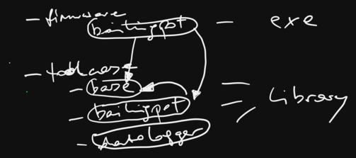

.. include:: <mmlalias.txt>

CMake: Advanced Topics (2024-06-11)
===================================

.. toctree::
   :hidden:

   agenda

.. sidebar::

   **Github Repository**

   * https://github.com/jfasch/2024-06-11

   **Original Agenda** 

   * :doc:`agenda`

   **Windows Users**

   * :doc:`/trainings/material/soup/linux/basics/intro/wsl`
   * `Windows Subsystem for Linux (WSL)
     <https://learn.microsoft.com/en-us/windows/wsl/>`__
   * `VSCode: Developing in WSL
     <https://code.visualstudio.com/docs/remote/wsl>`__
   * `VSCode: Remote Development using SSH
     <https://code.visualstudio.com/docs/remote/ssh>`__

.. contents::
   :local:

Day 1
-----

Basics
......

From :doc:`/trainings/material/soup/cmake/intro/group`

* :doc:`/trainings/material/soup/cmake/intro/basics`
* :doc:`/trainings/material/soup/cmake/intro/libraries`
* :doc:`/trainings/material/soup/cmake/intro/shared-libraries`
* :doc:`/trainings/material/soup/cmake/intro/installation`
* :doc:`/trainings/material/soup/cmake/intro/structure`

  Propagated properties ...

  .. image:: propagated-properties.png
     :scale: 20%

* :doc:`/trainings/material/soup/cmake/intro/cxx-and-rants`

Exercise: Build It!
...................

Add CMake build to existing source code in
https://github.com/jfasch/2024-06-11/tree/main/exercises/straightforward

Optional Code And External Dependencies
.......................................

From :doc:`/trainings/material/soup/cmake/advanced/group`

* :doc:`/trainings/material/soup/cmake/advanced/configure-file/topic`
* :doc:`/trainings/material/soup/cmake/advanced/conditional-code-problem/topic`
* :doc:`/trainings/material/soup/cmake/advanced/conditional-code-approach-1/topic`
* :doc:`/trainings/material/soup/cmake/advanced/conditional-code-approach-2/topic`
* :doc:`/trainings/material/soup/cmake/advanced/targets-properties/topic`
* :doc:`/trainings/material/soup/cmake/advanced/external-dependencies/topic`

Day 2
-----

Morning Awakening
.................

* Someone to show how :doc:`WSL
  </trainings/material/soup/linux/basics/intro/wsl>` can be used.
* Continue discussion from yesterday: how do I include file from the
  local directory?

  * ``#include "file.h"``
  * ``#include <file.h>``

  |longrightarrow| ``target_include_directories(... INTERFACE ...)``

The CMake Language
..................

From :doc:`/trainings/material/soup/cmake/advanced/language/group`

* :doc:`/trainings/material/soup/cmake/advanced/language/basics/topic`
* :doc:`/trainings/material/soup/cmake/advanced/language/variables/topic`
* :doc:`/trainings/material/soup/cmake/advanced/language/if-and-conditions/topic`
* :doc:`/trainings/material/soup/cmake/advanced/language/datatypes/topic`
* :doc:`/trainings/material/soup/cmake/advanced/language/file-etc/topic`
* :doc:`/trainings/material/soup/cmake/advanced/language/functions-and-macros/topic`
* :doc:`/trainings/material/soup/cmake/advanced/language/scripts/topic`
