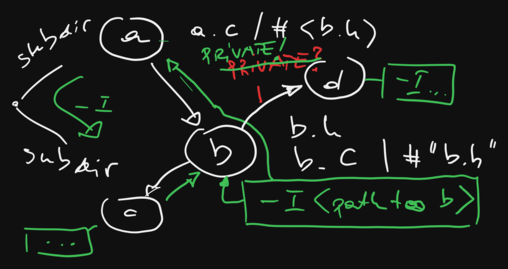

.. include:: <mmlalias.txt>

CMake: Advanced Topics (2024-06-11)
===================================

.. toctree::
   :hidden:

   agenda

.. sidebar::

   **Github Repository**

   * https://github.com/jfasch/2024-06-11

   **Original Agenda** 

   * :doc:`agenda`

   **Windows Users**

   * :doc:`/trainings/material/soup/linux/basics/intro/wsl`
   * `Windows Subsystem for Linux (WSL)
     <https://learn.microsoft.com/en-us/windows/wsl/>`__
   * `VSCode: Developing in WSL
     <https://code.visualstudio.com/docs/remote/wsl>`__
   * `VSCode: Remote Development using SSH
     <https://code.visualstudio.com/docs/remote/ssh>`__

.. contents::
   :local:

Day 1
-----

Basics
......

From :doc:`/trainings/material/soup/misc/cmake/intro/index`

* :doc:`/trainings/material/soup/misc/cmake/intro/basics`
* :doc:`/trainings/material/soup/misc/cmake/intro/libraries`
* :doc:`/trainings/material/soup/misc/cmake/intro/shared-libraries`
* :doc:`/trainings/material/soup/misc/cmake/intro/installation`
* :doc:`/trainings/material/soup/misc/cmake/intro/structure`

  Propagated properties ...

  .. image:: propagated-properties.png

* :doc:`/trainings/material/soup/misc/cmake/intro/cxx-and-rants`

Exercise: Build It!
...................

Add CMake build to existing source code in
https://github.com/jfasch/2024-06-11/tree/main/exercises/straightforward

.. image:: exercise-day-1.png

Bringing CMake Information Into C/C++
.....................................

From :doc:`/trainings/material/soup/misc/cmake/advanced/index`

* :doc:`/trainings/material/soup/misc/cmake/advanced/configure-file/topic`

Day 2
-----

Morning Awakening
.................

* Someone to show how :doc:`WSL
  </trainings/material/soup/linux/basics/intro/wsl>` can be used.
* Continue discussion from yesterday: how do I include file from the
  local directory?

  * ``#include "file.h"``
  * ``#include <file.h>``

  |longrightarrow| ``target_include_directories(... INTERFACE ...)``

More About Dependencies
.......................

* :doc:`/trainings/material/soup/misc/cmake/advanced/targets-properties/topic`
* :doc:`/trainings/material/soup/misc/cmake/advanced/external-dependencies/topic`

Much More ... (Various Kinds Of Dependencies)
.............................................

Demo project:
https://github.com/jfasch/2024-06-11/tree/main/livecoding/kinds-of-dependencies

.. graphviz:: kind-of-dependencies.dot

* Various kinds of property propagation (``PUBLIC``, ``PRIVATE``,
  ``INTERFACE``)
* ``add_library()`` variations

  * ``SHARED``: `b/CMakeLists.txt
    <https://github.com/jfasch/2024-06-11/blob/main/livecoding/kinds-of-dependencies/b/CMakeLists.txt>`__
  * ``INTERFACE``: `c/CMakeLists.txt
    <https://github.com/jfasch/2024-06-11/blob/main/livecoding/kinds-of-dependencies/c/CMakeLists.txt>`__

* Aggregating static libraries into shared libraries

  * Static library as position independent code: `d/CMakeLists.txt
    <https://github.com/jfasch/2024-06-11/blob/main/livecoding/kinds-of-dependencies/d/CMakeLists.txt>`__
  * Shared library *depends* on static library: `b/CMakeLists.txt
    <https://github.com/jfasch/2024-06-11/blob/main/livecoding/kinds-of-dependencies/b/CMakeLists.txt>`__

The CMake Language
..................

From :doc:`/trainings/material/soup/misc/cmake/advanced/language/index`

* :doc:`/trainings/material/soup/misc/cmake/advanced/language/basics/topic`
* :doc:`/trainings/material/soup/misc/cmake/advanced/language/variables/topic`
* :doc:`/trainings/material/soup/misc/cmake/advanced/language/if-and-conditions/topic`
* :doc:`/trainings/material/soup/misc/cmake/advanced/language/datatypes/topic`
* :doc:`/trainings/material/soup/misc/cmake/advanced/language/file-etc/topic`
* Exercise

  Write a CMake script (see
  :doc:`/trainings/material/soup/misc/cmake/advanced/language/scripts/topic`)
  that receives as input parameters

  * A directory name ``INPUT_DIR``
  * A filename ``OUTPUT_FILE``

  It reads all directory entries from ``INPUT_DIR``, transforms those
  names into their filename-only part (e.g. ``/a/b/c.txt`` ->
  ``c.txt``), and writes those names to ``OUTPUT_FILE``

* :doc:`/trainings/material/soup/misc/cmake/advanced/language/functions-and-macros/topic`
* :doc:`/trainings/material/soup/misc/cmake/advanced/language/scripts/topic`

Day 3
-----

Morning Awakening
.................

* Recap https://github.com/jfasch/2024-06-11/tree/main/exercises/ausbaufaehig

  * Create build directory and all that
  * Graph
  * Include paths (``make VERBOSE=1``)
  * Remember building a shared library from a subgraph?

* Recap
  :doc:`/trainings/material/soup/misc/cmake/advanced/targets-properties/screenplay`

The CMake Language, Continued
.............................

From :doc:`/trainings/material/soup/misc/cmake/advanced/language/index` ...

* :doc:`/trainings/material/soup/misc/cmake/advanced/language/functions-and-macros/topic`
* :doc:`/trainings/material/soup/misc/cmake/advanced/language/scripts/topic`

One example of a function ...

* :doc:`/trainings/material/soup/misc/cmake/advanced/library-function/screenplay`

External Dependencies
.....................

From :doc:`/trainings/material/soup/misc/cmake/advanced/index` ...

* :doc:`/trainings/material/soup/misc/cmake/advanced/external-dependencies/screenplay-sqlite3`
* :doc:`/trainings/material/soup/misc/cmake/advanced/external-dependencies/screenplay-sqlite3-optional-graph`
* :doc:`/trainings/material/soup/misc/cmake/advanced/external-dependencies/screenplay-sqlite3-optional-configured-file`
* :doc:`/trainings/material/soup/misc/cmake/advanced/external-dependencies/screenplay-mosquitto`

Code Generators
...............

* :doc:`/trainings/material/soup/misc/cmake/advanced/code-generators/screenplay`

Unit Tests
..........

* :doc:`/trainings/material/soup/misc/cmake/advanced/testing/topic`
