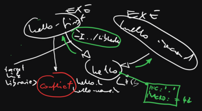
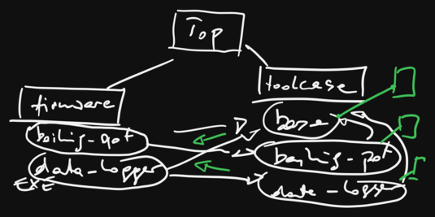

.. include:: <mmlalias.txt>

CMake: Advanced Topics (2024-07-01)
===================================

.. toctree::
   :hidden:

   agenda

.. sidebar::

   **Github Repository**

   * https://github.com/jfasch/2024-07-01

   **Original Agenda** 

   * :doc:`agenda`

   **Windows Users**

   * :doc:`/trainings/material/soup/linux/basics/intro/wsl`
   * `Windows Subsystem for Linux (WSL)
     <https://learn.microsoft.com/en-us/windows/wsl/>`__
   * `VSCode: Developing in WSL
     <https://code.visualstudio.com/docs/remote/wsl>`__
   * `VSCode: Remote Development using SSH
     <https://code.visualstudio.com/docs/remote/ssh>`__

.. contents::
   :local:

Day 1
-----

Basics
......

From :doc:`/trainings/material/soup/cmake/intro/group`

* :doc:`/trainings/material/soup/cmake/intro/basics`
* :doc:`/trainings/material/soup/cmake/intro/libraries`
* :doc:`/trainings/material/soup/cmake/intro/shared-libraries`
* :doc:`/trainings/material/soup/cmake/intro/installation`
* :doc:`/trainings/material/soup/cmake/intro/structure`
* :doc:`/trainings/material/soup/cmake/intro/cxx-and-rants`

Cross Development
.................

* :doc:`/trainings/material/soup/linux/toolchain/cmake/cross`
  (including a link to a working toolchain file)
* :doc:`More about toolchains and cross development
  </trainings/material/soup/linux/toolchain/group>`

Day 2
-----

Exercise: Build It!
...................

Add CMake build to existing source code in
https://github.com/jfasch/2024-07-01/tree/main/exercises/straightforward

Dependencies, Dependencies, Properties, ...
...........................................

* :doc:`/trainings/material/soup/cmake/advanced/targets-properties/topic`
* :doc:`/trainings/material/soup/cmake/advanced/targets-properties/screenplay`

The CMake Language
..................

From :doc:`/trainings/material/soup/cmake/advanced/language/group`

* :doc:`/trainings/material/soup/cmake/advanced/language/basics/topic`
* :doc:`/trainings/material/soup/cmake/advanced/language/variables/topic`
* :doc:`/trainings/material/soup/cmake/advanced/language/if-and-conditions/topic`
* :doc:`/trainings/material/soup/cmake/advanced/language/datatypes/topic`
* :doc:`/trainings/material/soup/cmake/advanced/language/file-etc/topic`
* :doc:`/trainings/material/soup/cmake/advanced/language/functions-and-macros/topic`
* :doc:`/trainings/material/soup/cmake/advanced/language/scripts/topic`

Day 3
-----

Morning Awakening
.................

* :doc:`/trainings/material/soup/cmake/advanced/library-function/screenplay`

External Dependencies
.....................

From :doc:`/trainings/material/soup/cmake/advanced/group` ...

* :doc:`/trainings/material/soup/cmake/advanced/external-dependencies/screenplay-sqlite3`
* :doc:`/trainings/material/soup/cmake/advanced/external-dependencies/screenplay-sqlite3-optional-graph`
* :doc:`/trainings/material/soup/cmake/advanced/external-dependencies/screenplay-sqlite3-optional-configured-file`
* :doc:`/trainings/material/soup/cmake/advanced/external-dependencies/screenplay-mosquitto`

.. list-table::
   :align: left
   :widths: auto

   * * :doc:`/trainings/material/soup/cxx-design-patterns/composite/composite`
     * :doc:`/trainings/material/soup/python/misc/mqtt/topic`
     * Dependencies in our project
   * * .. image:: composite.png
     * .. image:: mqtt.png
     * .. image:: graph-mqtt-sqlite.png

Code Generators
...............

* :doc:`/trainings/material/soup/cmake/advanced/code-generators/screenplay`

*Wrong way to generate code*: generate at CMake run time
 |longrightarrow| triggers unnecessary rebuilds everytime a
 ``CMakeLists.txt`` is changed.

.. code-block:: cmake 

   # -----------------------------
   # THIS IS NOT THE WAY TO DO IT!
   # -----------------------------

   execute_process(
     COMMAND ${CMAKE_CURRENT_SOURCE_DIR}/config-generator.py
             ${CMAKE_CURRENT_SOURCE_DIR}/2024-07-03.conf
   	  ${CMAKE_CURRENT_BINARY_DIR}/2024-07-03-do-not-use.cpp
   )
   
   add_executable(
     data-logger-deeply-embedded-2024-07-03-do-not-use
   
     data-logger-deeply-embedded.cpp
     ${CMAKE_CURRENT_BINARY_DIR}/2024-07-03-do-not-use.cpp
   )
   target_include_directories(data-logger-deeply-embedded-2024-07-03-do-not-use PRIVATE ${CMAKE_CURRENT_SOURCE_DIR})
   target_link_libraries(data-logger-deeply-embedded-2024-07-03-do-not-use data-logger-lib base-lib)

See https://github.com/jfasch/2024-07-01/blob/main/exercises/1/firmware/CMakeLists.txt

Unit Tests
..........

* :doc:`/trainings/material/soup/cmake/advanced/testing/topic`
