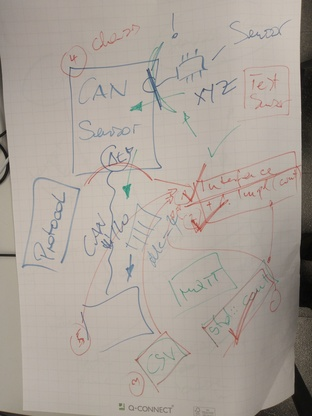
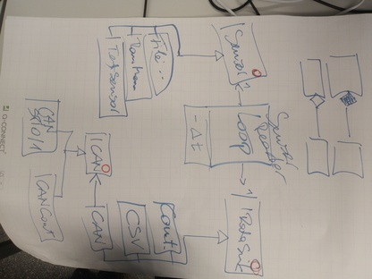

.. include:: <mmlalias.txt>


C++: An Embedded Wild Ride (2024-09-30 - 2024-10-04)
====================================================

.. contents::
   :local:

.. toctree::
   :hidden:

   agenda

.. sidebar::

   **Github Repository**

   * https://github.com/jfasch/2024-09-30

   **Original Agenda** 

   * :doc:`agenda`


Day 1
-----
     
"New" vs. "Old" C++: An Overview
................................

C++ is a huge pile of language constructs built on top of each other,
always backwards compatible with its origins. In 2011, C++ got a major
overhaul which is still ongoing. It is not always easy for someone who
is new to C++ to understand why things are how they are.

:doc:`/trainings/material/soup/cxx11/introduction/overview-livehacking`
tries to draw the boundary between the old and new C++.

(Omitting material from threading onwards)

Basic C++: Classes
..................

From
:doc:`/trainings/material/soup/cxx03/020-data-encapsulation/index`

* :doc:`/trainings/material/soup/cxx03/020-data-encapsulation/c`
* :doc:`/trainings/material/soup/cxx03/020-data-encapsulation/cpp-introduction`
* :doc:`/trainings/material/soup/cxx03/020-data-encapsulation/ctor-custom`
* :doc:`/trainings/material/soup/cxx03/020-data-encapsulation/ctor-default`
* :doc:`/trainings/material/soup/cxx03/030-functions-and-methods/010-overloading/topic`
* :doc:`/trainings/material/soup/cxx03/030-functions-and-methods/020-methods/topic`
* :doc:`/trainings/material/soup/cxx03/030-functions-and-methods/040-this/topic`
* :doc:`/trainings/material/soup/cxx03/030-functions-and-methods/050-references/topic`

See `livehacking/point.cpp
<https://github.com/jfasch/2024-09-30/blob/main/livehacking/point.cpp>`__

Exercise
........

Implement a temperature sensor class which resembles an embedded thing
that uses memory-mapped registers

* Requirements: `tests/raw-mem-sensor.cpp
  <https://github.com/jfasch/2024-09-30/blob/main/tests/raw-mem-sensor.cpp>`__
* "Hardware" definition see `toolcase/base/plat.h
  <https://github.com/jfasch/2024-09-30/blob/main/toolcase/base/plat.h>`__
* Implementation to be done in `toolcase/base/raw-mem-sensor.h
  <https://github.com/jfasch/2024-09-30/blob/main/toolcase/base/raw-mem-sensor.h>`__

See `toolcase/base/raw-mem-sensor.h
<https://github.com/jfasch/2024-09-30/blob/main/toolcase/base/raw-mem-sensor.h>`__
and `toolcase/base/raw-mem-sensor.cpp
<https://github.com/jfasch/2024-09-30/blob/main/toolcase/base/raw-mem-sensor.cpp>`__

Day 2
-----

Morning Wakeup
..............

* Complete yesterday's exercise. Put implementation into separate
  ``.cpp`` file, and discuss. See `toolcase/base/raw-mem-sensor.h
  <https://github.com/jfasch/2024-09-30/blob/main/toolcase/base/raw-mem-sensor.h>`__
  and `toolcase/base/raw-mem-sensor.cpp
  <https://github.com/jfasch/2024-09-30/blob/main/toolcase/base/raw-mem-sensor.cpp>`__

* ``explicit``: which problem does *that* solve again? See
  `livehacking/explicit.cpp
  <https://github.com/jfasch/2024-09-30/blob/main/livehacking/explicit.cpp>`__

More About Classes
..................

* :doc:`/trainings/material/soup/cxx03/020-data-encapsulation/ctor-default`

  * Show ``int i{};``
  * Show how default ctor uses that
  * Show how default ctor is not generated when explicit ctor is in place
  * :doc:`/trainings/material/soup/cxx11/oo/default`

  See

  * ``int`` "constructor": `livehacking/int-ctor.cpp>
    <https://github.com/jfasch/2024-09-30/blob/main/livehacking/int-ctor.cpp>`__
  * Usage in default constructor instantiation:
    `livehacking/point-default-init.cpp
    <https://github.com/jfasch/2024-09-30/blob/main/livehacking/point-default-init.cpp>`__

* :doc:`/trainings/material/soup/cxx03/020-data-encapsulation/ctor-custom`, 
  :doc:`/trainings/material/soup/cxx03/020-data-encapsulation/initializer-list`

  * ``class point``: Show how code does not compile when members are
    ``const``
  * |longrightarrow|
    :doc:`/trainings/material/soup/cxx03/020-data-encapsulation/initializer-list`

  See `livehacking/point-const-members.cpp
  <https://github.com/jfasch/2024-09-30/blob/main/livehacking/point-const-members.cpp>`__

Preparing for 2nd exercise (``class FileSensor``)
.................................................

.. sidebar:: See also

   * :doc:`/trainings/material/soup/unittest/index`
   * :doc:`/trainings/material/soup/cxx11/filesystem/topic`
   * :doc:`/trainings/material/soup/linux/hardware/w1/topic`

* Sketch a test for a sensor that reads from a file

  Much like Linux presents temperature sensors (see for example
  :doc:`/trainings/material/soup/linux/hardware/w1/topic`)

* :doc:`/trainings/material/soup/unittest/unittest_gtest_fixture/screenplay` 
  (from :doc:`/trainings/material/soup/unittest/index`)
* :doc:`/trainings/material/soup/cxx11/filesystem/topic`
* ``<fstream>`` short livehack

Exercise: ``class FileSensor``
..............................

Implement based on test which we agreed upon earlier.

Day 3
-----

Morning Wakeup
..............

.. sidebar:: See also

   * :doc:`/trainings/material/soup/cmake/intro/libraries` (from
     :doc:`/trainings/repertoire/misc/cmake`)

* Recap: ``= default``, brace initialization, member initialization,
  "``vector`` anomaly"
* Show CMake dependencies (``.dot``
  files). :doc:`/trainings/material/soup/cmake/intro/libraries`

Inheritance, And Polymorphism
.............................

From :doc:`/trainings/material/soup/cxx03/inheritance-oo-design/index`

* :doc:`/trainings/material/soup/cxx03/inheritance-oo-design/basics`
* :doc:`/trainings/material/soup/cxx03/inheritance-oo-design/private-protected`
* :doc:`/trainings/material/soup/cxx03/inheritance-oo-design/virtual-method`
* :doc:`/trainings/material/soup/cxx03/inheritance-oo-design/polymorphism`
* :doc:`/trainings/material/soup/cxx03/inheritance-oo-design/destructor`
* :doc:`/trainings/material/soup/cxx03/inheritance-oo-design/virtual-destructor`
* :doc:`/trainings/material/soup/cxx03/inheritance-oo-design/interface`

C++11: additional keywords

* :doc:`/trainings/material/soup/cxx11/oo/override`
* :doc:`/trainings/material/soup/cxx11/oo/final`

Livehacked outcome in `livehacking/inheritance.cpp
<https://github.com/jfasch/2024-09-30/blob/main/livehacking/inheritance.cpp>`__

Exercise
........

* Like
  :doc:`/trainings/material/soup/cxx-exercises/sensor-interface/sensor-interface`,
  but with our sensors.
* Project plan





Day 4
-----

Morning Wakeup
..............

* ``#include`` coding guidelies: e.g. ``toolcase/base/CoutSink.h`` has
  ``#include <base/IDataSink.h>``

  * Discuss ``""`` vs. ``<>``
  * ``toolcase/base/CMakeLists.txt``:
    ``target_include_directories(... INTERFACE ...)``

* Project structure: split ``toolcase/base``

  * No-dependency, and basic interfaces in ``toolcase/base``
  * Separate nodes (``add_library()``) for CAN, CSV, ``SensorReader``

Code Generation With CMake
..........................

.. sidebar:: See also

   * :doc:`/trainings/material/soup/cmake/advanced/code-generators/screenplay` (from :doc:`/trainings/repertoire/misc/cmake`)

* Show how config (sensor, sink) can be brought in more statically, at
  link time |longrightarrow| manual prototype
* Generate code? |longrightarrow|
  :doc:`/trainings/material/soup/cmake/advanced/code-generators/screenplay`

Livehacked outcome

* Code generator invocation: `programs/CMakeLists.txt
  <https://github.com/jfasch/2024-09-30/blob/main/programs/CMakeLists.txt>`__
* Code generator itself: `programs/thermometer-firmware-confgen.py
  <https://github.com/jfasch/2024-09-30/blob/main/programs/thermometer-firmware-confgen.py>`__

Project Work (Tests err Requirements)
.....................................

* CSV error tests (file not found, appending to existing file
  vs. overwriting)

  |longrightarrow| ``std::expected``

* ``SensorReader`` tests? |longrightarrow|
  ``SensorReader::one()``. How about more loops, with abstracted time?
  Discuss!

Resource Management: Copy
.........................

* :doc:`/trainings/material/soup/cxx03/020-data-encapsulation/ctor-dtor`
* :doc:`/trainings/material/soup/cxx03/020-data-encapsulation/copy-basics`
* :doc:`/trainings/material/soup/cxx03/020-data-encapsulation/object-copy`
* :doc:`/trainings/material/soup/cxx11/oo/delete`

Smart Pointers: ``std::shared_ptr<>``
.....................................

* :doc:`/trainings/material/soup/cxx11/smart-pointers/introduction`
* :doc:`/trainings/material/soup/cxx11/smart-pointers/sharedptr`

Day 5
-----

Morning Wakeup
..............

.. sidebar:: See also

   * :doc:`/trainings/material/soup/linux/hardware/can/index`
   * :doc:`/trainings/repertoire/linux-prog/embedded/embedded`

* ``toolcase/can/CanCoutPeriph.h``: dtor not needed
* Show ``toolcase/can/SocketCANPeriph.h``
* |longrightarrow| *no copy!*
* Show ``programs/can-thermometer-firmware.cpp``

Smart Pointers: ``std::unique_ptr<>``
.....................................

* :doc:`/trainings/material/soup/cxx11/smart-pointers/uniqueptr`

Resource Management: Move
.........................

* :doc:`/trainings/material/soup/cxx11/move/overview`
* :doc:`/trainings/material/soup/cxx11/move/livehack-string-move`
* :doc:`/trainings/material/soup/cxx11/move/livehack-using-string-move`
* :doc:`/trainings/material/soup/cxx11/move/afterword`

See `livehacking/string.cpp
<https://github.com/jfasch/2024-09-30/blob/main/livehacking/string.cpp>`__

.. _course-2024-09-30-candatasink-template:

Eliminating ``virtual``: Template ``CanDataSink<>``
...................................................

The `Strategy Pattern
<https://en.wikipedia.org/wiki/Strategy_pattern>`__ has many facets.

Originally, it was conceived as using a polymorphic type. Like
``CanDataSink`` (`CanDataSink.h
<https://github.com/jfasch/2024-09-30/blob/main/toolcase/can/CanDataSink.h>`__),
using a polymorphic CAN interface to abstract away CAN communication
(`ICan.h
<https://github.com/jfasch/2024-09-30/blob/main/toolcase/can/ICan.h>`__). While
this is the most flexible application of the pattern, it is not always
applicable in embedded systems where code size matters.

Instead of parameterizing ``CanDataSink`` with a polymorphic object -
at runtime - of base type ``ICan``, the same effect can be achieved by
parameterizing ``CanDataSink`` *at compile time*, by turning
``CanDataSink`` into a template class, parameterized with a concrete
class that does the physical output.

.. sidebar:: See also

   * :doc:`/trainings/material/soup/cxx11/concepts/index`

See
`embedded-nonvirtual-polymorphic-pointers/toolcase/can/CanDataSink.h
<https://github.com/jfasch/2024-09-30/blob/main/embedded-nonvirtual-polymorphic-pointers/toolcase/can/CanDataSink.h>`__.

Note that templates, instantiated with parameter types that are
lacking required functionality, can cause a compiler to frustrate
developers. :doc:`Concepts
</trainings/material/soup/cxx11/concepts/index>`
are a newer language feature to prevent such situations.

Eliminating ``virtual``: using ``std::variant``
...............................................

.. sidebar:: See also

   * :doc:`/trainings/material/soup/cxx11/lambda/index`
   * :doc:`/trainings/material/soup/cxx11/any-variant-optional/variant`

* Show function call operator (``operator()(...)``), and Lambdas:
  `livehacking/lambda.cpp
  <https://github.com/jfasch/2024-09-30/blob/main/livehacking/lambda.cpp>`__
* :doc:`/trainings/material/soup/cxx11/any-variant-optional/variant`, and ``std::visit``: 
  `livehacking/variant.cpp <https://github.com/jfasch/2024-09-30/blob/main/livehacking/variant.cpp>`__

**Idea**

The approach seen in :ref:`course-2024-09-30-candatasink-template`
does not permit runtime dispatch between two strategies. If runtime
dispatch is needed, ``virtual`` sometimes runs into opposition from
embedded developers for the following reasons.

* It has a certain runtime overhead. The compiler is prevented from
  applying optimizations across indirect calls. ``inline virtual`` is
  much desired, but not a feature of the language.
* Code bloat. Unsure though if that is really the case.

.. _course-2024-09-30-approach-1:

Approach 1: Pointers To Alternatives In A ``std::variant``
``````````````````````````````````````````````````````````

Rather than implementing the `Strategy Pattern
<https://en.wikipedia.org/wiki/Strategy_pattern>`__ using a classic
pointer to polymorphic type, union (err ``std::variant``) is used to
hold a fixed number of *unrelated* alternative pointer types. Advantages:

.. sidebar:: See also

   * :doc:`/trainings/material/soup/cxx11/concepts/index`
   * :doc:`/trainings/material/soup/cxx11/any-variant-optional/variant`

* No ``virtual``. The alternatives only need to match the requirements
  (see :ref:`course-2024-09-30-candatasink-template`); :doc:`Concepts
  </trainings/material/soup/cxx11/concepts/index>`
  could additionally be used to check requirements.
* Dynamic dispatch is done using `std::visit`, using the
  ``std::variant``'s type discriminator, with the effect that the
  compiler is allowed to optimize aggressively.
* If the ``std::variant`` is instantiated with only one type (when the
  embedded firmware is burnt into hardware), chances are that *dynamic
  dispatch is omitted altogether*.

**Implementation**

* `DataSinkPointerAlternative.h
  <https://github.com/jfasch/2024-09-30/blob/main/embedded-nonvirtual-polymorphic-pointers/toolcase/base/DataSinkPointerAlternative.h>`__:
  pointer-like, using a ``std::variant`` to hold a predefined set of
  alternatives
* `can-thermometer-firmware.cpp
  <https://github.com/jfasch/2024-09-30/blob/main/embedded-nonvirtual-polymorphic-pointers/programs/can-thermometer-firmware.cpp>`__:
  application of it.

Approach 2: Alternative Objects In A ``std::variant``
`````````````````````````````````````````````````````

As a case study (and to show :doc:`Move Semantics
</trainings/material/soup/cxx11/move/index>`
in action), :ref:`course-2024-09-30-approach-1` is modified to cram
entire objects in a ``std::variant``.

* Advantage: no pointer usage. Objects are *moved* or *copied*, thus
  there are no references that might dangle.
* Disadvantage: takes a while to understand.

**Implementation**

* `DataSinkObjectAlternative.h
  <https://github.com/jfasch/2024-09-30/blob/main/embedded-nonvirtual-polymorphic-objects/toolcase/base/DataSinkObjectAlternative.h>`__:
  pointer-like, using a ``std::variant`` to hold a predefined set of
  alternatives
* `can-thermometer-firmware.cpp
  <https://github.com/jfasch/2024-09-30/blob/main/embedded-nonvirtual-polymorphic-objects/programs/can-thermometer-firmware.cpp>`__:
  application of it.
