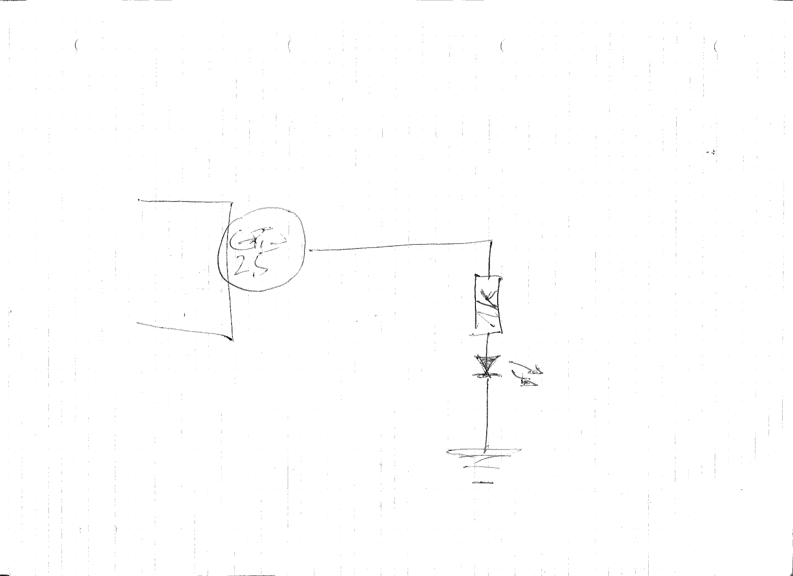

.. include:: <mmlalias.txt>

GPIO: Blinklicht
================

.. jf-exercise:: ece19.blinklicht
   :dependencies: ece19.file_read

.. contents:: 
   :local:

Write a program that uses one of the Raspberry GPIO pins to blink an
LED at a given frequency. The program will be invoked like so:

.. code-block:: console

   $ path/to/repo/root/exercises/lastname.firstname/blink 25 0.5

Commandline
-----------

The command takes two *positional* parameters,

#. GPIO number
#. Frequency, in seconds. The number can contain decimal points, and
   so can represent fractions of a second.

Use the ``argparse`` module to do the commandline stuff

* Documentation `here
  <https://docs.python.org/3/library/argparse.html#module-argparse>`__)
* Sample usage in the `checker program
  <https://github.com/jfasch/FH-ECE-19/blob/master/bin/checker-digit>`__
  I keep annoying students with.

``sysfs`` GPIO
--------------

The program uses ``sysfs`` GPIO, and *not* `RPi.GPIO
<https://pypi.org/project/RPi.GPIO/>`__. 

.. note::

   * RPi.GPIO is Raspberry specific. This means it won't work on any
     other Linux than the Raspberry's.
   * RPi.GPIO is Python specific. One cannot easily port prototype
     code to, say, C++.
   * RPi.GPIO is horrible; it accesses hardware registers directly.

* `Kernel documentation
  <https://www.kernel.org/doc/html/latest/admin-guide/gpio/sysfs.html>`__
* `Youtube tutorial (one of many)
  <https://www.youtube.com/watch?v=Si1R2gaqE64>`__

  .. raw:: html

     <iframe width="560" height="315" 
             src="https://www.youtube.com/embed/Si1R2gaqE64" 
	     title="YouTube video player" 
	     frameborder="0" 
	     allow="accelerometer; autoplay; clipboard-write; encrypted-media; gyroscope; picture-in-picture" 
	     allowfullscreen>
     </iframe>

* The new kid, `libgpiod
  <https://blog.adafruit.com/2018/11/26/sysfs-is-dead-long-live-libgpiod-libgpiod-for-linux-circuitpython/>`__
  solves many of the problems that Sysfs GPIO has. Will switch to that
  when time is right (after we learned what *encapsulation* is).

Electronic Aspect
-----------------

Well, this is embarassing ...

Dependencies
------------

.. jf-topicgraph::
   :entries: ece19.blinklicht
