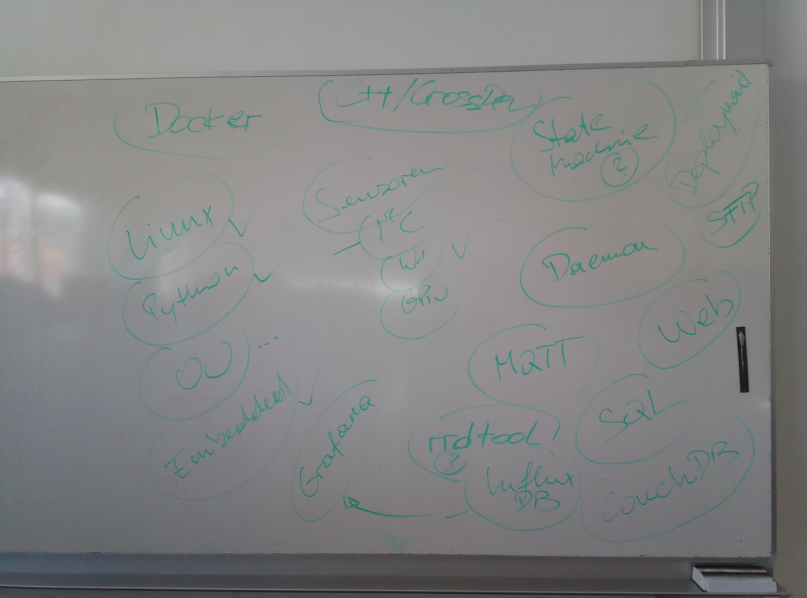

.. include:: <mmlalias.txt>

Daily Log
=========

.. contents::
   :local:
   
2021-03-04
----------

* *Organizational Blah*

  * :doc:`plan`
  * :doc:`cloud-computer`

* *Discussion*

2021-03-05
----------

.. sidebar:: Cheat Sheets

   * :download:`Bash Help Sheet <bash-help-sheet.pdf>`
   * :download:`Default Keyboard Shortcuts for Bash <readline-emacs-editing-mode-cheat-sheet.pdf>`

From :download:`Linux Basics (PDF)
</trainings/material/pdf/010-linux-basics.pdf>` ...
     
* *Bausteine von Unix und Linux*

  5-7, 9-16

* *Die Shell (Bash - "Bourne Again Shell")*

  36-45, 58-61, 63, 64

2021-03-18
----------

From :download:`Linux Basics (PDF)
</trainings/material/pdf/010-linux-basics.pdf>` ...
     
* *Das Filesystem*

  Es ist wichtig, im Filesystem navigieren zu können. Die Basic Tools
  müssen sitzen (``cd``, ``ls``, ``pwd``, ``mkdir``, ``rm``, ``cp``,
  ``mv``, etc.). (Dazu muss man natürlich verstehen, was Files,
  Directories etc. sind.)

  Das *Permission*-Thema ist *extrem* wichtig, und man kann damit
  rechnen, dass zur Prüfung ein paar trockene Fragen zu dem Thema
  kommen.

  * Pfade: 67-71
  * Directories: 72-76
  * Symbolische Links: 77-79
  * Directory Listings (``ls``): 84-87
  * Kopieren und Verschieben (``cp`` und ``mv``): 88-91
  * Owner, Permissions: 92-97, 100

2021-03-26
----------

* *Das Filesystem*

  * Permissions

    * Die ``umask``: 98-99
    * Tools für Permissions: 100
    * Set-UID Bit: 101
    * Sticky Bit: 102

  * Das ``find`` Command: 105-109

* Tools für Textfiles: 113ff.

  Das Kapitel wurde ansatzweise durchgegangen - jedes Tool. Wichtig
  ist, zu verstehen,

  * dass die Tools von *Standard Input* lesen, auf *Standard Output*
    schreiben (und auf *Standard Error* Fehler und Debug-Messages
    schreiben).
  * dass diese und andere Tools durch die Benutzung von *Standard
    Input* und *Standard Output* in der *Pipe*

* IO Redirection und Pipes: 133ff.

  Dieses Kapitel wurde in einem mit den Tools durchgemacht,
  ansatzweise.

  Wichtig ist mir, dass die Wirkungsweise der Pipe verstanden wird,
  und dass man Tools mit ihrer Hilfe verknüpfen kann.

2021-04-15
----------

* Aufwärmen

  * SSH Public Key Authentication
  * **Das verdammte Directory eines fremden Users, das ein File drin
    hat, das ich aus dem Directory nicht löschen darf.**
  * Abschluss des Linux/Shell Kapitels: *Fragerunde*

* Python Setup

  * :doc:`/trainings/material/soup/python/draft/installation`
  * :doc:`/trainings/material/soup/python/draft/vscode`

* Python Intro

  * :download:`Python Course (PDF) </trainings/material/pdf/300-python.pdf>`

2021-04-21
----------

Git Intro
.........

.. sidebar:: Download and Installation

   * `Git for Windows <https://git-scm.com/download/win>`__
   * `Git for MacOS <https://git-scm.com/download/mac>`__

.. raw:: html

   <iframe width="560" 
           height="315" 
	   src="https://www.youtube.com/embed/HVsySz-h9r4" 
	   title="YouTube video player" 
	   frameborder="0" 
	   allow="accelerometer; autoplay; clipboard-write; encrypted-media; gyroscope; picture-in-picture" 
	   allowfullscreen>
   </iframe>

Github
......

* Private repository on Github: https://github.com/jfasch/FH-ECE-19
* Create Github account, and send it to jf@faschingbauer.co.at
* Clone the repository

  .. code-block:: console

     $ cd directory-where-i-have-my-ec-work
     $ git clone https://github.com/jfasch/FH-ECE-19.git

* If you are getting tired of entering a password for each repo
  transaction, you can always `deploy a SSH public key to Github
  <https://docs.github.com/en/github/authenticating-to-github/connecting-to-github-with-ssh>`__,
  and then re-clone using the SSH access method:

  .. code-block:: console

     $ git clone git@github.com:jfasch/FH-ECE-19.git

Python
......

.. _first-notebook-here:

.. list-table::
   :align: left
   :header-rows: 1

   * * Notebook Structure
     * Notebook Download
   * * .. toctree::

          Notebooks/Datatypes

     * :download:`Notebook: Datatypes <Notebooks/Datatypes.ipynb>`

.. _first-dag-here:

**Course material**

.. jf-topicgraph::
   :entries: python.exercises.legacy.cmdline_digit

2021-04-29
----------

* Raspi Lab Setup

  * Image preparation using `script in our Github repo
    <https://github.com/jfasch/FH-ECE-19/blob/master/bin/fh-lab-image>`__
  * Me being Doze admin, configuring static IPs

* GPIO demo, using an LED
* OneWire demo, using one of those `DS18B20
  <https://datasheets.maximintegrated.com/en/ds/DS18B20.pdf>`__
  sensors.

   Topics of interest, from Group 2

* Exercise recap:
  :doc:`/trainings/material/soup/python/exercises/legacy/cmdline_digit`

2021-05-10
----------

Org Stuff
.........

* Course documentation

  * Notebooks now maintained here (moved over from Github) (see
    :ref:`here <first-notebook-here>`)
  * Topic dependency graphs inserted in random locations (see :ref:`here <first-dag-here>`)

* Github

  * Repo made private
  * FH VPN? Gitlab?

Python: Functions
.................

.. list-table::
   :align: left
   :header-rows: 1

   * * Course Material
     * Notebook Structure
     * Notebook Download
   * * * :doc:`/trainings/material/soup/python/basics/python_0270_functions/topic`
       * :doc:`/trainings/material/soup/python/basics/python_0270_functions/screenplay-scoping`
     * .. toctree::

          Notebooks/Functions

     * :download:`Notebook: Functions <Notebooks/Functions.ipynb>`

2021-05-12
----------

Python: Walk-Through Passing and Failing an Exam
................................................

Writing a checker for the exercise (:doc:`live hacking
<2021-05-12/screenplay-checker>`).

.. toctree::
   :hidden:

   2021-05-12/screenplay-checker

.. list-table::
   :align: left
   :header-rows: 1

   * * Course Material
     * Notebook Structure
     * Notebook Download
   * * (void)
     * .. toctree::

          Notebooks/Checker-Explanations

     * :download:`Notebook: Checker Explanations <Notebooks/Checker-Explanations.ipynb>`

Further Information
...................

* ``os.path`` module (from the `Python docs
  <https://docs.python.org/3/library/os.path.html#module-os.path>`__)
* ``subprocess`` module (from the `Python docs
  <https://docs.python.org/3/library/subprocess.html#module-subprocess>`__)
* `Stackoverflow: Git file permissions on Windows
  <https://stackoverflow.com/questions/6476513/git-file-permissions-on-windows>`__
* `Python Tutorial: Using Try/Except Blocks for Error Handling
  <https://www.youtube.com/watch?v=NIWwJbo-9_8>`__, by `Corey Schafer
  <https://www.youtube.com/channel/UCCezIgC97PvUuR4_gbFUs5g>`__

  .. raw:: html

     <iframe width="560" height="315" 
             src="https://www.youtube.com/embed/NIWwJbo-9_8" 
	     title="YouTube video player" 
	     frameborder="0" 
	     allow="accelerometer; autoplay; clipboard-write; encrypted-media; gyroscope; picture-in-picture" 
	     allowfullscreen>
     </iframe>

* `Python Tutorial: OS Module - Use Underlying Operating System
  Functionality <https://www.youtube.com/watch?v=tJxcKyFMTGo>`__, by
  `Corey Schafer
  <https://www.youtube.com/channel/UCCezIgC97PvUuR4_gbFUs5g>`__

  .. raw:: html

     <iframe width="560" height="315" 
	     src="https://www.youtube.com/embed/tJxcKyFMTGo" 
	     title="YouTube video player" 
	     frameborder="0" 
	     allow="accelerometer; autoplay; clipboard-write; encrypted-media; gyroscope; picture-in-picture" 
	     allowfullscreen>
     </iframe>

* `Python Tutorial: Calling External Commands Using the Subprocess
  Module <https://www.youtube.com/watch?v=2Fp1N6dof0Y>`__, by `Corey
  Schafer
  <https://www.youtube.com/channel/UCCezIgC97PvUuR4_gbFUs5g>`__

  .. raw:: html

     <iframe width="560" height="315" 
             src="https://www.youtube.com/embed/2Fp1N6dof0Y" 
	     title="YouTube video player" 
	     frameborder="0" 
	     allow="accelerometer; autoplay; clipboard-write; encrypted-media; gyroscope; picture-in-picture" 
	     allowfullscreen>
     </iframe>

* `Python 3.7: Encode String Method <https://www.youtube.com/watch?v=IoU4AbPpMys>`__

  .. raw:: html

     <iframe width="560" height="315" 
             src="https://www.youtube.com/embed/IoU4AbPpMys" 
	     title="YouTube video player" 
	     frameborder="0" 
	     allow="accelerometer; autoplay; clipboard-write; encrypted-media; gyroscope; picture-in-picture" 
	     allowfullscreen>
     </iframe>

2021-05-{19,20}
---------------

.. list-table::
   :align: left
   :header-rows: 1

   * * Course Material
     * Notebook
     * Notebook Download
   * * * :doc:`/trainings/material/soup/python/basics/python_0500_files/topic`
       * :doc:`/trainings/material/soup/python/basics/python_0320_strings_methods/topic`
     * .. toctree::

          Notebooks/2021-05-20-G2

     * :download:`Notebook: 2021-05-20 (G2) <Notebooks/2021-05-20-G2.ipynb>`

Reiterating on Exercise
.......................

:doc:`/trainings/material/soup/python/exercises/legacy/cmdline_digit`

* Hashbang: ``#!/usr/bin/python``

  * Behnaz Mehrabadi: missing

    * Program is run as a shell script
    * Why does it take so long? Turns out that ``import`` is a
      screenshot command.

  * Anzhelika Chernykh: ``#!usr/bin/python``

* Peter Kolter

  .. code-block:: python

     d = dict()
     d = {0: 'zero', 1: 'one', 2: 'two', 3: 'three',4: 'four',5: 'five', 6: 'six', 7: 'seven', 8:'eight', 9: 'nine'}

* Leo Moser

  .. code-block:: python

     if __name__ == "__main__":
         main()

``import argparse``
...................

In `checker-digit
<https://github.com/jfasch/FH-ECE-19/blob/master/bin/checker-digit>`__
...

* overcome those undescriptive ``IndexError`` messages when a user
  fails to pass the correct arguments.
* Optional argument: ``--python`` (a contribution to Doze users)

Exercise
........

.. jf-topicgraph::
   :entries: ece19.blinklicht_unittest,
	     ece19.blinklicht_abc,
	     ece19.blinklicht_oo,
	     ece19.blinklicht

2021-05-21
----------

Exercise ``digit`` (Once More)
..............................

(:doc:`/trainings/material/soup/python/exercises/legacy/cmdline_digit`)

* Make it executable

  On Linux,

  .. code-block:: console

     $ chmod 755 digit
     $ git add digit

  On Doze (there is no such *execute permissions*),

  .. code-block:: console

     $ git update-index --chmod=+x digit

  (found on `Stackoverflow
  <https://stackoverflow.com/questions/6476513/git-file-permissions-on-windows>`__)

* Windows: hashbang and CRLF massacre

  * "Executable" definition: ``.py`` vs. ``755``
  * ``755`` |longrightarrow| hash bang
  * Windows CRLF: ``#!/usr/bin/python^M``
  * Interpreter path: ``/usr/bin/python`` does not exist on Windows
  * ``\r\n`` massacre, especially inside hashbang line

* Linux: Why do I have to say, ``./digit`` ?

Modules
.......

* :doc:`/trainings/material/soup/python/python_1200_modules/topic`
* What's this?

  .. code-block:: python

     if __name__ == '__main__':
         ...

* Live-hack it: externalize students list into module

.. raw:: html

   <iframe width="560" height="315" 
           src="https://www.youtube.com/embed/CqvZ3vGoGs0" 
	   title="YouTube video player" 
	   frameborder="0" 
	   allow="accelerometer; autoplay; clipboard-write; encrypted-media; gyroscope; picture-in-picture" 
	   allowfullscreen>
   </iframe>

Encoding
........

* :doc:`/trainings/material/soup/python/draft/encoding/topic`
* Re-iterate on exercise's use when capturing ``stdout``.

Notebook
........

.. list-table::
   :align: left
   :header-rows: 1

   * * Course Material
     * Notebook
     * Notebook Download
   * * * :doc:`/trainings/material/soup/python/python_1200_modules/topic`
       * :doc:`/trainings/material/soup/python/draft/encoding/topic`
     * .. toctree::

          Notebooks/2021-05-21

     * :download:`Notebook: 2021-05-21 <Notebooks/2021-05-21.ipynb>`

2021-06-01
----------

.. jf-topicgraph::
   :entries: ece19.blinklicht

2021-06-07
----------

Trial exam (`see here
<https://virtueller-campus-2020-21.fh-joanneum.at/course/view.php?id=2852#section-6>`__)

Missing questions:

* ``stdin`` and ``stdout`` and their relationship to the
  pipe. ``stderr``.
* SSH, password vs. key based authentication
* Python: what to ask?
