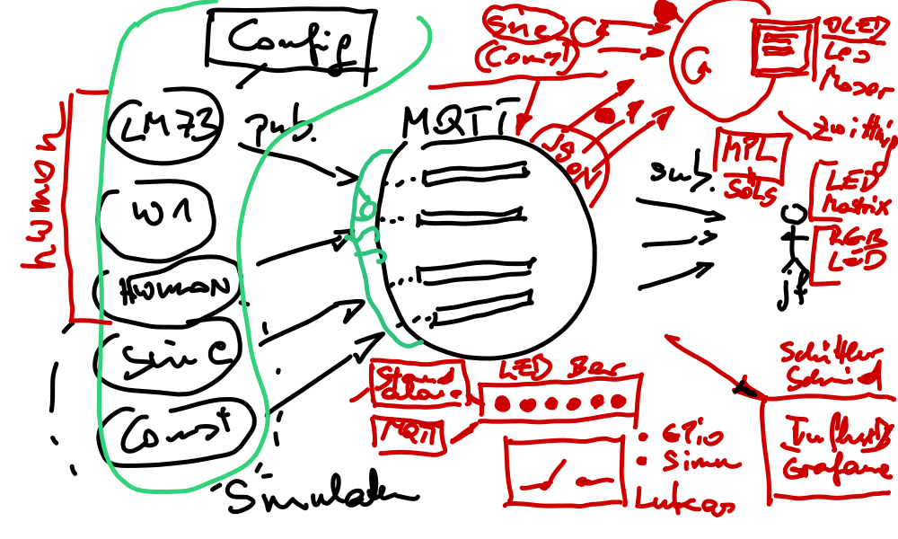

.. include:: <mmlalias.txt>

2021-12-1{4,5}
==============

.. contents::
   :local:

Integration day today.

Future Topics
-------------

* MT Schuettler/Schmid: live hacking maybe, using ``mutex.locked()``
  and ``mutex.acquire(blocking=False)``
* Temperature display interface?

* Tasks

  * (DONE) OLED Display/Kit -> Leo Moser
  * (DONE) Temp. Display -> Florian Zwittnig
  * (DONE) Temp. Display MQTT -> Matthias Kappel
  * (DONE) Thermometer Factory -> Daniel Söls, Felix Themessl
  * (DONE) OO -> Schweiger, Lang
  * (DONE) Switch (Simu, GPIO) -> Sonja Lukas, Jan Kornberger, Luis Kraker
  * (DONE) MQTT protocol -> Kudriaschow
  * (DONE) Hysterese -> Kappel, Lang. Unittests!
  * (DONE) RGB LED strip -> Chernykh Impl, Slovik Integr, Mehrabadi Doc.
  * (DONE) LED Matrix/Bar -> Baumgartner Doc./Integr., Mehrabadi Impl.
  * (DONE) LED Bar -> Hu, Nagelschmied, Schmid Markus

  * Stepper motor, temperature display: Stangl, Wasserfaller, Moser R.

  * Matplotlib -> Daniel Söls
  * InfluxDB, Grafana -> Schuettler, Schmid, jjj
  * Hysteresis user: two LEDs as callbacks -> Kappel, Lang

* Bug Tracker

  * lm73 hwmon 2 thermometers?

* Nachmittag

  * Wasserfaller -> andere Gruppe: Stangl, Vogel. Unit testing??

OO
--

* :doc:`/trainings/material/soup/python/advanced/oo/inheritance/topic`

Threading
---------

* :doc:`/trainings/material/soup/python/advanced/multithreading/basics`
* :doc:`/trainings/material/soup/python/advanced/multithreading/mutex`
    
C++ Sideways
------------

* `C++ STL Containers (Part 1) <https://youtu.be/nmNY8SbqZ34>`__

  .. raw:: html

     <iframe width="560" height="315" 
             src="https://www.youtube.com/embed/nmNY8SbqZ34" 
	     title="YouTube video player" 
	     frameborder="0" 
	     allow="accelerometer; autoplay; clipboard-write; encrypted-media; gyroscope; picture-in-picture" 
	     allowfullscreen>
     </iframe>

* `C++ STL Containers (Part 2) <https://youtu.be/Ft8SkoH2s8M>`__

  .. raw:: html

     <iframe width="560" height="315" 
             src="https://www.youtube.com/embed/Ft8SkoH2s8M" 
	     title="YouTube video player" 
	     frameborder="0" 
	     allow="accelerometer; autoplay; clipboard-write; encrypted-media; gyroscope; picture-in-picture" 
	     allowfullscreen>
     </iframe>
