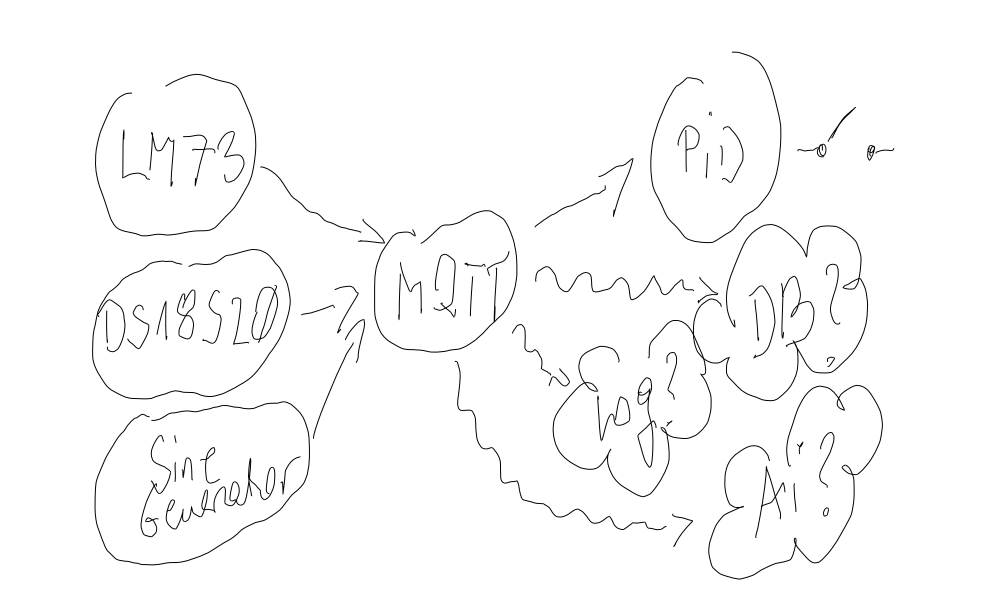

Group Project
=============

.. contents::
   :local:

Project Plan
------------

.. toctree::
   :maxdepth: 2
   
   soup/group-ec2

Big Picture |:rolling_on_the_floor_laughing:|
---------------------------------------------

See the :doc:`project plan <soup/group-ec2>` for details.

Round #1
--------

This is the beginning of the first round of a large "Embedded
Computing 2" group exercise. Please have a look at the :doc:`initial
project plan <soup/group-ec2>` to get an overview of where we are
(hint: right at the bottom of the dependency graph).

**First step**: group assignments. Who does what?

We will start with the tasks below. Each task will have people
assigned to it. Please read the task descriptions, and decide where
your place is/what you're going to do *mainly*. :ref:`2021-10-07` we
had a look at a sample "Management Sheet" (`here
<https://virtueller-campus-2021-22.fh-joanneum.at/mod/resource/view.php?id=22533>`__)
that I intend to use for the group assignments.

That sheet defines three *roles* per task,

* *Implementation*. Naturally, in a software project, something will
  have to be implemented. Can be assigned to more than one person if
  need be (for example larger tasks).
* *Dokumentation*. Not so self-understood: what is implemented must be
  documented [#sphinx-doc]_.
* *Integration*. In all but the most trivial projects, pieces will
  have to be integrated and tested with the rest of the project when
  their implementors claim that they are done [#unit-testing]_. This
  implies that an integrator must have knowledge about most if not all
  modules of the rest of the project [#doc-relevance]_.

.. note::

   All persons who are assigned to a task must be prepared to fulfill
   all of the roles. For example, a tester must be able to fix what
   the programmer messed up if necessary. Likewise, the programmer
   must know how to use the documentation tool, and cross check with
   requirements.

The following table is used as a starting point for the project.

.. list-table::
   :align: left
   :header-rows: 1

   * * Task
     * Assignment Strategy
   * * :doc:`soup/sensors/task-simu`
     * * 2 groups
       * 3 members each
   * * :doc:`soup/sensors/task-lm73`
     * * 2 groups
       * 3 members each
   * * :doc:`soup/sensors/task-ds18s20`
     * * 2 groups
       * 3 members each
   * * :doc:`soup/sensors/task-arduino-proxy`
     * * 1 group
       * 4 members. We will have to implement the arduino side as
         well, 2 implementors make sense.
   * * :doc:`soup/sensors/task-prog-stdout`
     * * 1 group
       * 2 members
   * * :doc:`soup/mqtt/task-prog-mqtt`
     * * 1 group
       * 3 members

.. rubric:: Footnotes

.. [#sphinx-doc] We will use `Sphinx <https://www.sphinx-doc.org>`__
  as a documentation tool. This enables us to keep most documentation
  as close to the code as possible.

.. [#unit-testing] As a preliminary step to integration (and
                   integration testing) there is something called
                   `unit testing
                   <https://en.wikipedia.org/wiki/Unit_testing>`__.
.. [#doc-relevance] Documentation is not only relevant to
                    customers. It is even more relevant *internally*.
