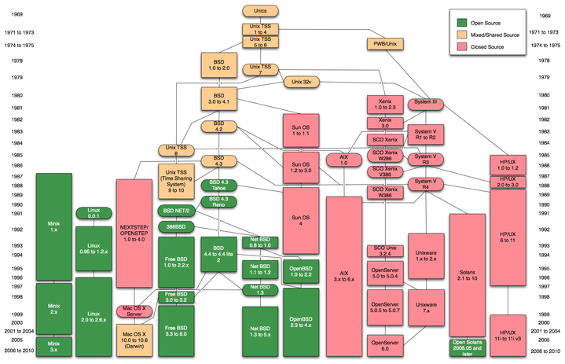

.. include:: <mmlalias.txt>

.. ot-topic:: c.introduction.introduction
   :dependencies: c.introduction.installation

Introduction
============

The Book (1)
------------

.. list-table::

   * * 

       .. image:: The_C_Programming_Language_cover.png

     * **The Definitive Book**

       * Brian W. Kernighan, Dennis M. Ritchie
       * First edition 1978 |longrightarrow| "K&R" C
       * Second (and most recent) edition 1988 |longrightarrow| `ANSI
         C <https://en.wikipedia.org/wiki/ANSI_C>`__
       * Most recent standard: ISO/IEC 9899:2011 |longrightarrow| `C11
         <https://en.wikipedia.org/wiki/C11_(C_standard_revision)>`__

The Book (2)
------------

* C is a "small" language
* Few central concepts |longrightarrow| simple - theoretically at least
* Complexity comes from the power of handling raw memory
* The book is *didactically perfect*
* Why should a C course be different?
* |longrightarrow| This course follows the book (loosely)

The Beginning
-------------

**There was nothing ...**

* ... but the PDP-11
* ... and a couple of cool guys
* Brian Kernighan, Dennis Ritchie |longrightarrow| C
* Ken Thompson, Dennis Ritchie |longrightarrow| first UNIX
* Ken Thompson |longrightarrow| first Shell

**The rest is history!**

Cool Guys and Their Hobby
-------------------------

.. list-table::

   * * 

       .. figure:: pdp11-kernighan-ritchie.jpg

	  Kernighan and Ritchie

     * 

       .. figure:: kernighan.jpg

          Brian Kernighan 

       .. figure:: ritchie.jpg

	  Dennis Ritchie +2011

History of UNIX
---------------

