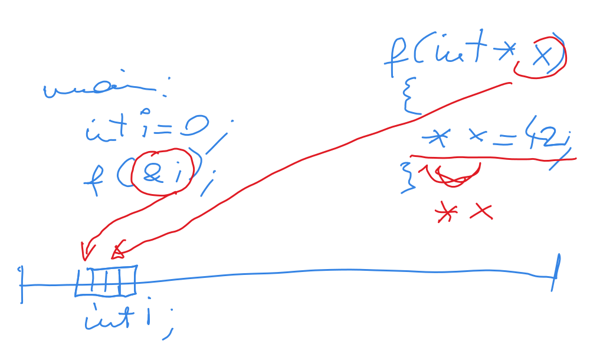

.. include:: <mmlalias.txt>

Pointers as Function Parameters
===============================

.. contents::
   :local:

Call by Reference (1)
---------------------

.. list-table::
   :align: left

   * * * **Problem**: in C, parameters are passed by-copy* - callee
         *see *copies* of the caller's values.
       * **Question**: how can I use a function to *modify* the
         caller's value?

     * .. code-block:: c

          void f(int a)
          {
              a = 42;
          }
          
          void main(void)
          {
              int i = 1;
              
              f(i);
              /* i is still 1 */
          }

Call by Reference (2)
---------------------

**Solution**: pointer

.. code-block:: c

   void f(int *a)
   {
       *a = 42;
   }
   
   void main(void)
   {
       int i = 1;
       
       f(&i);
   }

   A sketch of that matter (made on a Wacom-tablet during :doc:`one
   course </trainings/log/detail/2021-07-12/index>`)

