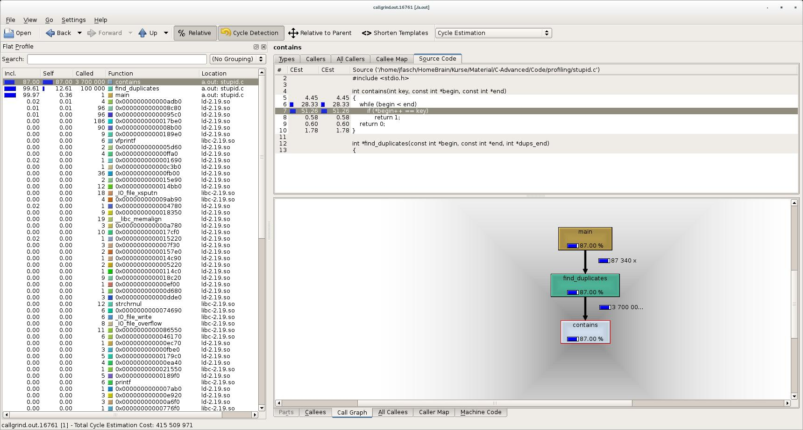

.. include:: <mmlalias.txt>

.. jf-topic:: c.profiling.callgrind
   :dependencies: c.profiling.gprof

``callgrind``
=============

``callgrind`` - How it Works
----------------------------

**How does it work?**

* ``valgrind``: run-time code instrumentation
* ``callgrind`` is a "tool" using ``valgrind`` infrastructure
* Call-graph analysis, optional cache and branch-prediction analysis

**Compared to good old** ``gprof`` ...

* Sluggishly slow (the price of run-time instrumentation)
* More accurate
* Nice graphical tool |longrightarrow| ``kcachegrind``

``callgrind`` - How it is Used
------------------------------

.. code-block:: console
   :caption: Compiler and Linker Calls

   $ gcc -c -o program.o program.c
   $ gcc -g -c -o program.o program.c # debug info
   $ gcc -o program program.o

* No compiler attention needed
* Debug information only for source annotation (|longrightarrow|
  ``kcachegrind``)

.. code-block:: console
   :caption: Producing Output: ``callgrind.out.<pid>``

   $ valgrind --tool=callgrind ./program
   ...
   $ ls callgrind.out.*
   callgrind.out.16761

``callgrind`` - Analysis Per Commandline
----------------------------------------

**Basically records the same information as** ``gprof``

* Flat profile
* Call Graph
* All sorts of counters (can detect cache misses etc.)

**Most basic analysis tool:** ``callgrind_annotate``

.. code-block:: console

   $ callgrind_annotate callgrind.out.16761
   ... unreadable but informative garbage ...

``callgrind`` - Analysis With ``kcachegrind``
---------------------------------------------

``callgrind`` - Useful Options
------------------------------

**Instrumented code takes very long**
  
* Start without instrumentation
* Switch on explicitly during runtime (by PID)

.. code-block:: console
   :caption: Start Without Instrumentation

   $ valgrind --tool=callgrind --instr-atstart=no ./program

.. code-block:: console
   :caption: Switch on Instrumentation

   $ callgrind_control --instr=on 16761
