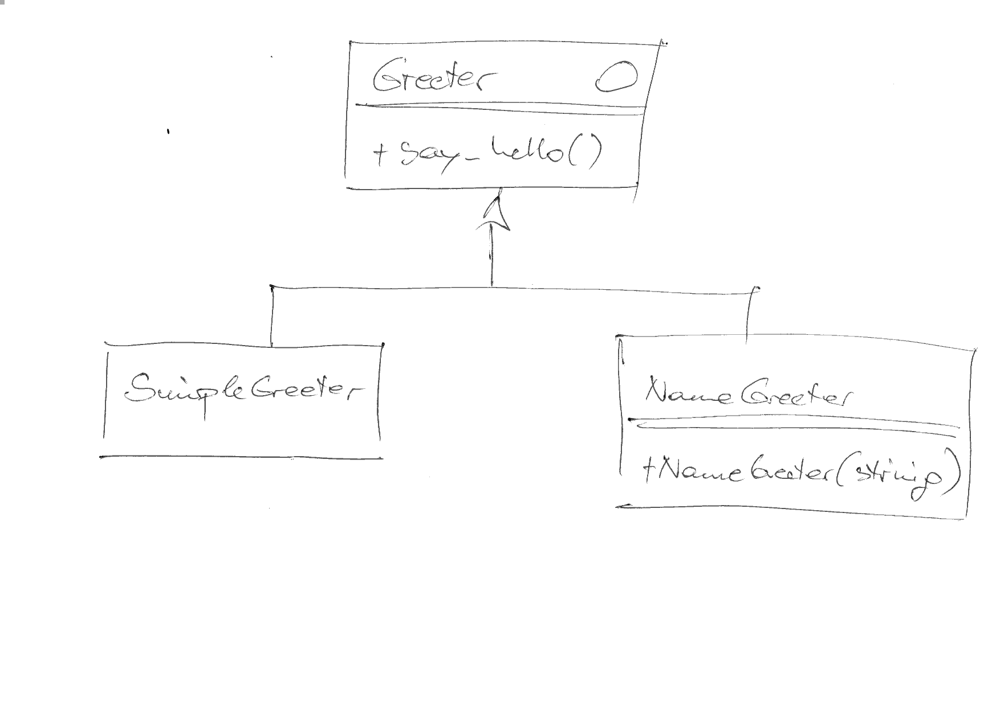

.. ot-topic:: cmake.intro.cxx_and_rants
   :dependencies: cmake.intro.structure
.. include:: <mmlalias.txt>

C++, Debug/Release, CMake "Programming", Rants
==============================================

.. contents::
   :local:

.. sidebar::

   **Source**

   .. code-block:: console

      09-c++/
      ├── bin
      │   ├── CMakeLists.txt
      │   ├── hello-first.cpp
      │   └── hello-second.cpp
      ├── CMakeLists.txt
      └── libhello
          ├── CMakeLists.txt
          ├── greeter.h
          ├── greeter-name.cpp
          ├── greeter-name.h
          ├── greeter-simple.cpp
          └── greeter-simple.h

   * :download:`09-c++/CMakeLists.txt`
   * :download:`09-c++/bin/CMakeLists.txt`
   * :download:`09-c++/bin/hello-first.cpp`
   * :download:`09-c++/bin/hello-second.cpp`
   * :download:`09-c++/libhello/CMakeLists.txt`
   * :download:`09-c++/libhello/greeter.h`
   * :download:`09-c++/libhello/greeter-simple.h`
   * :download:`09-c++/libhello/greeter-simple.cpp`
   * :download:`09-c++/libhello/greeter-name.h`
   * :download:`09-c++/libhello/greeter-name.cpp`

Pause
-----

* Give trainer time to switch project to C++

Class Diagram
-------------

C++ Standard Version
--------------------

.. sidebar::

   **Documentation**

   * `CMAKE_CXX_STANDARD
     <https://cmake.org/cmake/help/latest/prop_tgt/CXX_STANDARD.html>`__

.. code-block:: console

   SET(CMAKE_CXX_STANDARD 23)

.. code-block:: console

   $ make VERBOSE=1
   ... /usr/bin/c++ -std=gnu++23 ...

Debug Vs. Release Builds: ``CMAKE_BUILD_TYPE``
----------------------------------------------

.. sidebar::

   **Documentation**

   * `CMAKE_BUILD_TYPE
     <https://cmake.org/cmake/help/latest/variable/CMAKE_BUILD_TYPE.html>`__

* ``Debug``

  .. code-block:: console
  
     $ cmake -DCMAKE_BUILD_TYPE=Debug /home/jfasch/work/jfasch-home/trainings/material/soup/cmake/09-c++/
     $ make VERBOSE=1
     ... /usr/bin/c++ -O3 -DNDEBUG ...

  (Looks pretty arbitrary and half-hearted)

* ``Release``

  .. code-block:: console

     $ cmake -DCMAKE_BUILD_TYPE=Release /home/jfasch/work/jfasch-home/trainings/material/soup/cmake/09-c++/
     $ make VERBOSE=1
     ... /usr/bin/c++ -O3 -DNDEBUG ...

  (Looks pretty arbitrary and half-hearted)

Compiler Type
-------------

.. sidebar::

   **Documentation**

   * `CMAKE_<LANG>_COMPILER_ID
     <https://cmake.org/cmake/help/latest/variable/CMAKE_LANG_COMPILER_ID.html#variable:CMAKE_%3CLANG%3E_COMPILER_ID>`__
   * `IF (and conditionals)
     <https://cmake.org/cmake/help/latest/command/if.html>`__

* Compiler flags chosen half-heartely by CMake
* |longrightarrow| custom flags needed
* E.g. for "Debug", but only if GCC

  * Optimization off (``-O0``), to improve single-stepping experience
  * Better debug info (``-g3``)
  * More warnings (``-Wall``) for sanity
  * Turn warnings into errors (``-Werror``) for sanity

.. code-block:: console

   IF (${CMAKE_BUILD_TYPE} STREQUAL Debug)
     IF (${CMAKE_C_COMPILER_ID} STREQUAL GNU)
       SET(CMAKE_C_FLAGS "${CMAKE_C_FLAGS} -O0 -g3 -Wall -Werror")
     ENDIF()
     IF (${CMAKE_CXX_COMPILER_ID} STREQUAL GNU)
       SET(CMAKE_CXX_FLAGS "${CMAKE_CXX_FLAGS} -O0 -g3 -Wall -Werror")
     ENDIF()
   ENDIF()

Strings And Lists
-----------------

.. sidebar::

   **Documentation**

   * `STRING()
     <https://cmake.org/cmake/help/latest/command/string.html>`__
   * `LIST()
     <https://cmake.org/cmake/help/latest/command/list.html>`__

* CMake's "language" has no type system
* Strings can be compared numerically or lexically |longrightarrow| no
  errors, just bugs
* Lists are strings that contain semicolon separated values
* |longrightarrow| CMake commands to manipulate strings and lists
   
.. code-block:: console

   IF (${CMAKE_BUILD_TYPE} STREQUAL Debug)
     MESSAGE(DEBUG "Oida! Debug Build!!")
     IF (${CMAKE_C_COMPILER_ID} STREQUAL GNU)
       STRING(APPEND CMAKE_C_FLAGS "-O0 -g3 -Wall -Werror")
     ENDIF()
     IF (${CMAKE_CXX_COMPILER_ID} STREQUAL GNU)
       STRING(APPEND CMAKE_CXX_FLAGS "-O0 -g3 -Wall -Werror")
     ENDIF()
   ENDIF()

* Show ``MESSAGE()`` usage ...

.. code-block:: console

   $ cmake --log-level=Debug  -DCMAKE_BUILD_TYPE=Debug /home/jfasch/work/jfasch-home/trainings/material/soup/cmake/09-c++/
   -- Oida! Debug Build!!
   ...

``MESSAGE()`` (A.k.a ``printf()`` Debugging)
--------------------------------------------

.. sidebar::

   **Documentation**

   * `MESSAGE()
     <https://cmake.org/cmake/help/latest/command/message.html>`__

* Basic usage

  .. code-block:: console
  
     MESSAGE("Howdy")
  
  is the same as
  
  .. code-block:: console
  
     MESSAGE(NOTICE "Howdy")

  is the same as

  .. code-block:: console
  
     MESSAGE(Howdy)          # <--- root of all evil (one of roots)

|longrightarrow| all sorts of ... crap:

* Tags? Enums? *No!*

  .. code-block:: console

     MESSAGE(WARNING "Howdy")

  Prints, as expected ...

  .. code-block:: console

     CMake Warning at CMakeLists.txt:5 (MESSAGE):
       Howdy
		  
  .. code-block:: console

     MESSAGE(BULLSHIT "Howdy")

  Prints ...

  .. code-block:: console

     $ cmake ~/work/jfasch-home/trainings/material/soup/cmake/code/
     BULLSHITHowdy

``MESSAGE()``: Popular "Modes"
------------------------------

.. list-table::
   :align: left
   :widths: auto
   :header-rows: 1

   * * Mode
     * Description
   * * ``FATAL_ERROR``
     * CMake Error, stop processing and generation.
   * * ``SEND_ERROR``
     * CMake Error, continue processing, but skip generation.
   * * ``WARNING``
     * CMake Warning, continue processing.
   * * (none) or ``NOTICE``
     * Important message printed to stderr to attract user's attention.
   * * ``STATUS``
     * The main interesting messages that project users might be
       interested in. Ideally these should be concise, no more than a
       single line, but still informative.
   * * ``VERBOSE``
     * Detailed informational messages intended for project
       users. These messages should provide additional details that
       won't be of interest in most cases, but which may be useful to
       those building the project when they want deeper insight into
       what's happening.
   * * ``DEBUG``
     * Detailed informational messages intended for developers working
       on the project itself as opposed to users who just want to
       build it. These messages will not typically be of interest to
       other users building the project and will often be closely
       related to internal implementation details.
   * * ``TRACE``
     * Fine-grained messages with very low-level implementation
       details. Messages using this log level would normally only be
       temporary and would expect to be removed before releasing the
       project, packaging up the files, etc.

.. code-block:: console

   $ cmake --help
   ...
   --log-level=<ERROR|WARNING|NOTICE|STATUS|VERBOSE|DEBUG|TRACE>
   ...

.. attention::

   All of this lacks a clear definition. Apparently ...

   * Ordering appears to be ``ERROR > WARNING > NOTICE > STATUS >
     VERBOSE > DEBUG > TRACE``
   * ``STATUS`` is the default "level"
