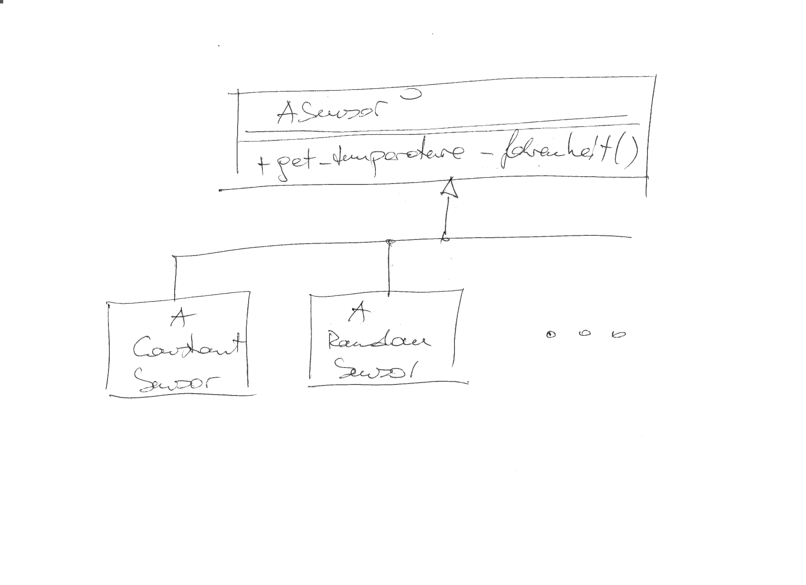
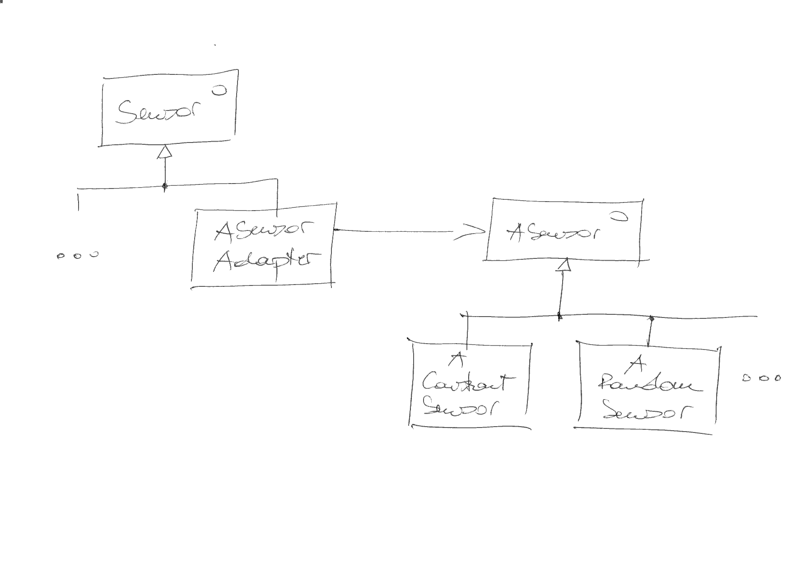

.. ot-topic:: cxx_design_patterns.adapter
   :dependencies: cxx03.inheritance_oo.interface,
		  cxx_design_patterns.uml,
		  cxx_design_patterns.sensor_hierarchy

.. include:: <mmlalias.txt>

Adapter
=======

.. contents::
   :local:

Problem
-------

The sensor hierarchy of our company covers many different
sensor. However, management has decided that it is not broad enough,
and some sensors of company A need to be added. Company A has software
implementations for those sensors that we could technically use. It
does not fit into our hierarchy, naturally [#impedance_mismatch]_.

What they have, though, is a similar hierarchy (one interface for all
their sensors), with the only apparent difference being that they
measure in degrees Fahrenheit.

.. literalinclude:: ../exercises/code/library/sensor-A.h
   :caption: :download:`../exercises/code/library/sensor-A.h`
   :language: c++

Solution: Adaptation
--------------------

Seems like we could be able to integrate all of their sensors in one
swoop, *easily*.

.. note::

   Convert Fahrenheit to Celsius using the following formula:

   .. math::

      C = (F - 32) * 5 / 9

Exercise
--------

Implement such an adapter class into our sensor hierarchy, suh that
the following test is satisfied:

.. literalinclude:: ../exercises/code/tests/adapter-suite.cpp
   :caption: :download:`../exercises/code/tests/adapter-suite.cpp`
   :language: c++

.. rubric:: Footnotes
.. [#impedance_mismatch] They sure don't share our ``Sensor``
                         interface. That interface is only internal to
                         our company.
