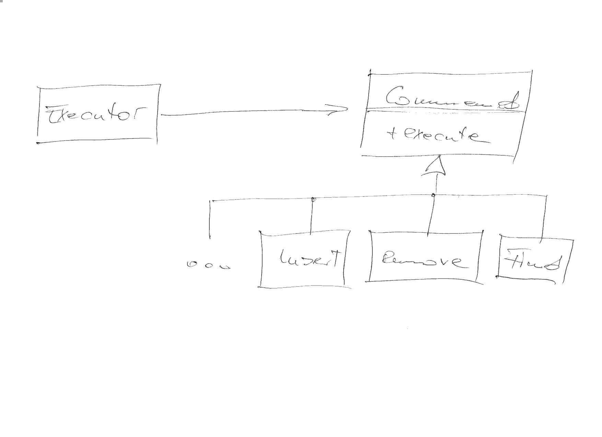

.. include:: <mmlalias.txt>

Command
=======

.. contents::
   :local:

.. toctree::
   :hidden:

   socialdb

Problem
-------

There is a multitude of possible operations on an object, and a
possible order in which one might want to invoke a sequence of such
operations. The executing entity is different from the originator of
the operations, and thus does not want to know about the particular
nature of those - it just wants to ``execute()`` them.

Commands are often :doc:`composed <../composite/composite>` - one command actually
holds/executes an entire set of lower level commands.

Solution
--------

Exercise
--------

Motivation
..........

There is a database implementation, ``SocialDB``, with the operations

* ``insert()``
* ``find()``
* ``drop()``

(See :doc:`here <socialdb>` for the definition of the ``SocialDB``
class.)

Implement a ``SocialDBCommand`` hierarchy that provides a type for
each of the database operations.

Step 1: Basic ``insert()``
..........................

Start with the insert command - it is the simplest because is has no
return value, and naively we do not currently expect errors.

.. literalinclude:: /trainings/material/soup/cxx-code/design-patterns-command/tests/command-suite-insert.cpp
   :caption: :download:`/trainings/material/soup/cxx-code/design-patterns-command/tests/command-suite-insert.cpp`
   :language: c++

Ensure that the command implements the ``SocialDBCommand``
interface. (That is the entire point behind *Command*.)

.. literalinclude:: /trainings/material/soup/cxx-code/design-patterns-command/tests/command-suite-insert-by-base.cpp
   :caption: :download:`/trainings/material/soup/cxx-code/design-patterns-command/tests/command-suite-insert-by-base.cpp`
   :language: c++

Step 2: Basic ``find()``
........................

Like with ``insert()``, lets ignore the possiblity of errors for a
moment. ``find()`` differs from ``insert()``, though, in that it has a
return value the issuer is sure interested in.

The ``SocialDBCommand`` interface has only a very anonymous ``void
execute()`` method that does not have room for command-specific return
values. 

Solution: store the return value in the specific command object, and
let the issuer ask for it once the command has run.

.. literalinclude:: /trainings/material/soup/cxx-code/design-patterns-command/tests/command-suite-find.cpp
   :caption: :download:`/trainings/material/soup/cxx-code/design-patterns-command/tests/command-suite-find.cpp`
   :language: c++

Step 3: ``drop()``
..................

Simplest!

.. literalinclude:: /trainings/material/soup/cxx-code/design-patterns-command/tests/command-suite-drop.cpp
   :caption: :download:`/trainings/material/soup/cxx-code/design-patterns-command/tests/command-suite-drop.cpp`
   :language: c++

Step 4: Handle ``find()`` Errors
................................

The way to quickly get to something that works is to ignore
errors. Let's not go in that directory for too long, and find a way to
communicate errors to the command's issuer.

The *find* command that we implemented above store the database
operation's return value, and make it available to the issuer via the
``result()`` method.

Now the ``find()`` database operation can throw an error (of type
``SocialDB::NotFound``) that also needs to be made available. Store
that in the object, and re-throw it in the ``result()`` method.

.. literalinclude:: /trainings/material/soup/cxx-code/design-patterns-command/tests/command-suite-notfound.cpp
   :caption: :download:`/trainings/material/soup/cxx-code/design-patterns-command/tests/command-suite-notfound.cpp`
   :language: c++

Step 5: Handle ``insert()`` Errors
..................................

While ``insert()`` does not return a value, it can throw. Like in
``find()``, store the exception in the *insert* command, and re-throw
when the issuer requests the ``result()``.

.. literalinclude:: /trainings/material/soup/cxx-code/design-patterns-command/tests/command-suite-notinserted.cpp
   :caption: :download:`/trainings/material/soup/cxx-code/design-patterns-command/tests/command-suite-notinserted.cpp`
   :language: c++

Step 6: Bulk Insert?
....................

Now that we have an *insert* command that we can instantiate objects
from, we could create a sequence of such objects and encapsulate those
in a, say, ``BulkInsert`` command. Lets give it a try.

.. image:: command-bulk-insert.png
   :scale: 40%

.. literalinclude:: /trainings/material/soup/cxx-code/design-patterns-command/tests/command-suite-bulk-insert.cpp
   :caption: :download:`/trainings/material/soup/cxx-code/design-patterns-command/tests/command-suite-bulk-insert.cpp`
   :language: c++

Step 6a: Bulk Insert Using ``std::initializer_list``?
.....................................................

.. sidebar::

   **See also**

   * :doc:`/trainings/material/soup/cxx11/020-new-language-features/030-brace-initialization/group`

To make matters less clumsy, they invented :doc:`brace initialization
</trainings/material/soup/cxx11/020-new-language-features/030-brace-initialization/group>`. Lets
try it out.

.. literalinclude:: /trainings/material/soup/cxx-code/design-patterns-command/tests/command-suite-bulk-insert--std_initializer_list.cpp
   :caption: :download:`/trainings/material/soup/cxx-code/design-patterns-command/tests/command-suite-bulk-insert--std_initializer_list.cpp`
   :language: c++
