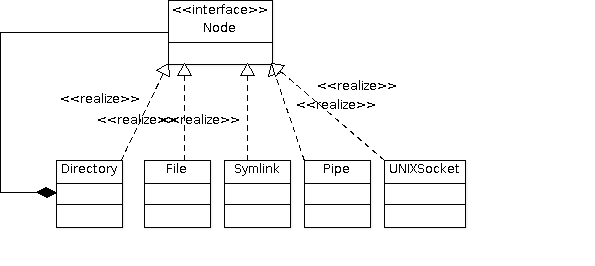
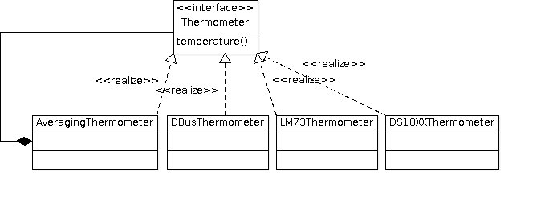

.. ot-topic:: cxx_design_patterns.composite
   :dependencies: cxx_design_patterns.proxy,
		  cxx03.inheritance_oo.interface,
		  cxx_design_patterns.uml,
		  cxx_design_patterns.sensor_hierarchy

.. include:: <mmlalias.txt>

Composite
=========

.. contents::
   :local:

Examples
--------

Unix Filesystem
...............

A typical directory structure:

.. image:: 73-composite-unixfs.dia
   :scale: 40%

A hypthetical class diagram:

Boolean Expressions
...................

.. image:: 73-composite-boolexpr-uml.png

Thermometers, And Average Calculation
.....................................

Exercises
---------

* :doc:`exercises/composite`
