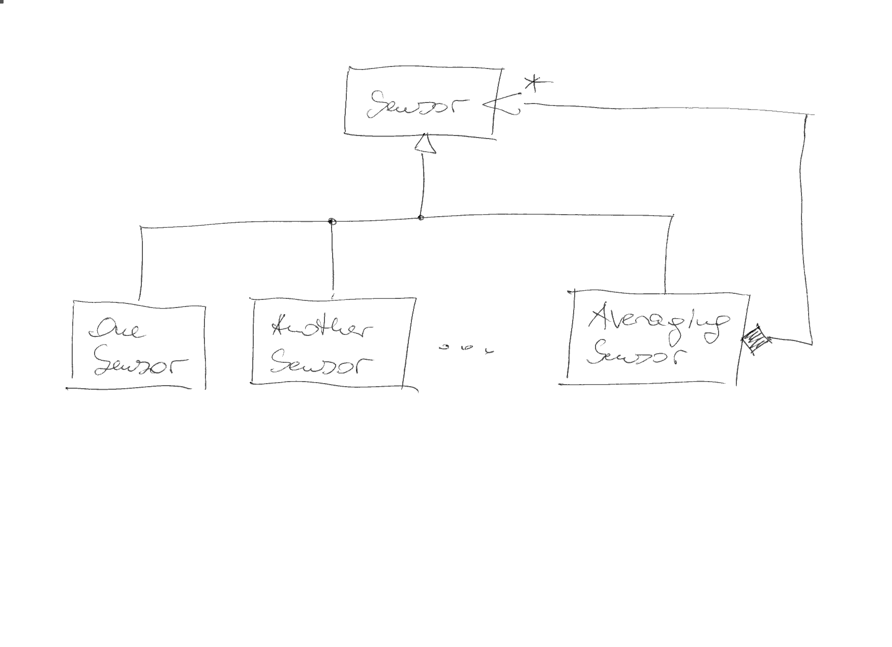

.. ot-topic:: cxx_design_patterns.composite
   :dependencies: cxx_design_patterns.proxy,
		  cxx03.inheritance_oo.interface,
		  cxx_design_patterns.uml

.. include:: <mmlalias.txt>

Composite
=========

.. contents::
   :local:

Problem
-------

Multiple objects of the same base type should be treated as one.

Solution
--------

Exercises
---------

* :doc:`exercises/composite`

