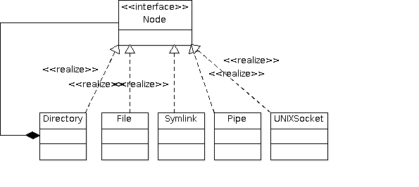
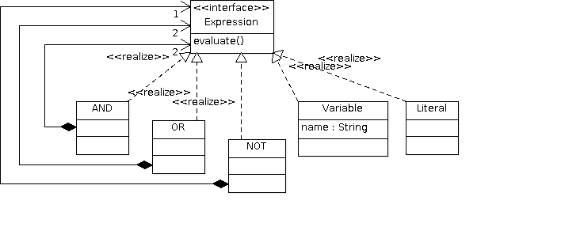
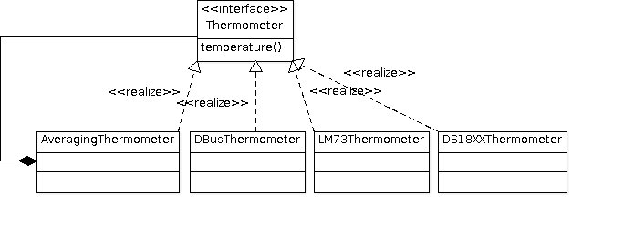

.. ot-topic:: cxx_design_patterns.composite
   :dependencies: cxx_design_patterns.proxy,
		  cxx_design_patterns.proxy_round,
		  cxx03.inheritance_oo.interface,
		  cxx_design_patterns.uml,
		  cxx_design_patterns.sensor_hierarchy

.. include:: <mmlalias.txt>

Composite
=========

.. contents::
   :local:

Examples
--------

Unix Filesystem
...............

A typical directory structure:

.. image:: 73-composite-unixfs.dia
   :scale: 40%

A hypthetical class diagram:

Boolean Expressions
...................

Thermometers, And Average Calculation
.....................................

Exercise
--------

Implement the following test:

.. literalinclude:: ../code/tests-trainee/composite-suite-basic.cpp
   :caption: :download:`../code/tests-trainee/composite-suite-basic.cpp`
   :language: c++

Maybe, as a C++ 11 excursion, lets implement real *initialization*,
and omit the ``add()`` method. This way it becomes impossible to
``add()`` another member to the composite object at the time it is
already being used.

.. note::

   This step is optional!

.. literalinclude:: ../code/tests-trainee/composite-suite-initializer-list.cpp
   :caption: :download:`../code/tests-trainee/composite-suite-initializer-list.cpp`
   :language: c++
