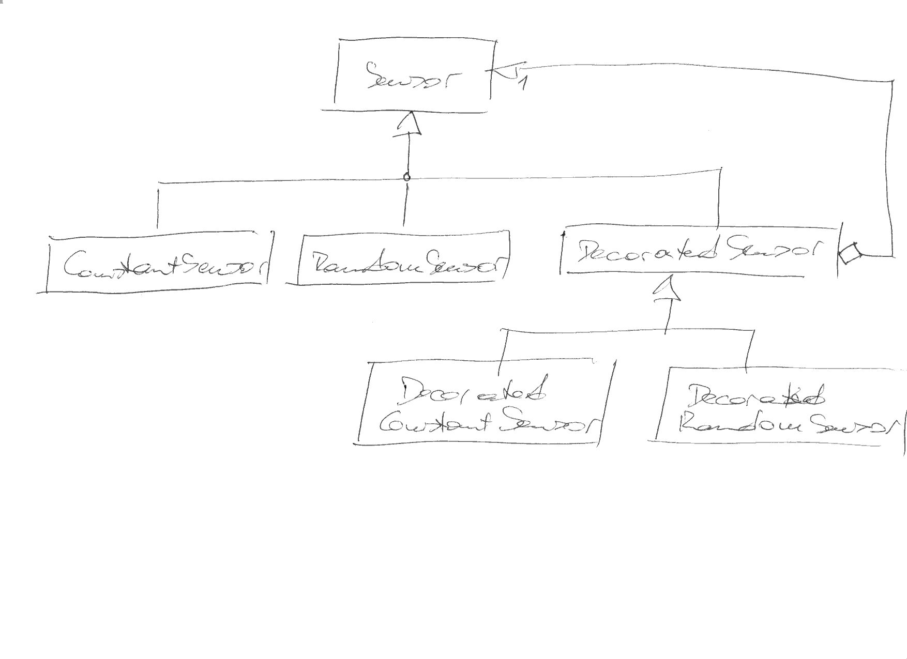
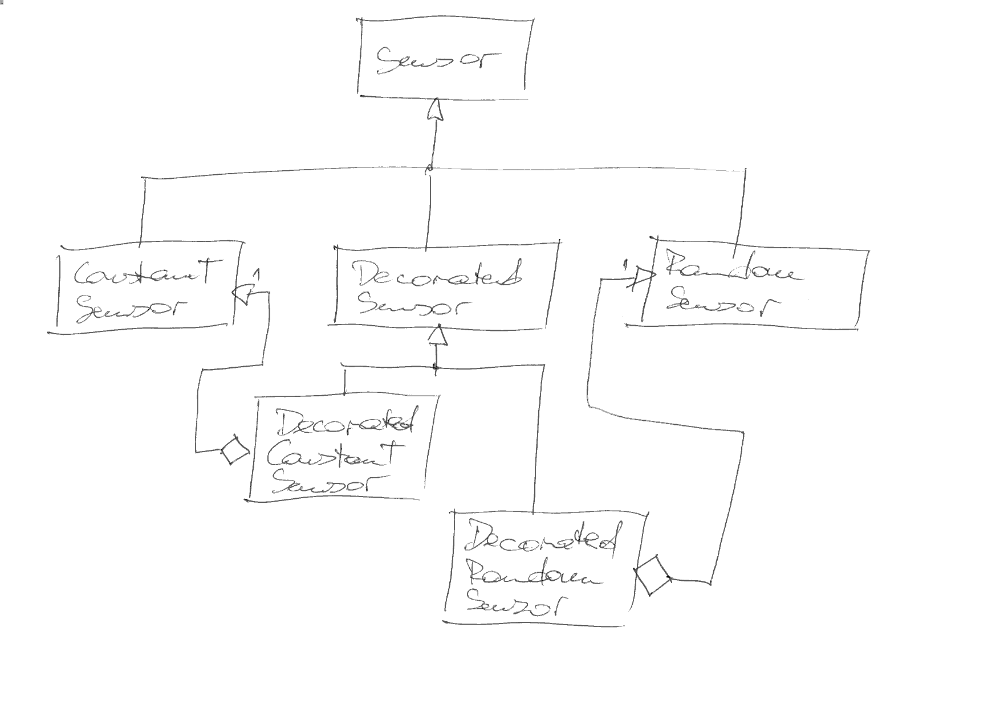

.. ot-topic:: cxx_design_patterns.decorator
   :dependencies: cxx_design_patterns.adapter, 
		  cxx03.inheritance_oo.interface,
		  cxx_design_patterns.uml,
		  cxx_design_patterns.sensor_hierarchy

.. include:: <mmlalias.txt>

Decorator
=========

.. contents::
   :local:

Problem
-------

* Modifying an interface to add functionality is inappropriate

  * ... maybe because there is no consensus that the functionality
    *should be* part of the interface
  * ... maybe simply because the interface is not in your hands

* |longrightarrow| add small wrapper classes with the added
  functionality
* Instances of wrapper classes should be usable as instances of the
  original interface

Solution
--------

* Introduce a *wrapper* class that *contains* an object of the
  original interface.
* The wrapper class *implements* the original interface. In other
  words, objects of the wrapper class *can be used as* object that
  implement the original interface.
* Additionally (that is the point), the wrapper class implements the
  functionality that cannot be part of the original interface.

Variant 1: Aggregate Base Class Objects
.......................................

Variant 2: Aggregate Conrete Class Objects
..........................................

Exercise
--------

:doc:`exercises/decorator`
