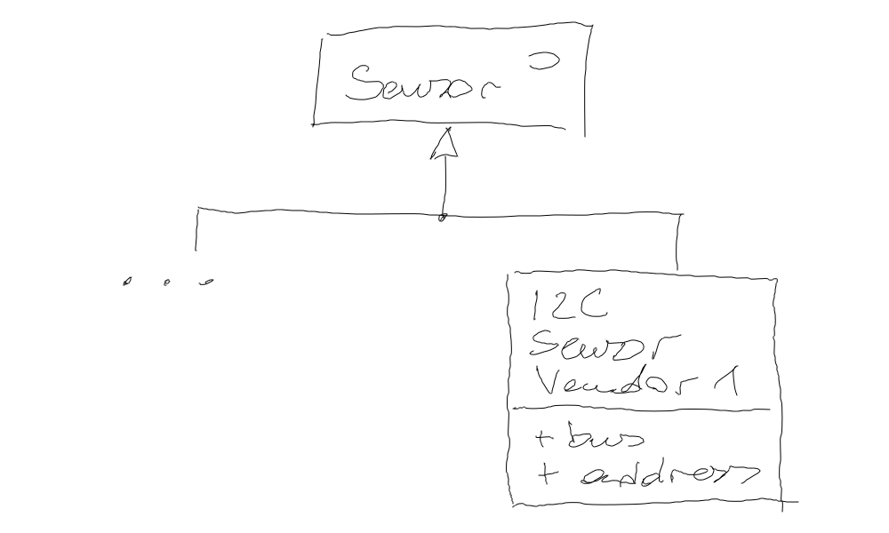
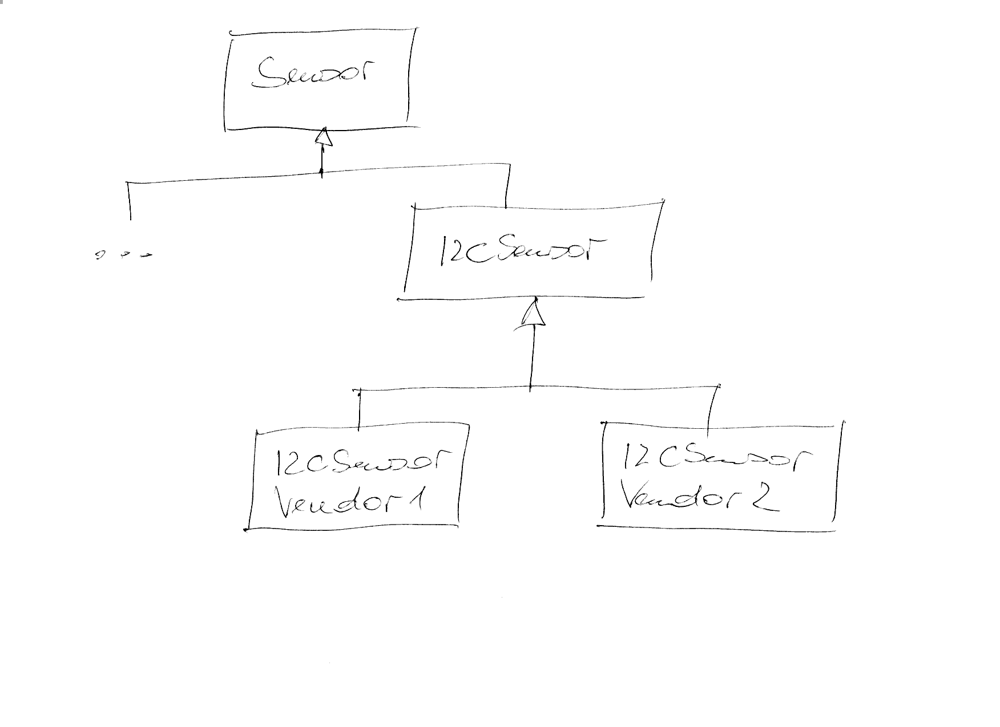

.. ot-exercise:: cxx_design_patterns.exercises.abstract_factory
   :dependencies: cxx03.inheritance_oo.interface,
		  cxx_design_patterns.singleton,
		  cxx_design_patterns.uml,
		  cxx_design_patterns.sensor_hierarchy

.. include:: <mmlalias.txt>

Exercise: Abstract Factory
==========================

.. contents::
   :local:

I2C Sensor Subhierarchy
-----------------------

Imagine a company currently deploys I2C sensors of vendor 1. These
sensor have their place in the sensor hierarchy,

Objects of that sensor type, ``I2CSensor_Vendor1``, are currently
directly instantiated in the code like so,

.. code-block:: c++

   I2CSensor_Vendor1 sensor(/*bus*/ 2, /*address*/ 0x37);
   // ...

Suddenly one day, due to pricing policies of that vendor, it becomes
necessary to make a switch from that vendor to another vendor,
vendor 2. At least, that switch should be possible, and a prototype
has to be created.

An existing sensor implementation ``I2CSensor_Vendor1``, is pushed
down into a subhierarchy like so ...

Problem: I2C Sensor Instantiation
---------------------------------

In current code, instantiation of the venerable ``I2CSensor_Vendor1``
class is distributed all over the place. It is not currently on
schedule to refactor and pull out instantiations into a central
location. One would rather pour ``if`` or ``#ifdef`` garbage all
across the software than taking the risk of damage and/or project
slip.

Solution: Factory Objects
-------------------------

A change that is reasonable, though, is to centralize the millions of
``if`` cascades,

.. code-block:: c++

   std::unique_ptr<I2CSensor> sensor = create_i2c_sensor(/*bus*/ 1, /*address*/ 0x37);

Better yet, introduce a singleton *factory* object,

.. code-block:: c++

   std::unique_ptr<I2CSensor> sensor = I2CSensorFactory::instance().create(/*bus*/ 1, /*address*/ 0x37);

Requirements
------------

Lets not speak out the *singleton* word for a moment, and implement
the following *Abstract Factory* hierarchy ...

.. image:: abstract-factory-hierarchy.png
   :scale: 40%

... which passed the following tests:

.. literalinclude:: code/tests/abstract-factory-suite-vendor1.cpp
   :caption: :download:`code/tests/abstract-factory-suite-vendor1.cpp`
   :language: c++

.. literalinclude:: code/tests/abstract-factory-suite-vendor2.cpp
   :caption: :download:`code/tests/abstract-factory-suite-vendor2.cpp`
   :language: c++

Notes
-----

* The concrete sensor objects are never seen by user code. Neither is
  the concrete factory.
* |longrightarrow| code does not *depend* on implementations, but
  rather on abstractions.
* |longrightarrow| *Decoupled!*
* If the instantiation is pu tinto the factory's ``.cpp`` file, we
  even reduce compile time.
