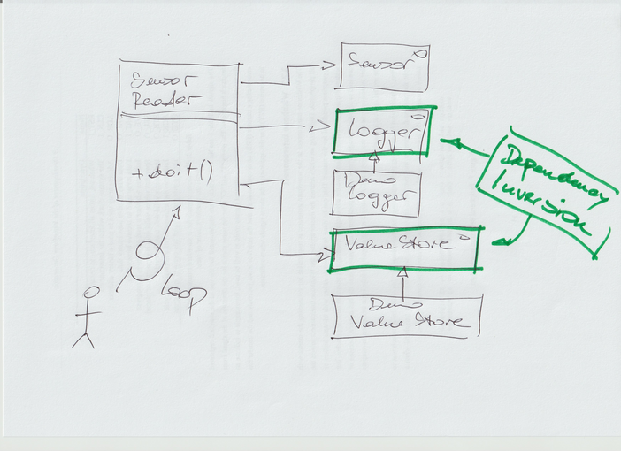
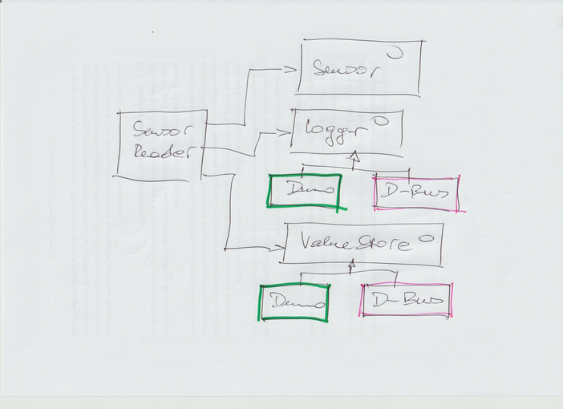

.. ot-topic:: cxx_design_patterns.heating_screenplay
   :dependencies: cxx_design_patterns.adapter,
		  cxx_design_patterns.uml,
		  cxx_design_patterns.sensor_hierarchy

.. include:: <mmlalias.txt>

Case Study/Livehacking: Heating Control (Reading Sensors)
=========================================================

.. contents::
   :local:

Step 1: Monolithic
------------------

* Hack ``SensorReader``
* Depending on concrete classes (logging, value store)
* All in one ``main()`` file

.. literalinclude:: /trainings/material/soup/cxx-code/heating-screenplay/heating-demo-v1.cpp
   :caption: :download:`/trainings/material/soup/cxx-code/heating-screenplay/heating-demo-v1.cpp`
   :language: c++

.. code-block:: console

   $ ./heating-demo-v1
   *** Round 1 ...
   DEMO-LOGGER: sensorA
   DEMO-STORE: setting sensorA = 40.1392
   DEMO-LOGGER: sensorB
   DEMO-STORE: setting sensorB = 4
   DEMO-LOGGER: sensorC
   DEMO-STORE: setting sensorC = 12597.1
   ...

Step 2: And D-Bus? |longrightarrow| Interfaces
----------------------------------------------

* ``SensorReader`` depends on concrete implementations

  * |longrightarrow| :doc:`Dependency Inversion Principle
    <../oo-principles>`

* See how we can log and store via D-Bus
* Create Interfaces
* Pull out ``SensorReader``
  (:download:`/trainings/material/soup/cxx-code/heating-screenplay/sensor-reader.h`)
* Modify demo program
  (:download:`/trainings/material/soup/cxx-code/heating-screenplay/heating-demo-v2.cpp`)

.. literalinclude:: /trainings/material/soup/cxx-code/heating-screenplay/sensor-reader.h
   :caption: :download:`/trainings/material/soup/cxx-code/heating-screenplay/sensor-reader.h`
   :language: c++

.. literalinclude:: /trainings/material/soup/cxx-code/heating-screenplay/heating-demo-v2.cpp
   :caption: :download:`/trainings/material/soup/cxx-code/heating-screenplay/heating-demo-v2.cpp`
   :language: c++

.. code-block:: console

   $ ./heating-demo-v2
   *** Round 1 ...
   DEMO-LOGGER: sensorA
   DEMO-STORE: setting sensorA = 36.2895
   DEMO-LOGGER: sensorB
   DEMO-STORE: setting sensorB = 4
   DEMO-LOGGER: sensorC
   DEMO-STORE: setting sensorC = 158243
   ...

Step 3: Start D-Bus Implementation
----------------------------------

Pull Demo Logger/Store Out Into Separate Files
..............................................

* :download:`logger-demo.h </trainings/material/soup/cxx-code/heating-screenplay/logger-demo.h>`
* :download:`valuestore-demo.h
  </trainings/material/soup/cxx-code/heating-screenplay/valuestore-demo.h>`

Adapter: ``DBusLogger``
.......................

.. literalinclude:: /trainings/material/soup/cxx-code/heating-screenplay/logger-dbus.h
   :caption: :download:`/trainings/material/soup/cxx-code/heating-screenplay/logger-dbus.h`
   :language: c++

Adapter: ``DBusValueStore``
...........................

.. literalinclude:: /trainings/material/soup/cxx-code/heating-screenplay/valuestore-dbus.h
   :caption: :download:`/trainings/material/soup/cxx-code/heating-screenplay/valuestore-dbus.h`
   :language: c++

Demo Program To Instantiate Either Demo Or DBus
...............................................

.. literalinclude:: /trainings/material/soup/cxx-code/heating-screenplay/heating-demo-v3.cpp
   :caption: :download:`/trainings/material/soup/cxx-code/heating-screenplay/heating-demo-v3.cpp`
   :language: c++

Stop Here, Need Help
....................

.. code-block:: console

   $ ./heating-demo-v3 DBUS
   *** Round 1 ...
   heating-demo-v3: /home/jfasch/work/jfasch-home/trainings/material/soup/cxx-design-patterns/exercises/../code/heating/logger-dbus.h:14: virtual void DBusLogger::log(const std::string&): Assertion `!"Boss, we need a DBus consultant!!"' failed.
   Aborted (core dumped)

* Call for consultant to do the dirty work
* In the meantime, focus on stabilizing core logic (there's a leak
  somewhere)

.. note::

   We did not modify ``SensorReader`` in a while!!

Tests
-----

.. literalinclude:: /trainings/material/soup/cxx-code/heating-screenplay/sensor-reader-suite.cpp
   :caption: :download:`/trainings/material/soup/cxx-code/heating-screenplay/sensor-reader-suite.cpp`
   :language: c++

.. code-block:: console

   $ ./heating-tests 
   Running main() from /home/jfasch/work/jfasch-home/googletest/googletest/src/gtest_main.cc
   [==========] Running 1 test from 1 test suite.
   [----------] Global test environment set-up.
   [----------] 1 test from sensorreader_suite
   [ RUN      ] sensorreader_suite.basics
   [       OK ] sensorreader_suite.basics (0 ms)
   [----------] 1 test from sensorreader_suite (0 ms total)
   
   [----------] Global test environment tear-down
   [==========] 1 test from 1 test suite ran. (0 ms total)
   [  PASSED  ] 1 test.
   
.. code-block:: console

   $ valgrind ./heating-tests 
   ==141320== Memcheck, a memory error detector
   ==141320== HEAP SUMMARY:
   ==141320==     in use at exit: 32 bytes in 2 blocks
   ==141320==   total heap usage: 204 allocs, 202 frees, 113,874 bytes allocated
