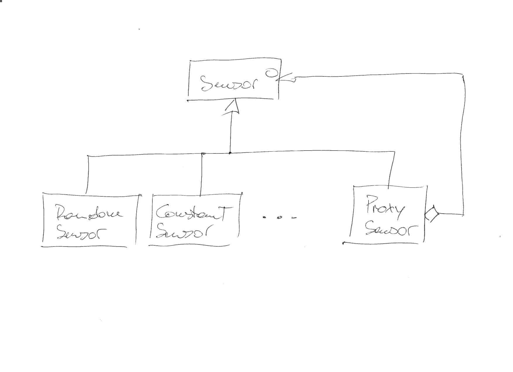
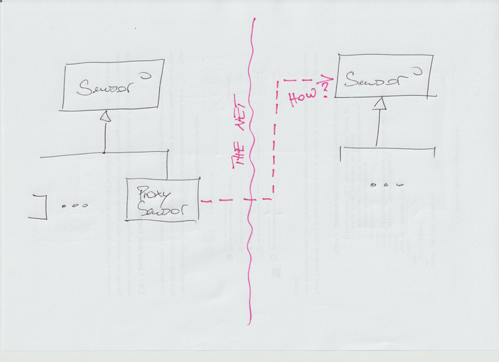

.. ot-topic:: cxx_design_patterns.proxy
   :dependencies: cxx03.inheritance_oo.interface,
		  cxx_design_patterns.uml,
		  cxx_design_patterns.sensor_hierarchy

.. include:: <mmlalias.txt>

Proxy
=====

.. contents::
   :local:

Problem
-------

Say an object lives outside of a client's address space, and a network
protocol must be used to access it from the client's address
space. The object has a base type, and it's that base type that should
also be used locally.

The *Proxy* pattern can also be used purely local, for example to hook
into the call to the target object.

Solution: *Proxy*
-----------------

Local Variant
.............

Remote Variant
..............

Exercises
---------

.. toctree::

   proxy-round
   proxy-remote

