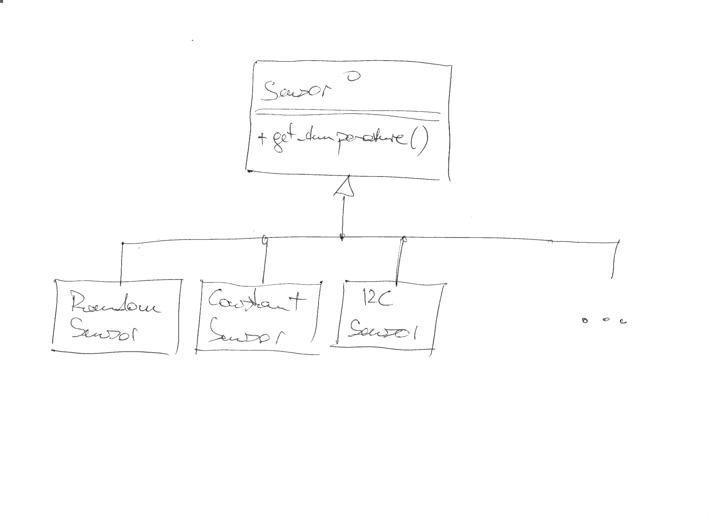

.. ot-topic:: cxx_design_patterns.sensor_hierarchy
   :dependencies: cxx03.inheritance_oo.interface,
		  cxx_design_patterns.uml

.. include:: <mmlalias.txt>

Exercise Foundation: ``Sensor`` Hierarchy
=========================================

.. contents::
   :local:

Hypothetical
------------

We are an organization that sits on a large pile of software. Sensors,
*temperature* sensors actually, are fundamental in that pile, and
there are many sensor implementations around. All are organized in a
class hierarchy, starting at an abstract base class (an
:doc:`interface
</trainings/material/soup/cxx03/100-inheritance-oo-design/group>`):

.. literalinclude:: /trainings/material/soup/cxx-exercises/sensors-core/sensors/sensor.h
   :caption: :download:`/trainings/material/soup/cxx-exercises/sensors-core/sensors/sensor.h`
   :language: c++

Two concrete implementations of such sensors that we will use in the
exercise series in this course are:

* :download:`RandomSensor
  </trainings/material/soup/cxx-exercises/sensors-core/sensors/sensor-random.h>`. That sensor yields
  floating point random numbers in a configurable range.
* :download:`ConstantSensor
  </trainings/material/soup/cxx-exercises/sensors-core/sensors/sensor-const.h>`. That one yield always the
  same temperature. Cool for testing.

We will extend that hierarchy along with the exercises.
  
Class Hierarchy
---------------

