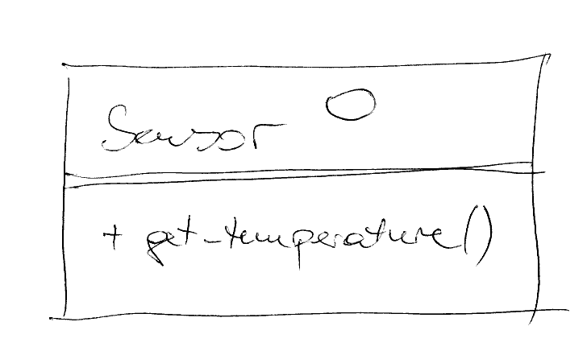
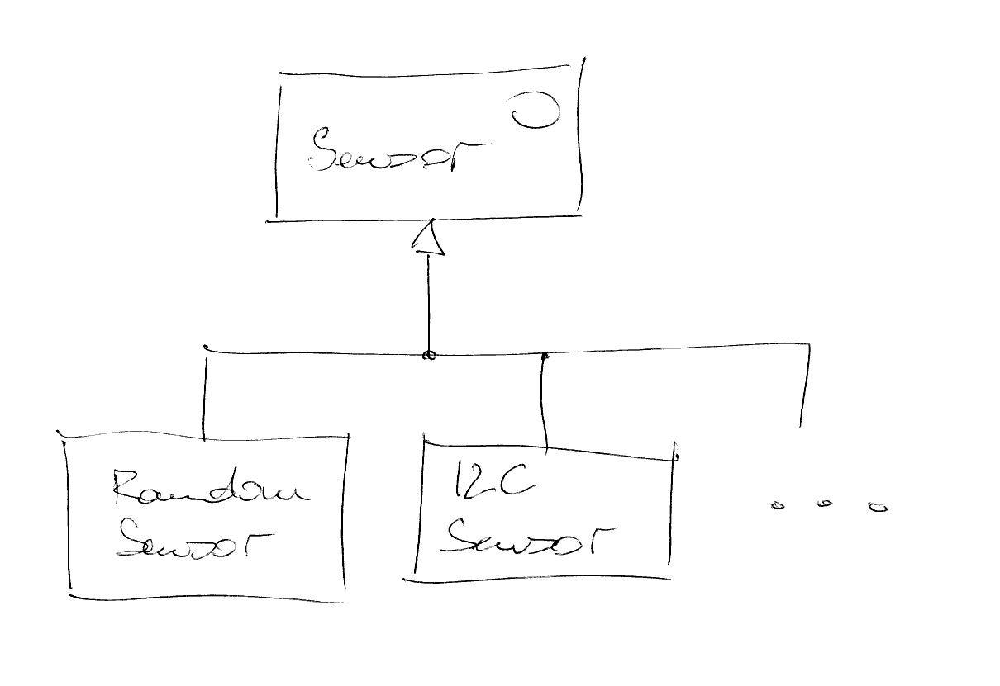
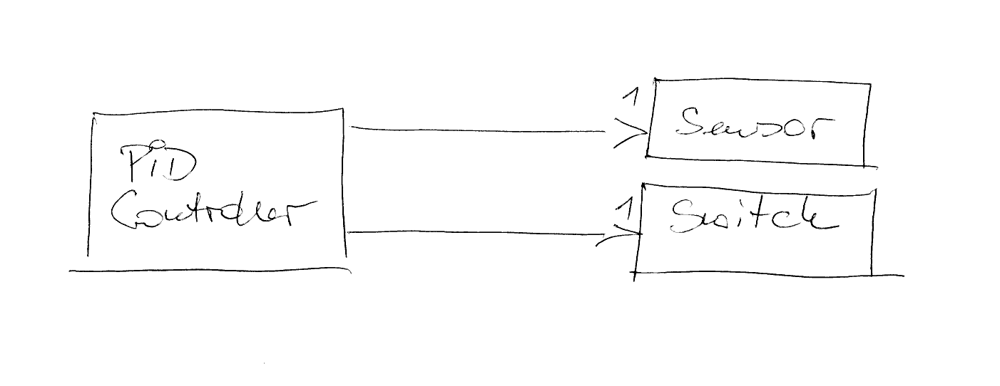
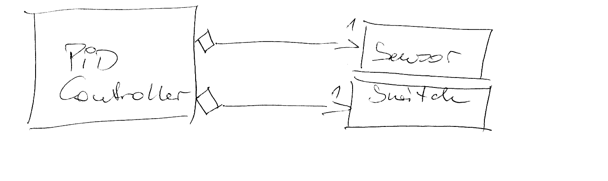
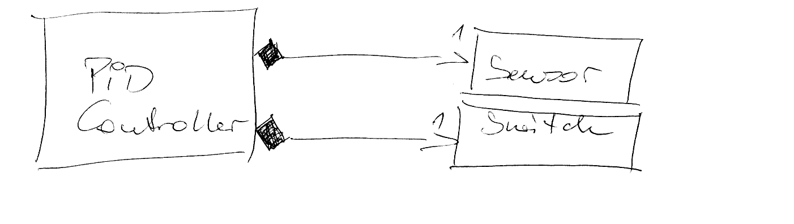

.. include:: <mmlalias.txt>

UML Short Introduction
======================

.. contents::
   :local:

Interface
---------

* Does not implement anything
* C++: *abstract base class*
* Purest form (preferred): no implementation of anything
* Implementation inheritance is possible though, but should not be
  overused

.. code-block:: c++

   class Sensor
   {
   public:
       virtual ~Sensor() {}
   
       virtual double get_temperature() = 0;
   };

Interface Implementation, Inheritance
-------------------------------------

* ``I2CSensor`` *is-a* ``Sensor``
* ``I2CSensor`` *can-be-used-as-a* ``Sensor`` (e.g. pointer
  assignment)

.. code-block:: c++

   class I2CSensor : public Sensor
   {
   public:
       I2CSensor(unsigned int bus, uint8_t address);
   
       double get_temperature() override;
   };

Connectors: Association, Aggregation, Composition
-------------------------------------------------

* Several forms of *knows-a*
* Describes *using-relationships* between types

Association
-----------

* Lightest form
* Usually implemented as raw pointer relationship
* Lifetime and resource management unspecified

.. code-block:: c++

   class PIDController
   {
   // ...
   private:
       Sensor* _sensor;
       Switch* _switch;
   };

Aggregation
-----------

* Semi *has-a*
* Often implemented as ``std::shared_ptr<>``

.. code-block:: c++

   class PIDController
   {
   // ...
   private:
       std::shared_ptr<Sensor> _sensor;
       std::shared_ptr<Switch> _switch;
   };

Composition
-----------

* Most-defined form
* Commonly implemented as 

  * Automatic membership
  * ``std::unique_ptr<>``

.. code-block:: c++

   class PIDController
   {
   // ...
   private:
       Sensor _sensor;
       Switch _switch;
   };

.. code-block:: c++

   class PIDController
   {
   // ...
   private:
       std::unique_ptr<Sensor> _sensor;
       std::unique_ptr<Switch> _switch;
   };

