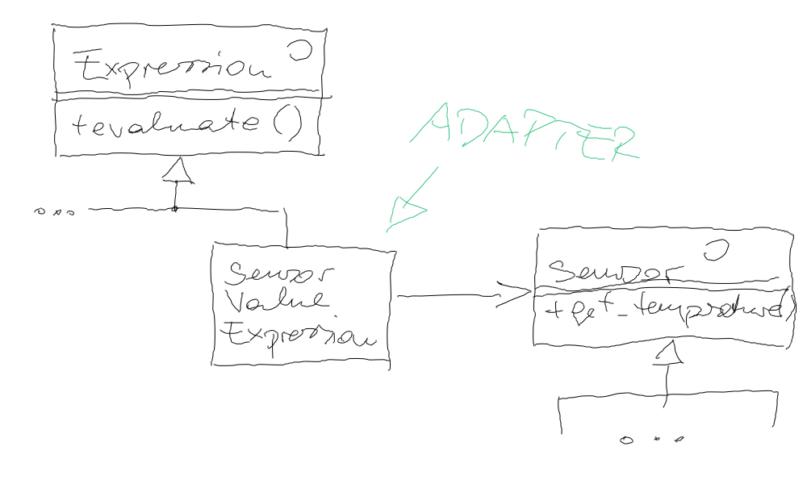

.. ot-exercise:: cxx_design_patterns.interpreter_and_adapter
   :dependencies: cxx_design_patterns.adapter,
		  cxx_design_patterns.interpreter,
		  cxx.exercises.design_patterns.interpreter_basic,
		  cxx_design_patterns.sensor_hierarchy

.. include:: <mmlalias.txt>

Exercise: Interpreter Combined With Adapter (And A Proxy)
=========================================================

.. contents::
   :local:

Motivation
----------

In :doc:`/trainings/material/soup/cxx-design-patterns/interpreter/interpreter` we created a clas hierarchy to do arithmetic
calculations, based on literals and variables - *values*, all in all.

The venerable ``Sensor`` :doc:`hierarchy </trainings/material/soup/cxx-design-patterns/sensor-hierarchy>` that
we used in :doc:`/trainings/material/soup/cxx-exercises/design-patterns/adapter` and in :doc:`/trainings/material/soup/cxx-exercises/design-patterns/proxy-round`, for example,
contains a number of classes (to be extended by real-world sensors one
day), that also provide *values*.

Why not use a sensor as an ``Expression``?

Requirement
-----------

In directory ``programs/``, add an executable that is built from the
following code:

.. literalinclude:: /trainings/material/soup/cxx-code/design-patterns-interpreter/programs/dynamic-measurement-language.cpp
   :caption: :download:`/trainings/material/soup/cxx-code/design-patterns-interpreter/programs/dynamic-measurement-language.cpp`
   :language: c++

